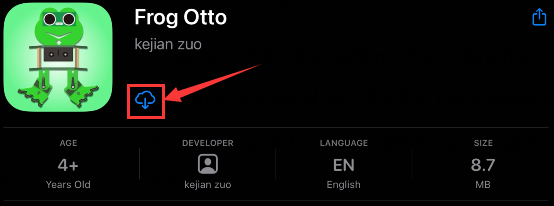

# 3. APP下载安装说明

⚠️ 特别提醒：如果已经在手机/平板上安装好了APP，则这一步骤可以直接跳过；否则，需要参照以下步骤在手机/平板上来安装APP

## Android 系统

A\. 进入链接：[https://www.keyesrobot.cn/zh-cn/latest/docs/APP.html](https://www.keyesrobot.cn/zh-cn/latest/docs/APP.html)， 找到 “Frog Otto” 所在行，点击对应的 “点击下载” 按钮，即可下载 “Frog Otto” 文件。

B\. 将 “Frog Otto.apk” 文件通过USB数据线转移到手机/平板上。

C\. 然后再参照提示安装 Android APP 即可。

D\. 蓝牙APP界面如下所示：

## 苹果系统(IOS)

A\. 进入链接：[https://www.keyesrobot.cn/zh-cn/latest/docs/APP.html](https://www.keyesrobot.cn/zh-cn/latest/docs/APP.html) ，找到 “Frog Otto” 所在行，点击对应的 “跳转APP Store” 按钮进入苹果商店。

B\. 搜索Frog Otto，单击下载搜索到的APP。

## 蓝牙APP界面

