# 青蛙机器人介绍

## 简介:

多么神奇的青蛙机器人要来了!

这个工具包提供了一个完美的机会来构建您的第一个机器人，它使学习机器人的过程容易，互动，和有趣!该工具包基于Keyes Nano CH340主板，兼容Arduino开源平台和Mixly Blocks编码。你可以编程自己的机器人走路，跳舞，避障和跟随障碍等，很容易构建和编程的。通过玩耍和实验，孩子们可以锻炼计算思维和编程思维，并将解决问题所需的技能付诸实践.

## 特点：

（1）输入电压：DC 7-12V。

（2）工作电压：5V

（3）最大输出电流：1.5A

（4）最大耗散功率：32W

（5）超声波感应角度：<15度

（6）超声波探测距离：2cm-300cm

（7）自带超声波模块，检测前方障碍物距离，组成青蛙机器人跟随系统.

（8）自带DX-BT24 5.1蓝牙模块，可以和手机蓝牙配对遥控青蛙机器人。

（9）特别提供兼容安卓系统和mac系统的蓝牙APP。

（10）扩展板自带一些数字口和模拟口的3pin 接口和4pin
接口，可外接其他传感器模块，扩展实验。

（11）扩展板自带I2C通信接口，可外接其他I2C通信模块，扩展实验。

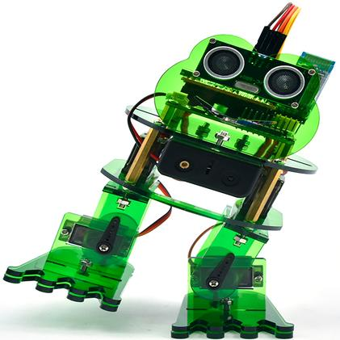

## 清单：

当我们收到这个青蛙机器人套件的时候，我们首先看到是一个包装精美的外盒，每个配件被安全且有序的装在外盒里面的小盒子里，对，你收到的就是这样一堆散装的配件和螺丝。我们先来清点一下：

|序号|产品名称|数量|图片|
|-|-|-|-|
|1|Keyes nano ch340 主板|1||
|2|AM/mini5P透明蓝 OD:5.0 L=30cm|1|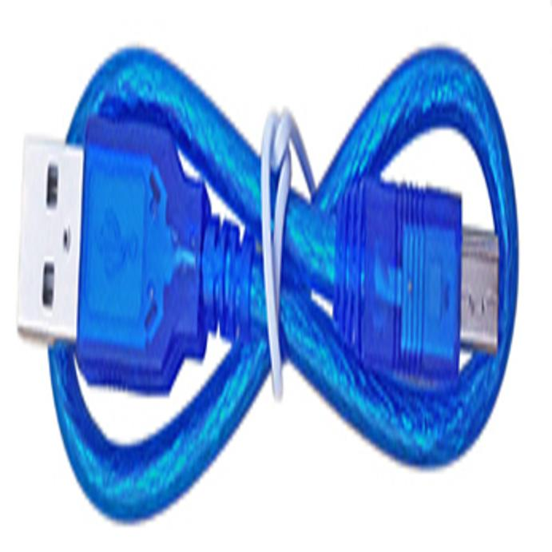|
|3|keyes NANO 扩展板|1|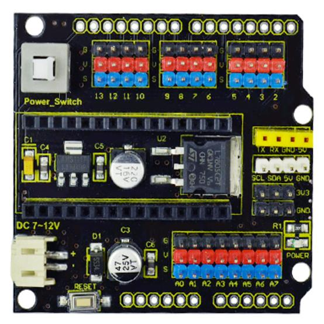|
|4|DX-BT24 V5.1 BLE蓝牙模块 上电不打印数据|1||
|5|HC-SR04超声波传感器|1|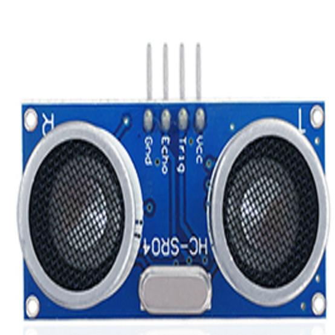|
|6|18650双节15CM露线适用DIY小车+双头JST-PH2.0MM-2P红黑线(总线长115MM)|1|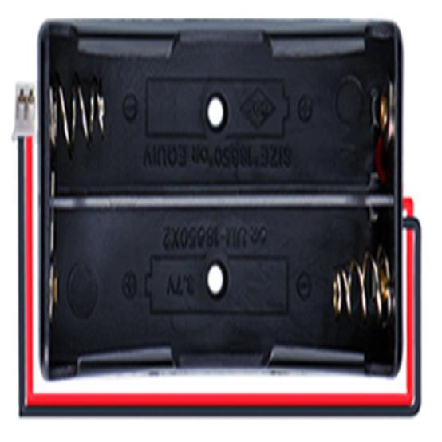|
|7|M1.6*10MM 圆头 十字螺丝|4||
|8|M1.6 304不锈钢螺母|4||
|9|M3*6MM 圆头 十字螺丝|16||
|10|M3*10MM 圆头 十字螺丝|10||
|11|M3*10MM 平头 十字螺丝|3||
|12|M3 镀镍螺母|14||
|13|M2*10MM 圆头 十字螺丝|8||
|14|M2 镀镍 螺母|12||
|15|M1.2X5MM 自攻螺丝|12|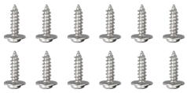|
|16|M3 304材质|2||
|17|双通M3*10MM|4||
|18|双通M3*30MM|4||
|19|小青蛙套件亚克力 3片 215*120MM T=3MM 绿色透明 环保|1|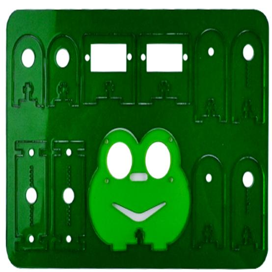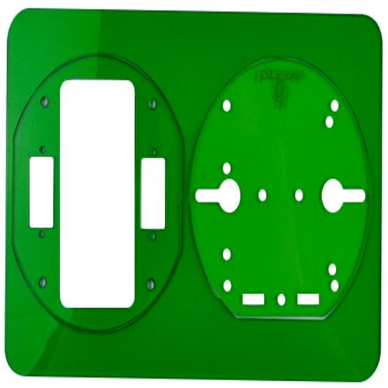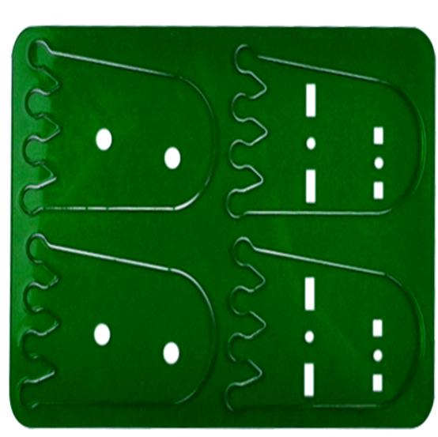|
|20|辉盛舵机 MG90S（14g）23*12.2*29mm(黑色) 180度 环保|4|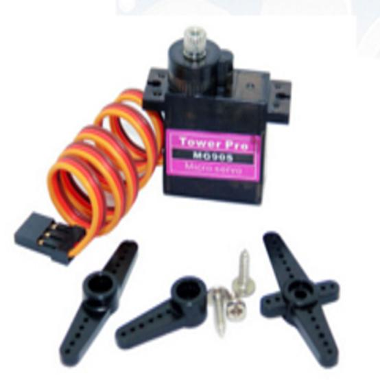|
|21|母对母10CM/40P/2.54/12股铜丝24号线|1||
|22|手柄颜色黄黑3*40MM十字螺丝刀|1|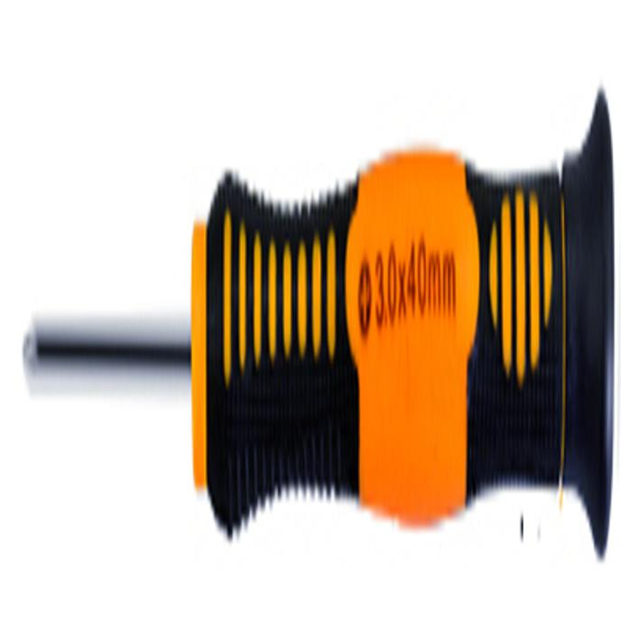|
|23|红膜透明亚克力双面胶|1|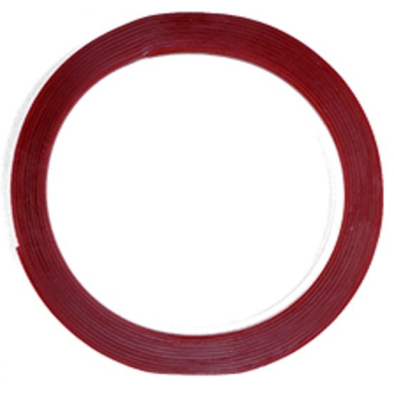|
|24|法兰轴承|2||
|25|扎带|3|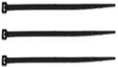|