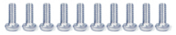
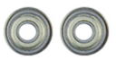
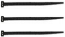
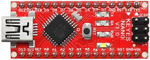

# 1. 青蛙机器人介绍

## 1.1 简介

多么神奇的青蛙机器人要来了!

这个工具包提供了一个完美的机会来构建您的第一个机器人，它使学习机器人的过程容易，互动，和有趣!该工具包基于Keyes Nano主板，兼容Arduino开源平台和Mixly Blocks编码。你可以编程自己的机器人走路，跳舞，避障和跟随障碍等，很容易构建和编程的。通过玩耍和实验，孩子们可以锻炼计算思维和编程思维，并将解决问题所需的技能付诸实践.

## 1.2 特点

（1）输入电压：DC 7-12V。

（2）工作电压：5V。

（3）最大输出电流：1.5A。

（4）最大耗散功率：32W。

（5）超声波感应角度：<15度。

（6）超声波探测距离：2cm-300cm。

（7）自带超声波模块，检测前方障碍物距离，组成青蛙机器人跟随系统等。

（8）自带DX-BT24 5.1蓝牙模块，可以和手机蓝牙配对遥控青蛙机器人。

（9）特别提供兼容安卓系统和MAC系统的蓝牙APP。

（10）扩展板自带一些数字口和模拟口的3pin接口和4pin接口，可外接其他传感器模块，扩展实验。

（11）扩展板自带I2C通信接口，可外接其他I2C通信模块，扩展实验。

## 1.3 清单

当我们收到这个青蛙机器人套件的时候，我们首先看到是一个包装精美的外盒，每个配件被安全且有序的装在外盒里面的小盒子里，对，你收到的就是这样一堆散装的配件和螺丝。我们先来清点一下：

|序号|产品名称|数量|图片|
|-|-|-|-|
|1|Keyes Nano主板|1||
|2|USB线|1||
|3|keyes NANO 扩展板|1||
|4|DX-BT24 V5.1 BLE蓝牙模块|1||
|5|HC-SR04超声波传感器|1||
|6|18650双节电池盒|1||
|7|M1.6*10MM 圆头 十字螺丝|4||
|8|M1.6 304不锈钢螺母|4||
|9|M3*6MM 圆头 十字螺丝|16||
|10|M3*10MM 圆头 十字螺丝|10||
|11|M3*10MM 平头 十字螺丝|3||
|12|M3 镀镍螺母|14||
|13|M2*10MM 圆头 十字螺丝|8||
|14|M2 镀镍 螺母|12||
|15|M1.2X5MM 自攻螺丝|12||
|16|M3 304材质|2||
|17|双通M3*10MM|4||
|18|双通M3*30MM|4||
|19|小青蛙套件亚克力 3片 215*120MM T=3MM 绿色透明 环保|1||
|20|辉盛舵机 MG90S（14g）23*12.2*29mm(黑色) 180度 环保|4||
|21|母对母10CM/40P/2.54/12股铜丝24号线|1||
|22|手柄颜色黄黑3*40MM十字螺丝刀|1||
|23|红膜透明亚克力双面胶|1||
|24|法兰轴承|2||
|25|扎带|3||

## 1.4 keyes Nano 主板

1\. Nano主板介绍

keyes Nano主板是一款基于ATmega328P-AU的小型、完整、易于操作的主板。与ARDUINO NANO相比，keyes NANO使用的USB转串口芯片是FT232，所以除了安装的驱动文件不一样，其他的使用方法完全一样。它有14个数字输入/输出引脚(其中6个可作为PWM输出)，8个模拟输入，一个16mhz晶体振荡器，一个迷你USB接口，一个ICSP接口和一个复位按钮。其中ICSP接口是用来给ATMEGA328P-AU烧录固件，由于这个该芯片我们在出厂前都以烧录好固件，所以一般不用。使用时我们可以利用miniUSB线供电，还可以利用排母接口Vin GND（DC 7-12V）供电。

2\. 规格参数:

|微控制器|ATmega328P-AU|
|-|-|
|工作电压|5V|
|输入电压 (推荐)|DC 7-12V|
|数字 I/O 引脚|14个 (D0-D13) (其中6个提供PWM输出)|
|PWM 数字 I/O 引脚|6个 (D3, D5, D6, D9, D10, D11)|
|模拟输入引脚|8个 (A0-A7)|
|每个I/O引脚直流电流|40 mA|
|闪存|32 KB，其中2KB由引导加载程序使用|
|静态存储器|2KB|
|只读储存器|1KB|
|时钟频率|16MHz|
|内置LED|控制引脚D13|

3\. 各个接口和主要元件说明:

这里是一个解释图，每一个元件和接口是可以做什么:

|1|ICSP 排针头|是一个AVR，一个由MOSI，MISO，SCK，RESET，VCC和GND组成的的微型编程头。它通常被称为SPI（串行外设接口），可以被认为是输出的“扩展”。实际上，你是将输出设备从属到SPI总线的主机。连接电脑时，可以给ATMEGA328P-AU烧录固件。|
|-|-|-|
|2|LED 指示灯 RX）|控制板通过串口通信，接收到信息时，RX灯闪烁。|
|3|LED 指示灯 TX）|控制板通过串口通信，发送信息时，TX灯闪烁。|
|4|LED 指示灯（POW）|给控制板供电时，LED亮起，否则熄灭。|
|5|LED 指示灯（L）|当D13为高电平时，LED亮起，为低电平时，LED熄灭。|
|6|RX0（D0）、TX1（D1）、D2-D13|有14个数字I/O引脚（D0-D13）（其中6个提供PWM（脉宽调制）输出），这些引脚可配置为数字输入引脚，用于读取逻辑值（0或1）；或作为数字输出引脚来驱动不同的模块，如LED，继电器等。|
|7|RST|可外按键，和复位键功能一样。|
|8|MEGA 328P微控制器|每个控制板板都有自己的微控制器。你可以假设它作为板的大脑。微控制器通常是ATMEL公司的。在从Arduino IDE加载新程序之前，你必须知道你的板上有什么IC。此信息位于IC顶部。这个控制板的微控制器是ATMEGA328P-AU。|
|9|MINI USB|利用mini USB线连接到电脑USB端口，可以给控制板供电，还可以给控制板上传程序。|
|10|3V3 pin|提供DC 3.3V 输出电压。|
|11|REF|代表模拟参考。它有时用于设置外部参考电压（0至5伏之间）作为模拟输入引脚的上限。|
|12|A0-A7|8个模拟引脚(A0-A7)|
|13|5V pin|提供DC 5V 输出电压。|
|14|GND|GND|
|15|VIN|外部输入DC 7-12V电压，给控制板供电。|
|16|复位键|可以重置你的控制板|
|17|FT232|USB转串口芯片，将电脑USB信号转化成串口信号。|
|18|AMS1117|它将外部输入的DC 7-12V 电压转化成DC 5V 电压，然后将DC 5V 电压转送给处理器和其他元件。|

4\. 特殊功能接口说明：

串口通信接口：RX0、TX1

PWM接口（脉宽调制）：D3 D5 D6 D9 D10 D11

外部中断接口：D2(中断0)和D3 (中断)

SPI通信接口：D10为SS、D11为MOSI、D12为MISO、D13为SCK

IIC通信端口：A4为SDA、A5为SCL

## 1.5 keyes Nano 扩展板

1\. 说明：

keyes Nano作为一款小巧的基于arduino平台的控制板，一直深受大家的喜爱。但是，当keyes Nano主板需要连接多个传感器模块，当keyes Nano主板需要外接电源时，需要用到面包板接线。接线很不方便。

为此，我们特别设计了这款扩展板，它完全兼容keyes Nano主板。这款扩展板不但将keyes Nano主板上的数字口和模拟口扩展成GND/5V/信号端，3PIN接口（2.54间距排针引出），还引出了一些常用的通信接口，如串口通信、I2C通信，大大方便了keyes Nano主板和其他传感器模块的连接。扩展板还自带有一个电源指示灯和一个复位按键。

同时为方便外接电源，扩展板上自带一个PH2.0-2P接口（输入DC 7-12V），自带一个自锁开关（Power_Switch），用于控制电源开关。为方便给其他传感器供电，扩展板自带3路DC 3.3V电源输出端（2.54间距排针引出）。为方便将扩展板将扩展板固定在其他设备，扩展板自带4个直径为3mm的定位孔。

2\. 特点：

A.将12路数字口扩展板成3pin 接口

B.将8路模拟口扩展板成3pin 接口

C.自带1个串口通信接口（蓝牙模块接口）

D.自带1个I2C通信接口

E.自带3路DC 3.3V电源输出接口

F.自带1个电源指示灯和1个复位按键

G.自带1个外接电源接口（PH2.0-2P）和1个控制按键

3\. 相关参数：

输入电压：DC 7-12V

电源接口：PH2.0-2P

排针/排母间距：2.54mm

定位孔大小：直径 3mm

尺寸：57\*54\*17mm

重量：20.4g

4\. 兼容开发板：

keyes Nano主控板

5\. 引脚说明：

6\. 使用方法：

只需将keyes Nano主板堆叠到keyes Nano扩展板上,通过白色接头用电池供电。

