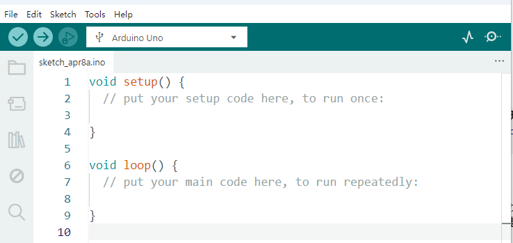
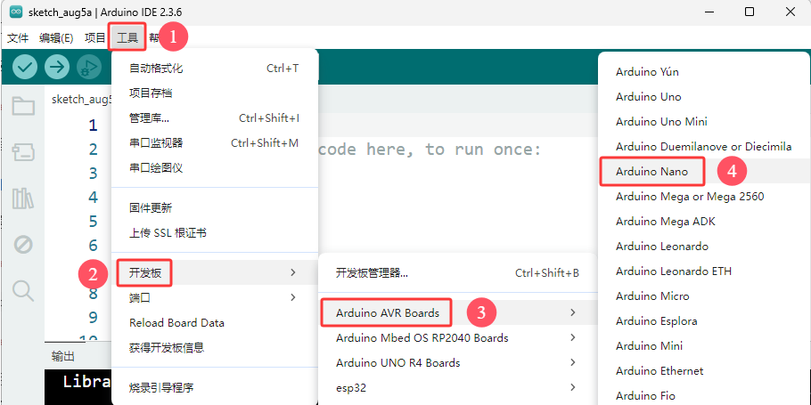
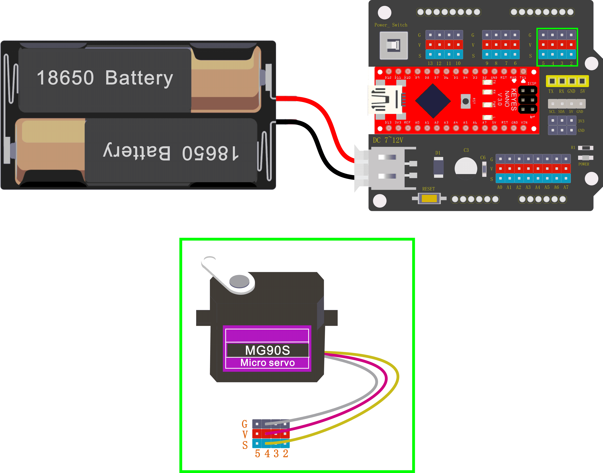
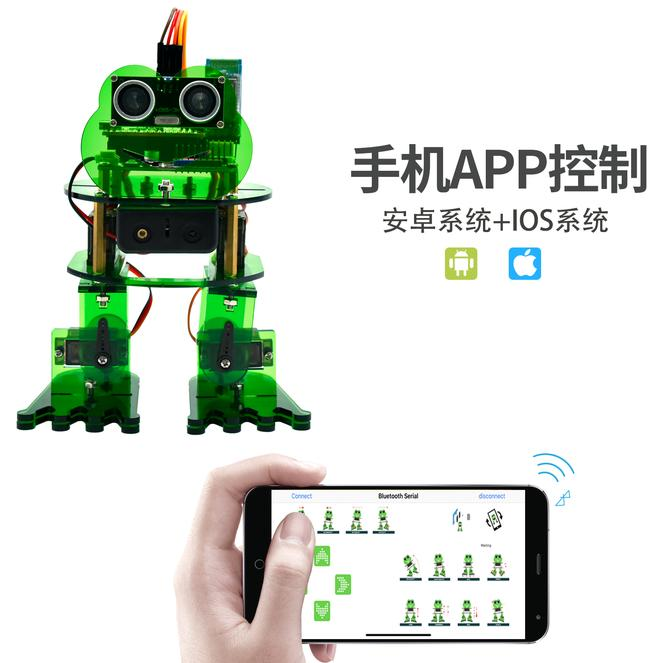

# 4. Arduino 教程

## 4.1 Arduino资料下载

请先下载本教程需要用到的 Arduino资料(包含：Arduino_代码 和 Arduino_库文件），请点击下载才能进行后续的学习，保存至您方便使用的路径下。

单击下载：[Arduino资料](./Arduino资料.7z) 

## 4.2 Arduino开发环境配置

### 4.2.1 Arduino IDE 简介

Arduino IDE是一款专为Arduino硬件设计的集成开发环境，它以初学者友好的界面和强大的开源代码支持而闻名。这款工具不仅简化了编程过程，降低了开发门槛，还为初学者提供了一个易于上手的学习平台。

Arduino IDE拥有简洁直观的用户界面，支持语法高亮、自动完成等功能，使得编程过程变得轻松愉快。更重要的是，它基于开放源代码，这意味着用户可以自由访问、修改和分发代码，从而大大扩展了开发的可能性。

对于初学者来说，Arduino IDE提供了丰富的教程、测试代码和社区支持，帮助他们快速上手并解决实际问题。同时，开源代码的特性也意味着用户可以借鉴和学习他人的代码，加速自己的学习进程。

总之，Arduino IDE以其初学者友好的界面和强大的开源代码支持，成为了Arduino开发者不可或缺的工具之一，无论是初学者还是专业人士，都能从中受益。

### 4.2.2  Windows 系统

**特别提醒：本教程采用的 Arduino IDE 版本是 2.3.6 。如果是其他版本的话，不能保证本教程提供的测试代码能编译和上传成功。** 

#### 4.2.2.1 Arduino IDE下载 

我们先到Arduino官方的网站：[Software | Arduino](https://www.arduino.cc/en/software/) 下载 Arduino IDE。

Arduino 软件有很多版本，有Windows，Mac，Linux系统的（如下图），而且还有过去老的版本，你只需要下载一个适合自己计算机系统的版本即可。

这里是以下载 **Windows Win 10 or newer(64-bit)** 为例，你也可以根据自己所需，选择下载 **Windows ZIP file**。选择如下图。


这里我们以Windows系统的为例给大家介绍下载和安装的步骤。Windows系统的也有两个版本，一个版本是安装版：Windows Win 10 or newer(64-bit) ；另一个是下载版：Windows ZIP file，是不用安装，直接下载文件到电脑，解压缩就可以用了。

#### 4.2.2.1 Arduino IDE安装

1\. 保存从软件页面下载的.exe文件到硬盘驱动器，然后简单地运行该文件.


2\. 阅读许可协议并同意.


3\. 选择安装选项.


4\. 选择安装位置.


5\. 单击 "Finish" 并运行Arduino IDE


### 4.2.3 MacOS 系统

#### 4.2.3.1 Arduino IDE下载

我们先到Arduino官方的网站：[Software | Arduino](https://www.arduino.cc/en/software/) 下载 Arduino IDE。

不同的系统，需要下载不同的Arduino IDE，下载方式和Windows类似。这里是以下载 **macOS Intel 10.15 Catalina or newer(64-bit)** 为例，你也可以根据自己所需，选择下载 **macOS Apple Silicon 11 Big Sur or newer(64-bit)**。选择如下图。


#### 4.2.3.2 Arduino IDE安装

Arduino IDE下载之后，双击下载的`arduino_ide_xxxx.dmg`文件并按照说明将 **Arduino IDE.app** 复制粘贴到 **Applications** 文件夹，几秒钟后您将看到 Arduino IDE 安装成功.


### 4.2.4 Linux 系统

#### 4.2.4.1 Arduino IDE下载

我们先到Arduino官方的网站：[Software | Arduino](https://www.arduino.cc/en/software/) 下载 Arduino IDE。

不同的系统，需要下载不同的Arduino IDE，下载方式和Windows类似。这里是以下载 **Linux Applmage(64-bit X86-64)** 为例，你也可以根据自己所需，选择下载 **Linux ZIP file(64-bit X86-64)**。选择如下图。


#### 4.2.4.2 Arduino IDE安装

关于在 Linux 系统上安装 Arduino IDE 2 的教程，请参考链接：[https://docs.arduino.cc/software/ide-v2/tutorials/getting-started/ide-v2-downloading-and-installing/#linux](https://docs.arduino.cc/software/ide-v2/tutorials/getting-started/ide-v2-downloading-and-installing/#linux)

### 4.2.5 设置Arduino IDE语言

⚠️ **特别提醒：Windows系统、MAC系统等不同系统，arduino IDE语言设置方法差不多，可以参考。**

1\. 首先打开Arduino IDE.



2\. 点击“**File** ——>**Preferences...**”，在**Preferences**对话框中，单击 “**English**” 按钮选择 “**中文(简体)**”，然后单击 “**OK**”.


3\. 这样，arduino IDE的语言切换完成了，arduino IDE的语言为中文(简体)。


### 4.2.6 Arduino IDE说明


1\. “文件”：列表里面的功能有新建项目，打开程序，打开最近使用的代码，打开测试代码，关闭IDE，保存代码，首选项，高级设置等。

2\. “编辑”：列表里面的功能有复制，粘贴，自动格式化，字体大小等这个一般都是使用快捷键进行操作。（建议坚持使用快捷键，接触多了就水到渠成了）。

3\. “项目”：列明里面的常用功能有验证\编译代码，上传代码，导入库等。

4\. “工具”：列表里面的常用功能有开发板选择，端口选择，这两个很重要。

5\. “帮助”：点击这个可以查看IDE版本已经官方的参考文件。

6\. “串口绘图仪”：它会将串口的数据以折线图的样式显示出来。

7\. “串口监视器”：可以将我们需要查看的数据在这里进行打印显示。

8\. 验证程序按钮。

9\. 验证并上传程序按钮。

10\. “项目文件夹”：可以新建项目，还可以只有arduino Cloud进行同步和编辑。

11\. “开发板管理器”：可以添加或删除开发板。

12\. “库管理”：就要添加和删除库。

13\. “调试”：可以对代码进行监视与断点调试。

14\. 搜索框。

15\. 代码编辑区。

16\. IDE提示区（上传代码报错或成功）和串口监视器显示区

至此Arduino IDE说明教程结束了，请学习如何给Arduino IDE添加库文件，如果没有添加库文件IDE会报错。

### 4.2.7 给Arduino IDE安装库文件(**重要**)

⚠️ **特别提醒：Windows系统、MAC系统等不同系统，安装库文件的方法差不多，可以相互参考；这里是以Windows系统为例。**

#### 4.2.7.1 什么是库文件

库是代码的集合，使您可以轻松地连接到传感器、显示器、模块等。

例如：LiquidCrystal_I2C库使LCD1602显示变得容易，Internet上有数百个其他库可供下载。参考中列出了内置库和手动添加的库。 

在编译代码或上传代码时，如果出现报错信息 “No such file or directory”，那说明缺少相应的库文件，如下图就是上传LCD1602模块代码时因为缺少了LiquidCrystal_I2C库文件的报错。


#### 4.2.7.2 如何安装库文件

在这里，我们将为您介绍最简单的添加库的方法。我们是以添加LiquidCrystal_I2C库文件为例。

1\. 首先，依次点击左上角的 “**项目” > “导入库” > “添加 .Zip 库...”**


2\. 导航到库文件所在的目录，例如：***Arduino资料\Arduino_库文件*** 文件夹，然后选择对应的库文件（这里是以 EEPROM 库文件为例，.zip格式），单击 “**打开(O)**”，即可添加成功。


3\. 安装完成后，你将收到一条通知(已从 EEPROM.zip 存档成功安装库)，同时输出框会显示 “**Library installed**”，确认该库已成功添加到Arduino IDE中。下次需要使用此库时，你不需要重复安装过程。


4\. 重复前面相同的添加过程(方法)来添加其他(剩余)的库文件，这里就不一一重复讲解了。

### 4.2.8 使用Arduino IDE上传第一个程序

先将Nano开发板通过USB线连接到电脑。


打开Arduino IDE, 单击 “**工具**” ---> “**开发板**” ---> “**Arduino AVR Boards**”，选择Nano开发板型号 “**Arduino Nano**”。



Nano主板可以烧入新的和旧的Bootloader。新型号的板子已经更新了Nano板子的bootloader。从2018年1月开始卖得板子使用了新bootloader，而在这之前的板子使用的是旧的bootloader。新板子选择ATmega328P，要编辑旧板子就要选择ATmega328P(Old Bootloader). 如果不知道是哪种板子，可以试验，直到上载成功就可以了。

⚠️ **特别提醒：** 我们提供的Nano主板是新板子，则需要选用ATmega328P。


选好开发板后，选择开发板的COM口，开发板安装完驱动后会显示一个COM端口，如果你不知道是哪个，可以进入你电脑的设备管理器中进行查看，如下图：（如果你有很多COM端口，你不知道是哪个就可以拔掉Nano开发板看哪个消失了，然后再插上Nano开发板消失的COM口又会显示出来，如果没有COM就请检查是否有安装好开发板驱动），这里是以 COM3 为例。


连接上Nano开发板和COM端口后，这两个地方都会显示已连接的标志。


然后添加代码：这里我们提供一个测试代码，使Nano主板上的 L 灯闪烁。

单击 “**文件**” ---> “**示例**” ---> “**01.Basics**”，选择 “**Blink**”。


然后我们点击编译并上传代码，上传成功后IDE也会有两个提示，如图：


可以看到Nano主板上的 L 灯在不断地闪烁。

### 4.2.9 Arduino基础代码介绍

更多详细解释请参考官方链接：[Language Reference | Arduino Documentation](https://docs.arduino.cc/language-reference/)

--------------

## 4.3 传感器模块课程

当你通过每个项目的工作方式，你将学习如何编程机器人移动，舞蹈，和跟随障碍等。

### 4.3.1 调节舵机角度 

**1\. 简介**


在青蛙机器人DIY的过程中，青蛙机器人的每个关节都有一个180的舵机。我们可以控制每个关节处的舵机进行不同角度的旋转，从而控制青蛙机器人进行不同的动作。在本课程中，我们将重点介绍青蛙机器人套件中舵机的原理和使用。舵机是一种位置伺服驱动器，可以在0到180度之间旋转。如果你想让你的机器人助手帮你拿一本书，机器人手臂旋转角度太大或太小，以致无法拿起书。只有角度刚刚好，才能完成取书的任务，所以才需要准确地控制关节处的舵机角度。

舵机是一种位置控制的旋转执行器。它主要由外壳、电路板、无芯电机、齿轮和位置传感器组成。还包括与您的舵机装在一起的各种黑色轴。

**2\. 工作原理**

舵机的工作原理是由接收机或者单片机发出信号给舵机，其内部有一个基准电路，产生周期为20ms，宽度为1.5ms的基准信号，将获得的直流偏置电压与电位器的电压比较，获得电压差输出。

舵机有很多规格，但所有的舵机都有外接三根线，分别用棕、红、橙三种颜色进行区分，由于舵机品牌不同，颜色也会有所差异，棕色为接地线，红色为电源正极线，橙色为信号线。


舵机的转动的角度是通过调节PWM（脉冲宽度调制）信号的占空比来实现的，标准PWM（脉冲宽度调制）信号的周期固定为20ms（50Hz），理论上脉宽分布应在1ms到2ms之间，但是，事实上脉宽可以在0.5ms 到2.5ms之间，脉宽和舵机的转角0°～180°相对应。所以，舵机的信号线最好接到PWM数字口。但请注意，对于不同品牌的电机，相同的信号可能有不同的旋转角度。


我们可以在Mixly IDE软件中设置相应引脚的HIGH/LOW，从而调整伺服角度; 此外，我们还专门创建了Servo库，以简化的代码方便地控制舵机角度。

**3\. 规格参数**

工作电压：DC 4.8V〜6V

可操作角度范围：大约180°(在 500→2500 μsec)

脉波宽度范围：500→2500 μsec

空载转速：0.12±0.01 sec/60（DC 4.8V），0.1±0.01 sec/60（DC 6V）

空载电流：200±20mA（DC 4.8V），220±20mA（DC 6V）

停止扭力：1.3±0.01kg·cm（DC 4.8V），1.5±0.1kg·cm（DC 6V）

停止电流：≦850mA（DC 4.8V），≦1000mA（DC 6V）

待机电流：3±1mA（DC 4.8V），4±1mA（DC 6V）

导线长度：250 ± 5 mm

外观尺寸：22.9\*12.2\*30mm

重量：9 ± 1 g (不包含白色的舵机转轴)

保存温度：-20℃〜60℃

操作温度：-10℃〜50℃

**4\. 接线图**

只需将keyes Nano主板堆叠到keyes Nano扩展板。连接舵机引脚到数字引脚 4 。



**5\. 测试代码**

测试舵机在0°到180°之间的运动角度。

```c
##include <Servo.h>

Servo servo_4;    //实例化舵机

void setup(){
  servo_4.attach(4);     //将舵机信号线（黄线）连接到数字引脚4
}

void loop(){
  for (int i = 0; i <= 180; i = i + (1)) {   //设置变量i来存储舵机位置,从0度到180度，步长为1
    servo_4.write(i);    //告诉舵机转到变量i的位置
    delay(200);         //等待200ms舵机转到变量i的位置
  }
  for (int i = 180; i >= 0; i = i + (-1)) {     //设置变量i来存储舵机位置,从180度到0度，步长为1
    servo_4.write(i);     //告诉舵机转到变量i的位置
    delay(200);          //等待200ms舵机转到变量i的位置
  }

}

```

**6\. 测试结果**

上传代码成功，按下Power_Switch按键，舵机将在0°到180°之间来回旋转。

**7\. 代码说明**

\#include <Servo.h\>是Arduino自带的Servo函数及其语句，下面是舵机函数的几个常用语句：

1\. attach（接口）——设定舵机的接口。

2\. write（角度）——用于设定舵机旋转角度的语句，可设定的角度范围是0°到180°。

3\. read（）——用于读取舵机角度的语句，可理解为读取最后一条write()命令中的值。

4\. attached（）——判断舵机参数是否已发送到舵机所在接口。

**注：** 以上语句的书写格式均为 “舵机变量名.具体语句() ” 例如：myservo.attach(4)。

**8\. 拓展试验**

请参阅上面的舵机测试代码。尝试复位舵机和转速(提示:设置舵机角度延迟时间; 或者调整增加/减少步长，步长应该能被180整除，比如2, 3, 5等。)

```c
##include <Servo.h>

Servo servo_4;    //实例化舵机

void setup(){
  servo_4.attach(4);     //将舵机信号线（黄线）连接到数字引脚4
}

void loop(){
  for (int i = 0; i <= 180; i = i + (1)) {   //设置变量i来存储舵机位置,从0度到180度，步长为1
    servo_4.write(i);    //告诉舵机转到变量i的位置
    delay(1000);         //等待1000ms舵机转到变量i的位置
  }
  for (int i = 180; i >= 0; i = i + (-1)) {     //设置变量i来存储舵机位置,从180度到0度，步长为1
    servo_4.write(i);     //告诉舵机转到变量i的位置
    delay(1000);          //等待1000ms舵机转到变量i的位置
  }

}
```

修改延迟时间, 即可查看结果:

```c
##include <Servo.h>

Servo servo_4;    //实例化舵机

void setup(){
  servo_4.attach(4);     //将舵机信号线（黄线）连接到数字引脚4
}

void loop(){
  for (int i = 0; i <= 180; i = i + (20)) {   //设置变量i来存储舵机位置,从0度到180度，步长为20
    servo_4.write(i);    //告诉舵机转到变量i的位置
    delay(200);         //等待200ms舵机转到变量i的位置
  }
  for (int i = 180; i >= 0; i = i + (-20)) {     //设置变量i来存储舵机位置,从180度到0度，步长为20
    servo_4.write(i);     //告诉舵机转到变量i的位置
    delay(200);          //等待200ms舵机转到变量i的位置
  }

}
```


### 4.3.2 超声波检测的障碍

**1\. 简介**

触发信号后，超声波模块发出超声波。当超声波遇到物体并被反射回来时，模块输出一个回波信号，因此它可以从触发信号和回波信号的时间差来确定物体的距离。我们可以用超声波传感器来探测前方是否有障碍物。通常用于测量前方障碍物与机器人之间的距离。在机器人DIY的过程中，我们可以利用超声波传感器测量到的距离来构建功能机器人，如自动躲避、跟随等。

在实验中，我们使用超声波传感器测量机器人与前方障碍物之间的距离。下图是一个超声波模块。


**2\. 规格参数**

工作电压：5V（DC）

工作电流：15mA

工作频率：40khz

最大探测距离：3-5m

最小探测距离：2cm

感应角度：不大于15度

**3\. 接线图**


将超声波传感器连接到NANO扩展板上，VCC引脚连接到5V(V)，Trig引脚连接到数字 6 (S)， Echo引脚连接到数字 7 (S)，GND引脚连接到GND(G)；然后将keyes Nano主板堆叠到NANO扩展板上。

**4\. 测试代码**

```c
float checkdistance() {       //测距函数
  // 产生一个10us的高脉冲去触发TrigPin
  digitalWrite(6, LOW);     //设置引脚6的输出电压为低电平
  delayMicroseconds(2);   //延迟2微秒
  digitalWrite(6, HIGH);   //设置引脚6的输出电压为高电平
  delayMicroseconds(10);  //延迟10微秒
  digitalWrite(6, LOW);   //设置引脚6的输出电压为低电平
  // 检测脉冲宽度，并计算出距离
  float distance = pulseIn(7, HIGH) / 58.00;   // 读取引脚7上的高电平脉冲，最大脉冲时间除以58.00，并且把结果以浮动值的形式赋给distance变量
  delay(10);    // 延迟10毫秒
  return distance;  //返回距离值
}

void setup(){
  Serial.begin(9600);      //打开串行端口，将数据传输速率设置为9600bps
  pinMode(6, OUTPUT);    //将数字引脚6初始化为输出模式，接超声波传感器的Trig
  pinMode(7, INPUT);     //将数字引脚7初始化为输入模式，接超声波传感器的Echo
  Serial.begin(9600);  
}

void loop(){
  Serial.println(checkdistance());    //通过串口换行输出checkdistance()值
  delay(200);  //延迟200毫秒

}
```

**5\. 测试结果**

上传代码成功，按下NANO扩展板上的Power_Switch按键。点击打开串口监视器，设置波特率为9600。将你的手或一个大的、扁平的物体移近或移远超声波传感器。当物体接近或远离时，监视器将显示从传感器读取的距离(单位:厘米)。


**6\. 代码说明**

float distance = pulseIn(7, HIGH) / 58.00

pulseIn函数其实就是一个简单的测量脉冲宽度的函数，默认单位是us。也就是说pulseIn测出来的是超声波从发射到接收所经过的时间。对于除数58也很好理解，声音在干燥、摄氏20度的空气中的传播速度大约为343米/秒，合34,300厘米/秒。或者，我们作一下单位换算，34,300除以1,000,000厘米/微秒。即为：0.0343厘米/微秒，再换一个角度，1/（0.0343厘米/微秒）即：29.15微秒/厘米。这就意味着，每291.5微秒表示10CM的距离。1厘米就是29.15微秒。但是发送后到接收到回波，声音走过的是2倍的距离呀。

所以实际距离就是1厘米，对应58.3微秒。实际上整个测距过程是测的发出声波到收到回波的时间，你的程序里的第一个distance实际上是时间us。所以换成距离cm，要除以58。当然除以58.3可能更精确。所以我们可以用pulseIn(7, HIGH) / 58.00获取测得的距离。

**7\. 拓展试验**

你可以在显示器上添加新的文本或距离单位(厘米):

```c
float checkdistance() {  //测距函数
  // 产生一个10us的高脉冲去触发TrigPin
  digitalWrite(6, LOW);  //设置引脚6的输出电压为低电平
  delayMicroseconds(2);  //延迟2微秒
  digitalWrite(6, HIGH);  //设置引脚6的输出电压为高电平
  delayMicroseconds(10);  //延迟10微秒
  digitalWrite(6, LOW);   //设置引脚6的输出电压为低电平
  // 检测脉冲宽度，并计算出距离
  float distance = pulseIn(7, HIGH) / 58.00;   // 读取引脚7上的高电平脉冲，最大脉冲时间除以58.00，并且把结果以浮动值形式赋值给distance变量
  delay(10);  // 延迟10毫秒
  return distance;  //返回距离值
}

void setup(){
  Serial.begin(9600);  //打开串行端口，将数据传输速率设置为9600bps
  pinMode(6, OUTPUT);  //将数字引脚6初始化为输出模式，接超声波传感器的Trig
  pinMode(7, INPUT);   //将数字引脚7初始化为输入模式，接超声波传感器的Echo
  Serial.begin(9600);  
}

void loop(){
  Serial.print(checkdistance());   //通过串口不换行输出checkdistance()值
  Serial.println("cm");            //通过串口换行输出字符串“cm”
  delay(200);                      //延迟200毫秒

}

```

修改波特率和延迟时间, 即可查看结果:

```c
float checkdistance() {  //测距函数
  // 产生一个10us的高脉冲去触发TrigPin
  digitalWrite(6, LOW);  //设置引脚6的输出电压为低电平
  delayMicroseconds(2);  //延迟2微秒
  digitalWrite(6, HIGH);  //设置引脚6的输出电压为高电平
  delayMicroseconds(10);  //延迟10微秒
  digitalWrite(6, LOW);   //设置引脚6的输出电压为低电平
  // 检测脉冲宽度，并计算出距离
  float distance = pulseIn(7, HIGH) / 58.00;   // 读取引脚7上的高电平脉冲，最大脉冲时间除以58.00，并且把结果以浮动值形式赋值给distance变量
  delay(10);  // 延迟10毫秒
  return distance;  //返回距离值
}

void setup(){
  Serial.begin(9600);  //打开串行端口，将数据传输速率设置为9600bps
  pinMode(6, OUTPUT);  //将数字引脚6初始化为输出模式，接超声波传感器的Trig
  pinMode(7, INPUT);   //将数字引脚7初始化为输入模式，接超声波传感器的Echo
  Serial.begin(9600);  
}

void loop(){
  Serial.println(checkdistance());   //通过串口换行输出checkdistance()值
  delay(1000);                      //延迟1000毫秒
}
```

## 4.4 青蛙机器人组装 

让我们开始组装可爱的青蛙机器人，让它移动、跳舞，甚至跟随物体; 通过蓝牙APP轻松操作机器人!

制作青蛙机器人的所有部件都包含在工具包中，组装它们很容易，通常需要大约半小时左右。


**注意:**

在安装青蛙机器人之前，首先需要调节4个舵机到90°，然后将4个舵机连接到Nano扩展板上, 分别将4个舵机连接到数字引脚 5、4、3、2; 再把keyes Nano主板堆叠到Nano扩展板上。


### 4.4.1 4个舵机角度初始化

上传下面的代码，将4个舵机都转到90°的位置。 (**可以参考 4.3.1 调节舵机角度**)

```c
##include <Servo.h>

Servo servo_2;  //实例化舵机2
Servo servo_3;  //实例化舵机3
Servo servo_4;  //实例化舵机4
Servo servo_5;  //实例化舵机5

void setup(){
  servo_2.attach(2);  //将舵机2信号线（黄线）连接到数字引脚2
  servo_3.attach(3);  //将舵机3信号线（黄线）连接到数字引脚3
  servo_4.attach(4);  //将舵机4信号线（黄线）连接到数字引脚4
  servo_5.attach(5);  //将舵机5信号线（黄线）连接到数字引脚4
}

void loop(){
  servo_2.write(90);  //设定舵机2的角度是90°
  delay(500);         //延迟500毫秒
  servo_3.write(90);  //设定舵机3的角度是90°
  delay(500);         //延迟500毫秒
  servo_4.write(90);  //设定舵机4的角度是90°
  delay(500);         //延迟500毫秒
  servo_5.write(90);  //设定舵机5的角度是90°
  delay(500);         //延迟500毫秒
}
```

4个舵机的角度都初始化完后，接下来开始组装青蛙机器人，组装步骤如下：

### 4.4.2 固定脚 


### 4.4.3 把腿固定在脚上


### 4.4.4 固定头部到身体


### 4.4.5 国定舵机到身体上


### 4.4.6 完整的青蛙机器人


### 4.4.7 接线

先将keyes Nano主板堆叠到keyes NANO扩展板上，然后用4根母对母杜邦线将HC-SR04超声波传感器模块连接到keyes NANO扩展板上，超声波传感器的VCC引脚连接至5V(V)，Trig引脚至数字6(S)，Echo引脚至数字7(S)，Gnd引脚至Gnd(G);

将舵机的棕色线是与Gnd(G)相连，红色线与5v(V)相连，橙色线是分别与数字口 5、4、3、2 相连的。


4个舵机控制接口可以参考下图:


插入DX-BT24 V5.1 BLE蓝牙模块，引脚头TX, RX, GND, 5V在keyes NANO扩展板上。

|keyes NANO扩展板|DX-BT24 V5.1 BLE蓝牙模块|
|-|-|
|TX|RXD|
|RX|TXD|
|GND|GND|
|5V|VCC|


## 4.5 青蛙机器人课程：

### 4.5.1 行走


**1\. 设计思路**

完成机器人组装后，你会看到机器人上的4个舵机连接到keyes Nano扩展板上。我们前面已经介绍了如何调整舵机角度的相关知识。在电路中，我们将利用keyes Nano扩展板使4个舵机进行不同角度的切换，从而控制青蛙机器人行走起来。

**2\. 青蛙是如何工作的**

设计青蛙机器人，需要设计4个舵机的安装位置，以及对应的控制接口。舵机的详细安装位置，我们可以参考前面的安装方法，控制接口可以参考下图。


**3\. 接线图**

⚠️ **特别注意：青蛙机器人已经组装好了，这里不需要把舵机拆下来又重新组装和接线，这里再次提供接线图，是为了方便您编写代码！**


**4\. 测试代码**

⚠️ **特别提醒：应先将蓝牙模块拔下来，接着上传测试代码，代码上传成功后，再插入蓝牙模块。否则，测试代码上传会失败！**

```c
##include <Servo.h>
##include <Oscillator.h>
##include <EEPROM.h>
##define N_SERVOS 4
//-- 第一步: 配置连接舵机的引脚
/*
         ---------------
        |     O   O     |
        |---------------|
YR 3==> |               | <== YL 2
         ---------------
            ||     ||
            ||     ||
RR 5==>   -----   ------  <== RL 4
         |-----   ------|
*/
##define EEPROM_TRIM false

//调整开始舵机的角度 (注意：这里必须调整)
##define TRIM_RR -5  //right02
##define TRIM_RL 5  //left02
##define TRIM_YR -5  //right01
##define TRIM_YL 0  //left01

//舵机引脚
##define PIN_RR 5
##define PIN_RL 4
##define PIN_YR 3
##define PIN_YL 2
##define INTERVALTIME 10.0
Oscillator servo[N_SERVOS];

##include "SR04.h"
##define TRIG_PIN 6   //超声波发送引脚
##define ECHO_PIN 7   //超声波接收引脚
SR04 sr04 = SR04(ECHO_PIN,TRIG_PIN);
long a;
int i = 0;  
int val = 0;

//各函数声明
void goingUp(int tempo);
void drunk (int tempo);
void noGravity(int tempo);
void kickLeft(int tempo);
void kickRight(int tempo);
void run(int steps, int T=500);
void walk(int steps, int T=1000);
void backyard(int steps, int T=3000);
void backyardSlow(int steps, int T=5000);
void turnLeft(int steps, int T=3000);
void turnRight(int steps, int T=3000);
void moonWalkLeft(int steps, int T=1000);
void moonWalkRight(int steps, int T=1000);
void crusaito(int steps, int T=1000);
void swing(int steps, int T=1000);
void upDown(int steps, int T=1000);
void flapping(int steps, int T=1000);

int t=495;
double pause=0;

//机器人停止
void Stop()
{
  for(int i=0;i<4;i++) servo[i].SetPosition(90);
}

//机器人后退
 void backyard(int steps, int T)
{
  int A[4]= {15, 15, 30, 30};
  int O[4] = {0, 0, 0, 0};
  double phase_diff[4] = {DEG2RAD(0), DEG2RAD(0), DEG2RAD(-90), DEG2RAD(-90)};
  for(int i=0;i<steps;i++)oscillate(A,O, T, phase_diff);
}

//机器人左转
 void turnLeft(int steps, int T)
{
  int A[4]= {20, 20, 10, 30};
  int O[4] = {0, 0, 0, 0};
  double phase_diff[4] = {DEG2RAD(0), DEG2RAD(0), DEG2RAD(90), DEG2RAD(90)};
  for(int i=0;i<steps;i++)oscillate(A,O, T, phase_diff);
}

//机器人右转
 void turnRight(int steps, int T)
{
  int A[4]= {20, 20, 30, 10};
  int O[4] = {0, 0, 0, 0};
  double phase_diff[4] = {DEG2RAD(0), DEG2RAD(0), DEG2RAD(90), DEG2RAD(90)};
  for(int i=0;i<steps;i++)oscillate(A,O, T, phase_diff);
}

//机器人前进
 void walk(int steps, int T)
{
  int A[4]= {15, 15, 30, 30};
  int O[4] = {0, 0, 0, 0};
  double phase_diff[4] = {DEG2RAD(0), DEG2RAD(0), DEG2RAD(90), DEG2RAD(90)};
  for(int i=0;i<steps;i++)oscillate(A,O, T, phase_diff);
}

void oscillate(int A[N_SERVOS], int O[N_SERVOS], int T, double phase_diff[N_SERVOS]){
  for (int i=0; i<4; i++) {
    servo[i].SetO(O[i]);
    servo[i].SetA(A[i]);
    servo[i].SetT(T);
    servo[i].SetPh(phase_diff[i]);
  }
  double ref=millis();
   for (double x=ref; x<T+ref; x=millis()){
     for (int i=0; i<4; i++){
        servo[i].refresh();
     }
  }
}

unsigned long final_time;
unsigned long interval_time;
int oneTime;
int iteration;
float increment[N_SERVOS];
int oldPosition[]={90,90,90,90};

void moveNServos(int time, int  newPosition[]){
  for(int i=0;i<N_SERVOS;i++) increment[i] = ((newPosition[i])-oldPosition[i])/(time/INTERVALTIME);
  final_time =  millis() + time;
  iteration = 1;
  while(millis() < final_time){ //Javi del futuro cambia esto
      interval_time = millis()+INTERVALTIME;
      oneTime=0;
      while(millis()<interval_time){
          if(oneTime<1){
              for(int i=0;i<N_SERVOS;i++){
                  servo[i].SetPosition(oldPosition[i] + (iteration * increment[i]));
              }
              iteration++;
              oneTime++;
          }
      }
  }

  for(int i=0;i<N_SERVOS;i++){
    oldPosition[i] = newPosition[i];
  }
}

void setup(){
  Serial.begin(9600);
  servo[0].attach(PIN_RR);
  servo[1].attach(PIN_RL);
  servo[2].attach(PIN_YR);
  servo[3].attach(PIN_YL);
  int trim;
  if(EEPROM_TRIM){
    for(int x=0;x<4;x++){
      trim=EEPROM.read(x);
      if(trim>128)trim=trim-256;
      Serial.print("TRIM ");
      Serial.print(x);
      Serial.print(" en ");
      Serial.println(trim);
      servo[x].SetTrim(trim);
    }
  }
  else{
    servo[0].SetTrim(TRIM_RR);
    servo[1].SetTrim(TRIM_RL);
    servo[2].SetTrim(TRIM_YR);
    servo[3].SetTrim(TRIM_YL);
  }
  for(int i=0;i<4;i++) servo[i].SetPosition(90);
}

void loop(){
  walk(5,2*t);  //以2*t的速度前进5步 
  backyard(5,2*t);  //以2*t的速度后退5步 
  Stop();    //停止
  delay(1000); //延迟1000毫秒
  turnLeft(5,2*t);  //以2*t的速度左转5步 
  turnRight(5,2*t);  //以2*t的速度右转5步 
  Stop();    //停止
  delay(1000);  //延迟1000毫秒

}
```

**5\. 实验结果**

上传代码完成后，按下 Nano扩展板上的Power_Switch按键后。青蛙机器人准备向前走5步，后退5步，保持站立1秒，向左转5步，向右转5步，保持站立1秒，交替循环。


### 4.5.2 跳舞


**1\. 设计思路**

基于机器人行走电路，我们可以使用相同的电子元件和接线方法。只要修改代码，让青蛙机器人跳舞就行了。

**2\. 接线图**

⚠️ **特别注意：青蛙机器人已经组装好了，这里不需要把舵机拆下来又重新组装和接线，这里再次提供接线图，是为了方便您编写代码！**


**3\. 测试代码**

⚠️ **特别提醒：应先将蓝牙模块拔下来，接着上传测试代码，代码上传成功后，再插入蓝牙模块。否则，测试代码上传会失败！**

```c
##include <Servo.h>
##include <Oscillator.h>
##include <EEPROM.h>
##define N_SERVOS 4
//-- 第一步：配置连接舵机的引脚
/*
         ---------------
        |     O   O     |
        |---------------|
YR 3==> |               | <== YL 2
         ---------------
            ||     ||
            ||     ||
RR 5==>   -----   ------  <== RL 4
         |-----   ------|
*/
##define EEPROM_TRIM false

//调整开始舵机的角度 (注意：这里必须调整)
##define TRIM_RR (-5)  //right02
##define TRIM_RL 5  //left02
##define TRIM_YR (-5)  //right01
##define TRIM_YL 0  //left01

//舵机引脚
##define PIN_RR 5
##define PIN_RL 4
##define PIN_YR 3
##define PIN_YL 2
##define INTERVALTIME 10.0
Oscillator servo[N_SERVOS];

##include "SR04.h"
##define TRIG_PIN 6  //超声波发送引脚
##define ECHO_PIN 7  //超声波接收引脚
SR04 sr04 = SR04(ECHO_PIN,TRIG_PIN);
long a;
int i = 0;
int val = 0;

//各函数声明
void goingUp(int tempo);
void drunk (int tempo);
void noGravity(int tempo);
void kickLeft(int tempo);
void kickRight(int tempo);
void run(int steps, int T=500);
void walk(int steps, int T=1000);
void backyard(int steps, int T=3000);
void backyardSlow(int steps, int T=5000);
void turnLeft(int steps, int T=3000);
void turnRight(int steps, int T=3000);
void moonWalkLeft(int steps, int T=1000);
void moonWalkRight(int steps, int T=1000);
void crusaito(int steps, int T=1000);
void swing(int steps, int T=1000);
void upDown(int steps, int T=1000);
void flapping(int steps, int T=1000);

int t=495;
double pause=0;

//机器人停止
void Stop()
{
  for(int i=0;i<4;i++) servo[i].SetPosition(90);
}

//机器人后退
 void backyard(int steps, int T)
{
  int A[4]= {15, 15, 30, 30};
  int O[4] = {0, 0, 0, 0};
  double phase_diff[4] = {DEG2RAD(0), DEG2RAD(0), DEG2RAD(-90), DEG2RAD(-90)};
  for(int i=0;i<steps;i++)oscillate(A,O, T, phase_diff);
}

//机器人前进
 void walk(int steps, int T)
{
  int A[4]= {15, 15, 30, 30};
  int O[4] = {0, 0, 0, 0};
  double phase_diff[4] = {DEG2RAD(0), DEG2RAD(0), DEG2RAD(90), DEG2RAD(90)};
  for(int i=0;i<steps;i++)oscillate(A,O, T, phase_diff);
}

void oscillate(int A[N_SERVOS], int O[N_SERVOS], int T, double phase_diff[N_SERVOS]){
  for (int i=0; i<4; i++) {
    servo[i].SetO(O[i]);
    servo[i].SetA(A[i]);
    servo[i].SetT(T);
    servo[i].SetPh(phase_diff[i]);
  }
  double ref=millis();
   for (double x=ref; x<T+ref; x=millis()){
     for (int i=0; i<4; i++){
        servo[i].refresh();
     }
  }
}

unsigned long final_time;
unsigned long interval_time;
int oneTime;
int iteration;
float increment[N_SERVOS];
int oldPosition[]={90,90,90,90};

void moveNServos(int time, int  newPosition[]){
  for(int i=0;i<N_SERVOS;i++) increment[i] = ((newPosition[i])-oldPosition[i])/(time/INTERVALTIME);
  final_time =  millis() + time;
  iteration = 1;
  while(millis() < final_time){ //Javi del futuro cambia esto
      interval_time = millis()+INTERVALTIME;
      oneTime=0;
      while(millis()<interval_time){
          if(oneTime<1){
              for(int i=0;i<N_SERVOS;i++){
                  servo[i].SetPosition(oldPosition[i] + (iteration * increment[i]));
              }
              iteration++;
              oneTime++;
          }
      }
  }

  for(int i=0;i<N_SERVOS;i++){
    oldPosition[i] = newPosition[i];
  }
}

//机器人滑步
void crusaito(int steps, int T){
    int A[4]= {25, 25, 30, 30};
    int O[4] = {- 15, 15, 0, 0};
    double phase_diff[4] = {DEG2RAD(0), DEG2RAD(180 + 120), DEG2RAD(90), DEG2RAD(90)};
    for(int i=0;i<steps;i++)oscillate(A,O, T, phase_diff);
}

//机器人摆动
void drunk (int tempo){
  pause=millis();
  int move1[] = {60,70,90,90};
  int move2[] = {110,120,90,90};
  int move3[] = {60,70,90,90};
  int move4[] = {110,120,90,90};
  moveNServos(tempo*0.235,move1);
  moveNServos(tempo*0.235,move2);
  moveNServos(tempo*0.235,move3);
  moveNServos(tempo*0.235,move4);
  while(millis()<(pause+tempo));
}

//机器人摇摆运动
void flapping(int steps, int T){
    int A[4]= {25, 25, 0, 0};
    int O[4] = {-15, 15, 0, 0};
    double phase_diff[4] = {DEG2RAD(0), DEG2RAD(0), DEG2RAD(90), DEG2RAD(90)};
    for(int i=0;i<steps;i++)oscillate(A,O, T, phase_diff);
}

//机器人慢慢踮起脚
void goingUp(int tempo){
      pause=millis();
      for(int i=0;i<4;i++) servo[i].SetPosition(90);
      delay(tempo);
      servo[0].SetPosition(80);
      servo[1].SetPosition(100);
      delay(tempo);
      servo[0].SetPosition(70);
      servo[1].SetPosition(110);
      delay(tempo);
      servo[0].SetPosition(60);
      servo[1].SetPosition(120);
      delay(tempo);
      servo[0].SetPosition(50);
      servo[1].SetPosition(130);
      delay(tempo);
      while(millis()<pause+8*t);
}

//机器人跳动
void jump()
{
int move5[4] = {70,110,80,100};
  int move6[4] = {70,110,100,80};
  int move7[4] = {90,90,80,100};
  int move8[4] = {90,90,100,80};
pause=millis();
    moveNServos(t*0.15,move5);
    moveNServos(t*0.15,move6);
    moveNServos(t*0.15,move7);
    moveNServos(t*0.15,move8);
    while(millis()<(pause+t));
  }

//机器人左快步
void kickLeft(int tempo){
  for(int i=0;i<4;i++) servo[i].SetPosition(90);
  delay(tempo);
  servo[0].SetPosition(50); //pie derecho
  servo[1].SetPosition(70); //pie izquiero
  delay(tempo);
  servo[0].SetPosition(80); //pie derecho
  servo[1].SetPosition(70); //pie izquiero
  delay(tempo/4);
  servo[0].SetPosition(30); //pie derecho
  servo[1].SetPosition(70); //pie izquiero
  delay(tempo/4);
  servo[0].SetPosition(80); //pie derecho
  servo[1].SetPosition(70); //pie izquiero
  delay(tempo/4);
  servo[0].SetPosition(30); //pie derecho
  servo[1].SetPosition(70); //pie izquiero
  delay(tempo/4);
  servo[0].SetPosition(80); //pie derecho
  servo[1].SetPosition(70); //pie izquiero
  delay(tempo);
}

//机器人右快步
void kickRight(int tempo){
for(int i=0;i<4;i++) servo[i].SetPosition(90);
  delay(tempo);
  servo[0].SetPosition(110); //pie derecho
  servo[1].SetPosition(130); //pie izquiero
  delay(tempo);
  servo[0].SetPosition(110); //pie derecho
  servo[1].SetPosition(100); //pie izquiero
  delay(tempo/4);
  servo[0].SetPosition(110); //pie derecho
  servo[1].SetPosition(150); //pie izquiero
  delay(tempo/4);
  servo[0].SetPosition(110); //pie derecho
  servo[1].SetPosition(80); //pie izquiero
  delay(tempo/4);
  servo[0].SetPosition(110); //pie derecho
  servo[1].SetPosition(150); //pie izquiero
  delay(tempo/4);
  servo[0].SetPosition(110); //pie derecho
  servo[1].SetPosition(100); //pie izquiero
  delay(tempo);
}

//机器人走左太空步
 void moonLEFT(int steps, int T)
{
  int A[4]= {25, 25, 0, 0};
  int O[4] = {-15, 15, 0, 0};
  double phase_diff[4] = {DEG2RAD(0), DEG2RAD(180 - 120), DEG2RAD(90), DEG2RAD(90)};
  for(int i=0;i<steps;i++)oscillate(A,O, T, phase_diff);
}

//机器人走右太空步
 void moonRight(int steps, int T)
{
  int A[4]= {25, 25, 0, 0};
  int O[4] = {-15, 15, 0, 0};
  double phase_diff[4] = {DEG2RAD(0), DEG2RAD(180 + 120), DEG2RAD(90), DEG2RAD(90)};
  for(int i=0;i<steps;i++)oscillate(A,O, T, phase_diff);
}

//机器人失重状态
void noGravity(int tempo){
  int move1[4] = {120,140,90,90};
  int move2[4] = {140,140,90,90};
  int move3[4] = {120,140,90,90};
  int move4[4] = {90,90,90,90};
  for(int i=0;i<4;i++) servo[i].SetPosition(90);
  for(int i=0;i<N_SERVOS;i++) oldPosition[i]=90;
  moveNServos(tempo*2,move1);
  moveNServos(tempo*2,move2);
  delay(tempo*2);
  moveNServos(tempo*2,move3);
  moveNServos(tempo*2,move4);
}

//机器人摩擦摩擦
void segunda1()
{
int move1[4] = {90,90,80,100};
  int move2[4] = {90,90,100,80};
  int move3[4] = {90,90,80,100};
  int move4[4] = {90,90,100,80};
     pause=millis();
      moveNServos(t*0.15,move1);
      moveNServos(t*0.15,move2);
      moveNServos(t*0.15,move3);
      moveNServos(t*0.15,move4);
      while(millis()<(pause+t));
    }

//机器人游泳姿势运动
void swing(int steps, int T){
    int A[4]= {15, 15, 8, 8};
    int O[4] = {-A[0], A[1], 0, 0};
    double phase_diff[4] = {DEG2RAD(0), DEG2RAD(180), DEG2RAD(90), DEG2RAD(-90)};
    for(int i=0;i<steps;i++)oscillate(A,O, T, phase_diff);
}

void setup(){
  Serial.begin(9600);
  servo[0].attach(PIN_RR);
  servo[1].attach(PIN_RL);
  servo[2].attach(PIN_YR);
  servo[3].attach(PIN_YL);
  int trim;
  if(EEPROM_TRIM){
    for(int x=0;x<4;x++){
      trim=EEPROM.read(x);
      if(trim>128)trim=trim-256;
      Serial.print("TRIM ");
      Serial.print(x);
      Serial.print(" en ");
      Serial.println(trim);
      servo[x].SetTrim(trim);
    }
  }
  else{
    servo[0].SetTrim(TRIM_RR);
    servo[1].SetTrim(TRIM_RL);
    servo[2].SetTrim(TRIM_YR);
    servo[3].SetTrim(TRIM_YL);
  }
  for(int i=0;i<4;i++) servo[i].SetPosition(90);
}

void loop(){
  goingUp(2*t);     //以2*t的速度慢慢踮起脚
  for (int i = 0; i <= 2; i = i + (1)) {  //设置变量i来存储摩擦次数,从0到2，步长为1
    segunda1();    // 机器人摩擦摩擦
  }
  for (int i = 0; i <= 2; i = i + (1)) {  //设置变量i来存储跳动次数,从0到2，步长为1
    jump();       // 机器人跳动
  }
  walk(3,2*t);       //以2*t的速度前进3步
  backyard(3,2*t);  //以2*t的速度后退3步
  crusaito(1,5*t);  //以5*t的速度滑步1步
  crusaito(1,1*t);  //以1*t的速度滑步1步
  crusaito(1,3*t);  //以3*t的速度滑步1步
  for (int i = 0; i <= 2; i = i + (1)) {  //设置变量i来存储摆动次数,从0到2，步长为1
    drunk(4*t);     //以4*t的速度摆动
  }
  moonLEFT(5,2*t);    //以2*t的速度走左太空步5步，
  noGravity(2*t);    //以2*t的速度执行失重状态
  swing(5,2*t);      //以2*t的速度走游泳姿势5步
  moonRight(5,2*t);  //以2*t的速度走右太空步5步
  Stop();           //停止
  flapping(5,2*t);  //以2*t的速度摇摆运动5步
  Stop();          //停止
  kickLeft(t);     //左快步
  for (int i = 0; i <= 2; i = i + (1)) {  //设置变量i来存储跳动次数,从0到2，步长为1
    jump();        //跳动
  }
  Stop();         //停止
  kickRight(t);   //右快步
  for (int i = 0; i <= 2; i = i + (1)) {  //设置变量i来存储跳动次数,从0到2，步长为1
    jump();      //跳动
  }
  Stop();        //停止

}
```

**4\. 测试结果**

上传代码完成，按下Nano扩展板上的Power_Switch按键后。青蛙机器人将会跳舞。你会看到令人难以置信的舞蹈动作。


### 4.5.3 跟随


**1\. 设计思路**

在以上章节中，我们介绍了如何利用超声波传感器检测前方障碍物距离。同时对青蛙机器人的多种动作进行了操作。在该设计思路中，首先用超声波传感器测量前方障碍物的距离，然后根据距离值来控制机器人的运动方式，从而实现跟随功能。

超声波跟随的具体逻辑如下图所示:


在设计思路的基础上，可以开始制作带有超声波传感器的障碍物跟踪机器人。参照下面的接线图和测试代码.

**2\. 接线图**

⚠️ **特别注意：青蛙机器人已经组装好了，这里不需要把舵机和超声波传感器拆下来又重新组装和接线，这里再次提供接线图，是为了方便您编写代码！**


**3\. 测试代码**

⚠️ **特别提醒：应先将蓝牙模块拔下来，接着上传测试代码，代码上传成功后，再插入蓝牙模块。否则，测试代码上传会失败！**

```c
##include <Servo.h>
##include <Oscillator.h>
##include <EEPROM.h>
##define N_SERVOS 4
//-- 第一步：配置连接舵机的引脚
/*
         ---------------
        |     O   O     |
        |---------------|
YR 3==> |               | <== YL 2
         ---------------
            ||     ||
            ||     ||
RR 5==>   -----   ------  <== RL 4
         |-----   ------|
*/
##define EEPROM_TRIM false

//调整开始舵机的角度 (注意：这里必须调整)
##define TRIM_RR (-5)  //right02
##define TRIM_RL 5  //left02
##define TRIM_YR (-5)  //right01
##define TRIM_YL 0  //left01

//舵机引脚
##define PIN_RR 5
##define PIN_RL 4
##define PIN_YR 3
##define PIN_YL 2
##define INTERVALTIME 10.0
Oscillator servo[N_SERVOS];

##include "SR04.h"
##define TRIG_PIN 6  //超声波发送引脚
##define ECHO_PIN 7  //超声波接收引脚
SR04 sr04 = SR04(ECHO_PIN,TRIG_PIN);
long a;
int i = 0;
int val = 0;

//各函数声明
void goingUp(int tempo);
void drunk (int tempo);
void noGravity(int tempo);
void kickLeft(int tempo);
void kickRight(int tempo);
void run(int steps, int T=500);
void walk(int steps, int T=1000);
void backyard(int steps, int T=3000);
void backyardSlow(int steps, int T=5000);
void turnLeft(int steps, int T=3000);
void turnRight(int steps, int T=3000);
void moonWalkLeft(int steps, int T=1000);
void moonWalkRight(int steps, int T=1000);
void crusaito(int steps, int T=1000);
void swing(int steps, int T=1000);
void upDown(int steps, int T=1000);
void flapping(int steps, int T=1000);

int t=495;
double pause=0;

volatile int distance;  //整数变量，用于存放超声波传感器接收到的距离值

//机器人停止
void Stop()
{
  for(int i=0;i<4;i++) servo[i].SetPosition(90);
}

//机器人后退
 void backyard(int steps, int T)
{
  int A[4]= {15, 15, 30, 30};
  int O[4] = {0, 0, 0, 0};
  double phase_diff[4] = {DEG2RAD(0), DEG2RAD(0), DEG2RAD(-90), DEG2RAD(-90)};
  for(int i=0;i<steps;i++)oscillate(A,O, T, phase_diff);
}

//机器人前进
 void walk(int steps, int T)
{
  int A[4]= {15, 15, 30, 30};
  int O[4] = {0, 0, 0, 0};
  double phase_diff[4] = {DEG2RAD(0), DEG2RAD(0), DEG2RAD(90), DEG2RAD(90)};
  for(int i=0;i<steps;i++)oscillate(A,O, T, phase_diff);
}

void oscillate(int A[N_SERVOS], int O[N_SERVOS], int T, double phase_diff[N_SERVOS]){
  for (int i=0; i<4; i++) {
    servo[i].SetO(O[i]);
    servo[i].SetA(A[i]);
    servo[i].SetT(T);
    servo[i].SetPh(phase_diff[i]);
  }
  double ref=millis();
   for (double x=ref; x<T+ref; x=millis()){
     for (int i=0; i<4; i++){
        servo[i].refresh();
     }
  }
}

unsigned long final_time;
unsigned long interval_time;
int oneTime;
int iteration;
float increment[N_SERVOS];
int oldPosition[]={90,90,90,90};

void moveNServos(int time, int  newPosition[]){
  for(int i=0;i<N_SERVOS;i++) increment[i] = ((newPosition[i])-oldPosition[i])/(time/INTERVALTIME);
  final_time =  millis() + time;
  iteration = 1;
  while(millis() < final_time){ //Javi del futuro cambia esto
      interval_time = millis()+INTERVALTIME;
      oneTime=0;
      while(millis()<interval_time){
          if(oneTime<1){
              for(int i=0;i<N_SERVOS;i++){
                  servo[i].SetPosition(oldPosition[i] + (iteration * increment[i]));
              }
              iteration++;
              oneTime++;
          }
      }
  }

  for(int i=0;i<N_SERVOS;i++){
    oldPosition[i] = newPosition[i];
  }
}

float checkdistance() {  //测距函数
  // 产生一个10us的高脉冲去触发TrigPin
  digitalWrite(6, LOW);  //设置引脚6的输出电压为低电平
  delayMicroseconds(2);  //延迟2微秒
  digitalWrite(6, HIGH);  //设置引脚6的输出电压为高电平
  delayMicroseconds(10);  //延迟10微秒
  digitalWrite(6, LOW);  //设置引脚6的输出电压为低电平
  // 检测脉冲宽度，并计算出距离
  float distance = pulseIn(7, HIGH) / 58.00; // 读取引脚7上的高电平脉冲，最大脉冲时间除以58.00，并且把结果以浮动值形式赋值给distance变量
  delay(10);  // 延迟10毫秒
  return distance;  //返回距离值
}

void setup(){
  distance = 0;
  Serial.begin(9600);
  Serial.begin(9600);
  servo[0].attach(PIN_RR);
  servo[1].attach(PIN_RL);
  servo[2].attach(PIN_YR);
  servo[3].attach(PIN_YL);
  int trim;
  if(EEPROM_TRIM){
    for(int x=0;x<4;x++){
      trim=EEPROM.read(x);
      if(trim>128)trim=trim-256;
      Serial.print("TRIM ");
      Serial.print(x);
      Serial.print(" en ");
      Serial.println(trim);
      servo[x].SetTrim(trim);
    }
  }
  else{
    servo[0].SetTrim(TRIM_RR);
    servo[1].SetTrim(TRIM_RL);
    servo[2].SetTrim(TRIM_YR);
    servo[3].SetTrim(TRIM_YL);
  }
  for(int i=0;i<4;i++) servo[i].SetPosition(90);
  pinMode(6, OUTPUT);    //将数字引脚6初始化为输出模式，接超声波传感器的Trig
  pinMode(7, INPUT);     //将数字引脚7初始化为输入模式，接超声波传感器的Echo
  Serial.begin(9600);     //打开串行端口，将数据传输速率设置为9600bps
}

void loop(){
  distance = checkdistance();  //将checkdistance()值赋给于变量distance
  Serial.println(distance);  //通过串口换行输出checkdistance()值
  if (distance > 20 && distance < 60) {  //如果条件distance > 20且distance < 60成立时
    walk(1,2*t);  //以2*t的速度前进1步

  } else if (distance > 10 && distance <= 20) {  //否则如果条件distance > 10且distance <= 20成立时
    Stop();      //停止
  } else if (distance <= 10) {  //否则如果条件distance <= 10 成立时
    backyard(1,2*t);  //以2*t的速度后退1步
  } else {  //否则以上条件都未成立时
    Stop();  //停止

  }

}
```

**4\. 测试结果**

上传代码完成，按下Nano扩展板上的Power_Switch按键后，青蛙机器人会随着前面的障碍物移动。


### 4.5.4 避障


**1\. 设计思路**

在以上章节中，我们利用超声波传感器检测前方障碍物距离来控制青蛙实现跟随功能。那么在本实验的设计思路中，我们用超声波传感器测量前方障碍物的距离，然后根据距离值来控制机器人的运动方式，从而实现避障功能。

超声波避障的具体逻辑如下图所示:


在设计思路的基础上，可以开始制作带有超声波传感器的障碍物避障机器人。参照下面的接线图和测试代码.

**2\. 接线图**

⚠️ **特别注意：青蛙机器人已经组装好了，这里不需要把舵机和超声波传感器拆下来又重新组装和接线，这里再次提供接线图，是为了方便您编写代码！**


**3\. 测试代码**

⚠️ **特别提醒：应先将蓝牙模块拔下来，接着上传测试代码，代码上传成功后，再插入蓝牙模块。否则，测试代码上传会失败！**

4个舵机、1个超声波传感器和电源连接良好。在超声波测量距离的情况下要实现以下功能，我们要做到以下几点：

```c
##include <Servo.h>
##include <Oscillator.h>
##include <EEPROM.h>
##define N_SERVOS 4
//-- First step: Configure the pins where the servos are attached
/*
         ---------------
        |     O   O     |
        |---------------|
YR 3==> |               | <== YL 2
         ---------------
            ||     ||
            ||     ||
RR 5==>   -----   ------  <== RL 4
         |-----   ------|
*/
##define EEPROM_TRIM false
//调整开始舵机的角度 (注意：这里必须调整)
##define TRIM_RR (-5)  //right02
##define TRIM_RL 5  //left02
##define TRIM_YR (-5)  //right01
##define TRIM_YL 0  //left01
//舵机引脚
##define PIN_RR 5
##define PIN_RL 4
##define PIN_YR 3
##define PIN_YL 2
##define INTERVALTIME 10.0
Oscillator servo[N_SERVOS];
##include "SR04.h"
##define TRIG_PIN 6  //超声波发送引脚
##define ECHO_PIN 7  //超声波接收引脚
SR04 sr04 = SR04(ECHO_PIN,TRIG_PIN);
long a;
int i = 0;
int val = 0;
volatile int distance;

//各函数声明
void goingUp(int tempo);
void drunk (int tempo);
void noGravity(int tempo);
void kickLeft(int tempo);
void kickRight(int tempo);
void run(int steps, int T=500);
void walk(int steps, int T=1000);
void backyard(int steps, int T=3000);
void backyardSlow(int steps, int T=5000);
void turnLeft(int steps, int T=3000);
void turnRight(int steps, int T=3000);
void moonWalkLeft(int steps, int T=1000);
void moonWalkRight(int steps, int T=1000);
void crusaito(int steps, int T=1000);
void swing(int steps, int T=1000);
void upDown(int steps, int T=1000);
void flapping(int steps, int T=1000);
int t=495;
double pause=0;

void oscillate(int A[N_SERVOS], int O[N_SERVOS], int T, double phase_diff[N_SERVOS]){
  for (int i=0; i<4; i++) {
    servo[i].SetO(O[i]);
    servo[i].SetA(A[i]);
    servo[i].SetT(T);
    servo[i].SetPh(phase_diff[i]);
  }
  double ref=millis();
   for (double x=ref; x<T+ref; x=millis()){
     for (int i=0; i<4; i++){
        servo[i].refresh();
     }
  }
}

unsigned long final_time;
unsigned long interval_time;
int oneTime;
int iteration;
float increment[N_SERVOS];
int oldPosition[]={90,90,90,90};

void moveNServos(int time, int  newPosition[]){
  for(int i=0;i<N_SERVOS;i++) increment[i] = ((newPosition[i])-oldPosition[i])/(time/INTERVALTIME);
  final_time =  millis() + time;
  iteration = 1;
  while(millis() < final_time){ //Javi del futuro cambia esto
      interval_time = millis()+INTERVALTIME;
      oneTime=0;
      while(millis()<interval_time){
          if(oneTime<1){
              for(int i=0;i<N_SERVOS;i++){
                  servo[i].SetPosition(oldPosition[i] + (iteration * increment[i]));
              }
              iteration++;
              oneTime++;
          }
      }
  }

  for(int i=0;i<N_SERVOS;i++){
    oldPosition[i] = newPosition[i];
  }
}

float checkdistance() {
  digitalWrite(6, LOW);
  delayMicroseconds(2);
  digitalWrite(6, HIGH);
  delayMicroseconds(10);
  digitalWrite(6, LOW);
  float distance = pulseIn(7, HIGH) / 58.00;
  delay(10);
  return distance;
}

 void walk(int steps, int T)
{
  int A[4]= {15, 15, 30, 30};
  int O[4] = {0, 0, 0, 0};
  double phase_diff[4] = {DEG2RAD(0), DEG2RAD(0), DEG2RAD(90), DEG2RAD(90)};
  for(int i=0;i<steps;i++)oscillate(A,O, T, phase_diff);
}

 void turnLeft(int steps, int T)
{
  int A[4]= {20, 20, 10, 30};
  int O[4] = {0, 0, 0, 0};
  double phase_diff[4] = {DEG2RAD(0), DEG2RAD(0), DEG2RAD(90), DEG2RAD(90)};
  for(int i=0;i<steps;i++)oscillate(A,O, T, phase_diff);
}

void setup(){
  Serial.begin(9600);
  distance = 0;
  Serial.begin(9600);
  servo[0].attach(PIN_RR);
  servo[1].attach(PIN_RL);
  servo[2].attach(PIN_YR);
  servo[3].attach(PIN_YL);
  int trim;
  if(EEPROM_TRIM){
    for(int x=0;x<4;x++){
      trim=EEPROM.read(x);
      if(trim>128)trim=trim-256;
      Serial.print("TRIM ");
      Serial.print(x);
      Serial.print(" en ");
      Serial.println(trim);
      servo[x].SetTrim(trim);
    }
  }
  else{
    servo[0].SetTrim(TRIM_RR);
    servo[1].SetTrim(TRIM_RL);
    servo[2].SetTrim(TRIM_YR);
    servo[3].SetTrim(TRIM_YL);
  }
  for(int i=0;i<4;i++) servo[i].SetPosition(90);
  pinMode(6, OUTPUT);
  pinMode(7, INPUT);
}
void loop(){
  distance = checkdistance();
  Serial.println(distance);
  if (distance >= 10) {
    walk(1,2*t);
  } else {
    turnLeft(3,3*t);
  }
}
```

**4\. 测试结果**

上传代码完成，按下Nano扩展板上的Power_Switch按键后，青蛙机器人根据前面的障碍物的距离而左转弯。


### 4.5.5 蓝牙控制


**1\. 简介**

我们现在准备给青蛙机器人另一种能力——蓝牙遥控!

对于一个智能机器人来说，应该有一个控制终端和一个被控制终端。在本项目实验中，我们使用手机作为控制台(主机)，与机器人连接的DX-BT24 5.1蓝牙模块（从机）作为被控制终端。使用时，我们需要在手机上安装一个APP，连接DX-BT24 5.1蓝牙模块，点击蓝牙APP上的按钮，就可以导航机器人的多种动作。同时在串口显示器上显示每个按键的控制字符。

**2\. DX-BT24 5.1蓝牙模块**


（1）描述：

DX-BT24 5.1蓝牙模块是为智能无线数据传输而打造，采用英国DAILOG公司14531芯片，配置256Kb 空间，遵循V5.1 BLE蓝牙规范。支持AT指令，用户可根据需要更改串口波特率、设备名称等参数，使用灵活。本模块支持UART接口，并支持蓝牙串口透传，具有成本低、体积小、功耗低、收发灵敏性高等优点，只需配备少许的外围元件就能实现其强大功能。

（2）技术参数：

蓝牙协议：Bluetooth Specification V5.1 BLE

工作距离：在开放环境中，实现40m超远距离通讯

工作频率：2.4GHz ISM频段

通信接口：UART

蓝牙认证：符合FCC CE ROHS REACH认证标准

串口参数：9600、8数据位、1停止位、无效位、无流控

工作电压：5V DC

工作温度：–10至+65摄氏度

（3）应用领域:

DX-BT24蓝牙模块同时支持 BT5.1 BLE 协议，可以同具备BLE 蓝牙功能的 iOS 设备直接连接，支持后台程序常驻运行。主要用于短距离的数据无线传输领域。避免繁琐的线缆连接，能直接替代串口线。BT24 模块成功应用领域：

※ 蓝牙无线数据传输； ※ 手机、电脑周边设备； ※ 手持POS设备；※ 医疗设备无线数据传输； ※ 智能家居控制； ※蓝牙打印机；※ 蓝牙遥控玩具； ※ 共享单车；

（4）接口说明：


① STATE：状态脚

② RX：接收脚

③ TX：发送脚

④ GND：接地脚

⑤ VCC：电源脚

⑥ EN：使能脚

将蓝牙连接到keyes Nano扩展板上：

|keyes NANO扩展板|DX-BT24 V5.1 BLE蓝牙模块|
|-|-|
|TX|RXD|
|RX|TXD|
|GND|GND|
|5V|VCC|


**2\. 下载安装APP**

⚠️ **特别提醒：** 如果已经在手机/平板上安装好了APP，则这一步骤可以直接跳过；否则，需要参照参照 **APP下载安装说明** 中的步骤在手机/平板上安装APP。


**3\. 测试代码**

⚠️ **特别提醒：应先将蓝牙模块拔下来，接着上传测试代码，代码上传成功后，再插入蓝牙模块。否则，测试代码上传会失败！**

```c
char bluetooth_val;  //字符变量，用于存放蓝牙接收到的值

void setup(){
  Serial.begin(9600);  //打开串行端口，将数据传输速率设置为9600bps
  Serial.begin(9600);
}

void loop(){
  if (Serial.available())  //判断串口缓存区是否有数据
  {
    bluetooth_val = Serial.read();  //读取串口缓存区的数据
    Serial.println(bluetooth_val);  //打印出来
  }

}
```

**4\. 测试结果**

① 在Keyes nano开发板上上传测试代码代码成功。

② 先将 Nano 主板堆叠到Nano扩展板上，然后将蓝牙模块连接到keyes Nano扩展板上，按照如下接线图接线。

|keyes NANO扩展板|DX-BT24 V5.1 BLE蓝牙模块|
|-|-|
|TX|RXD|
|RX|TXD|
|GND|GND|
|5V|VCC|


③ 利用mini USB线将Keyes Nano开发板连接到电脑上。

④ 在手机中安装好APP。

⑤ 上电后，按下扩展板上Power_Switch按键后，蓝牙指示灯闪烁，进入手机APP连接蓝牙。打开蓝牙APP页面，会弹出如下图提醒，需要点击 **允许** 打开精确定位。


⑥ 点击APP左上角的 “**CONNECT**” 按钮，搜索并连接蓝牙。单击 “**connect**” 来连接蓝牙。BT24已连接，蓝牙模块上LED变为常亮。


蓝牙APP界面如下所示：


⑦ 蓝牙连接成功后，点击打开串口监视器，设置波特率为9600。

⑧ 对准蓝牙模块按下APP按键，我们可以看到APP按键对应的控制字符，如下图。


### 4.5.6 蓝牙控制青蛙机器人 

**1\. 设计思路**

我们可以结合APP上每个按键的控制字符，扩展到控制4个舵机的角度，从而使机器人移动.

**2\. 下载安装APP**

⚠️ **特别提醒：** 如果已经在手机/平板上安装好了APP，则这一步骤可以直接跳过；否则，需要参照参照 **APP下载安装说明** 中的步骤在手机/平板上安装APP。


蓝牙APP界面如下所示：


|按钮|控制字符|功能|
|-|-|-|
||  |配对连接DX-BT24蓝牙模块| 
||  |进入蓝牙控制界面| 
||  |断开蓝牙连接| 
||按住发送“F” 松开发送“S”|按住，小青蛙前进； 松开，停止。|
||按住发送“B” 松开发送“S”|按住，小青蛙后退； 松开，停止。|
||按住发送“L” 松开发送“S”|按住，小青蛙左转； 松开，停止。|
||按住发送“R” 松开发送“S”|按住，小青蛙右转； 松开，停止。|
||按住发送“1” 松开发送“S”|按住，左侧漫步； 松开，停止。|
||按住发送“2” 松开发送“S”|按住，右侧漫步； 松开，停止。|
||按住发送“3” 松开发送“S”|按住，右侧跳步； 松开，停止。|
||按住发送“4” 松开发送“S”|按住，左侧跳步； 松开，停止。|
||按住发送“6” 松开发送“S”|点击，往右倾斜一次，再慢慢回复|
||按住发送“7” 松开发送“S”|点击，滑步一次|
||按住发送“8” 松开发送“S”|按住，摩擦摩擦； 松开，停止。|
||按住发送“G” 松开发送“S”|按住，左右摆动； 松开，停止。|
||按住发送“9” 松开发送“S”|按住，跳； 松开，停止。|
||按住发送“H” 松开发送“S”|按住，游泳动作； 松开，停止。|
||按住发送“J” 松开发送“S”|点击，慢慢踮起脚，再放下。|
||按住发送“P” 松开发送“S”|点击，跳舞。|
||点击一次发送“U” 再点击一次发送“S”|开启超声波跟随。|
||/|点击一次开启手机姿态控制；再点击一次关闭。|

在思路设计的基础上，可以开始构建蓝牙遥控青蛙机器人，参照下面的接线图和测试代码。

**3\. 接线图**

⚠️ **特别注意：青蛙机器人已经组装好了，这里不需要把舵机和超声波传感器拆下来又重新组装和接线，这里再次提供接线图，是为了方便您编写代码！**

|keyes NANO扩展板|DX-BT24 V5.1 BLE蓝牙模块|
|-|-|
|TX|RXD|
|RX|TXD|
|GND|GND|
|5V|VCC|

分别将4个舵机连接到数字引脚5、4、3、2。


**4\. 测试代码**

⚠️ **特别提醒：应先将蓝牙模块拔下来，接着上传测试代码，代码上传成功后，再插入蓝牙模块。否则，测试代码上传会失败！**

```c
##include <Servo.h>
##include <Oscillator.h>
##include <EEPROM.h>
##define N_SERVOS 4
//-- 第一步：配置连接舵机的引脚
/*
         ---------------
        |     O   O     |
        |---------------|
YR 3==> |               | <== YL 2
         ---------------
            ||     ||
            ||     ||
RR 5==>   -----   ------  <== RL 4
         |-----   ------|
*/
##define EEPROM_TRIM false

//调整开始舵机的角度 (注意：这里必须调整)
##define TRIM_RR (-5)  //right02
##define TRIM_RL 5  //left02
##define TRIM_YR (-5)  //right01
##define TRIM_YL 0  //left01

//舵机引脚
##define PIN_RR 5
##define PIN_RL 4
##define PIN_YR 3
##define PIN_YL 2
##define INTERVALTIME 10.0
Oscillator servo[N_SERVOS];

##include "SR04.h"
##define TRIG_PIN 6  //超声波发送引脚
##define ECHO_PIN 7  //超声波发送引脚
SR04 sr04 = SR04(ECHO_PIN,TRIG_PIN);
long a;
int i = 0;
int val = 0;

//各函数声明
void goingUp(int tempo);
void drunk (int tempo);
void noGravity(int tempo);
void kickLeft(int tempo);
void kickRight(int tempo);
void run(int steps, int T=500);
void walk(int steps, int T=1000);
void backyard(int steps, int T=3000);
void backyardSlow(int steps, int T=5000);
void turnLeft(int steps, int T=3000);
void turnRight(int steps, int T=3000);
void moonWalkLeft(int steps, int T=1000);
void moonWalkRight(int steps, int T=1000);
void crusaito(int steps, int T=1000);
void swing(int steps, int T=1000);
void upDown(int steps, int T=1000);
void flapping(int steps, int T=1000);

int t=495;
double pause=0;

//机器人停止
void Stop()
{
  for(int i=0;i<4;i++) servo[i].SetPosition(90);
}

//机器人后退
 void backyard(int steps, int T)
{
  int A[4]= {15, 15, 30, 30};
  int O[4] = {0, 0, 0, 0};
  double phase_diff[4] = {DEG2RAD(0), DEG2RAD(0), DEG2RAD(-90), DEG2RAD(-90)};
  for(int i=0;i<steps;i++)oscillate(A,O, T, phase_diff);
}

char bluetooth_val;   //字符变量，用于存放蓝牙接收到的值

//机器人左转
 void turnLeft(int steps, int T)
{
  int A[4]= {20, 20, 10, 30};
  int O[4] = {0, 0, 0, 0};
  double phase_diff[4] = {DEG2RAD(0), DEG2RAD(0), DEG2RAD(90), DEG2RAD(90)};
  for(int i=0;i<steps;i++)oscillate(A,O, T, phase_diff);
}

//机器人右转
 void turnRight(int steps, int T)
{
  int A[4]= {20, 20, 30, 10};
  int O[4] = {0, 0, 0, 0};
  double phase_diff[4] = {DEG2RAD(0), DEG2RAD(0), DEG2RAD(90), DEG2RAD(90)};
  for(int i=0;i<steps;i++)oscillate(A,O, T, phase_diff);
}

//机器人前进
 void walk(int steps, int T)
{
  int A[4]= {15, 15, 30, 30};
  int O[4] = {0, 0, 0, 0};
  double phase_diff[4] = {DEG2RAD(0), DEG2RAD(0), DEG2RAD(90), DEG2RAD(90)};
  for(int i=0;i<steps;i++)oscillate(A,O, T, phase_diff);
}

void oscillate(int A[N_SERVOS], int O[N_SERVOS], int T, double phase_diff[N_SERVOS]){
  for (int i=0; i<4; i++) {
    servo[i].SetO(O[i]);
    servo[i].SetA(A[i]);
    servo[i].SetT(T);
    servo[i].SetPh(phase_diff[i]);
  }
  double ref=millis();
   for (double x=ref; x<T+ref; x=millis()){
     for (int i=0; i<4; i++){
        servo[i].refresh();
     }
  }
}

unsigned long final_time;
unsigned long interval_time;
int oneTime;
int iteration;
float increment[N_SERVOS];
int oldPosition[]={90,90,90,90};

void moveNServos(int time, int  newPosition[]){
  for(int i=0;i<N_SERVOS;i++) increment[i] = ((newPosition[i])-oldPosition[i])/(time/INTERVALTIME);
  final_time =  millis() + time;
  iteration = 1;
  while(millis() < final_time){ //Javi del futuro cambia esto
      interval_time = millis()+INTERVALTIME;
      oneTime=0;
      while(millis()<interval_time){
          if(oneTime<1){
              for(int i=0;i<N_SERVOS;i++){
                  servo[i].SetPosition(oldPosition[i] + (iteration * increment[i]));
              }
              iteration++;
              oneTime++;
          }
      }
  }

  for(int i=0;i<N_SERVOS;i++){
    oldPosition[i] = newPosition[i];
  }
}

void setup(){
  Serial.begin(9600);
  servo[0].attach(PIN_RR);
  servo[1].attach(PIN_RL);
  servo[2].attach(PIN_YR);
  servo[3].attach(PIN_YL);
  int trim;
  if(EEPROM_TRIM){
    for(int x=0;x<4;x++){
      trim=EEPROM.read(x);
      if(trim>128)trim=trim-256;
      Serial.print("TRIM ");
      Serial.print(x);
      Serial.print(" en ");
      Serial.println(trim);
      servo[x].SetTrim(trim);
    }
  }
  else{
    servo[0].SetTrim(TRIM_RR);
    servo[1].SetTrim(TRIM_RL);
    servo[2].SetTrim(TRIM_YR);
    servo[3].SetTrim(TRIM_YL);
  }
  for(int i=0;i<4;i++) servo[i].SetPosition(90);
  Serial.begin(9600);
  Serial.begin(9600);
}

void loop(){
  if (Serial.available())  //判断串口缓存区是否有数据
  {
    bluetooth_val = Serial.read();  //读取串口缓存区的数据
    Serial.println(bluetooth_val);  //打印出来
  }
  switch (bluetooth_val) {  //变量bluetooth_val的值与各个case逐个进行比较
   case 'F':                //当变量bluetooth_val的值是'F'时
    walk(1,2*t);            //以2*t的速度前进1步
    break;                  //退出switch-case语句体
   case 'B':                //当变量bluetooth_val的值是'B'时
    backyard(1,2*t);        //以2*t的速度后退1步
    break;                   
   case 'L':                //当变量bluetooth_val的值是'L'时
    turnLeft(1,2*t);        //以2*t的速度左转1步 
    break;                   
   case 'R':                 //当变量bluetooth_val的值是'R'时
    turnRight(1,2*t);        //以2*t的速度右转1步 
    break;                  
   case 'S':                //当变量bluetooth_val的值是'S'时
    Stop();                 //停止
    break;                   
  }

}
```

**5\. 测试结果**

① 在Keyes Nano开发板上上传代码成功。

② 将keyes Nano开发板堆叠在Nano扩展板，按照接线图接线。

③ 使用mini USB线将Keyes Nano主板与电脑连接上。

④ 在手机中安装好APP。

⑤ 上电后，按下扩展板上Power_Switch按键后，蓝牙指示灯闪烁，进入手机APP连接蓝牙。打开蓝牙APP页面，会弹出如下图提醒，需要点击 **允许** 打开精确定位。


⑥ 点击APP左上角的 “**CONNECT**” 按钮，搜索并连接蓝牙。单击 “**connect**” 来连接蓝牙。BT24已连接，蓝牙模块上LED变为常亮。


蓝牙APP界面如下所示：


⑦ 蓝牙连接成功后，对准蓝牙模块，轻按蓝牙APP上的按键控制青蛙机器人，按住APP的按钮图案，机器人前进；按住APP按钮图案，机器人后退；按住APP按钮图案，机器人左转；按住APP按钮图案，机器人右转；松开所有按钮图案后，机器人站立停止。


### 4.5.7 蓝牙多功能青蛙机器人

**1\. 设计思路**

如何将我们所学到的青蛙机器人的多种功能结合起来?在这个思路设计中，我们编写完整的代码来通过蓝牙APP实现不同功能的切换，非常简单地。


**2\. 接线图**

⚠️ **特别注意：青蛙机器人已经组装好了，这里不需要把舵机和超声波传感器拆下来又重新组装和接线，这里再次提供接线图，是为了方便您编写代码！**


**3\. 测试代码**

⚠️ **特别提醒：应先上传测试代码，代码上传成功后，再插入蓝牙模块。否则，测试代码上传会失败！**

```c
##include <Servo.h>
##include <Oscillator.h>
##include <EEPROM.h>
##define N_SERVOS 4
//-- 第一步：配置连接舵机的引脚
/*
         ---------------
        |     O   O     |
        |---------------|
YR 3==> |               | <== YL 2
         ---------------
            ||     ||
            ||     ||
RR 5==>   -----   ------  <== RL 4
         |-----   ------|
*/
##define EEPROM_TRIM false

//调整开始舵机的角度 (注意：这里必须调整)
##define TRIM_RR (-5)  //right02
##define TRIM_RL 5  //left02
##define TRIM_YR (-5)  //right01
##define TRIM_YL 0  //left01

//舵机引脚
##define PIN_RR 5
##define PIN_RL 4
##define PIN_YR 3
##define PIN_YL 2
##define INTERVALTIME 10.0
Oscillator servo[N_SERVOS];

##include "SR04.h"
##define TRIG_PIN 6    //超声波发送引脚
##define ECHO_PIN 7    //超声波接收引脚
SR04 sr04 = SR04(ECHO_PIN,TRIG_PIN);
long a;
int i = 0;
int val = 0;

//各函数声明
void goingUp(int tempo);
void drunk (int tempo);
void noGravity(int tempo);
void kickLeft(int tempo);
void kickRight(int tempo);
void run(int steps, int T=500);
void walk(int steps, int T=1000);
void backyard(int steps, int T=3000);
void backyardSlow(int steps, int T=5000);
void turnLeft(int steps, int T=3000);
void turnRight(int steps, int T=3000);
void moonWalkLeft(int steps, int T=1000);
void moonWalkRight(int steps, int T=1000);
void crusaito(int steps, int T=1000);
void swing(int steps, int T=1000);
void upDown(int steps, int T=1000);
void flapping(int steps, int T=1000);
int t=495;
double pause=0;

volatile int distance;  //整数变量，用于存放超声波传感器接收到的距离值
volatile int flag;      //设置整数变量flag

//机器人停止
void Stop()
{
  for(int i=0;i<4;i++) servo[i].SetPosition(90);
}

//机器人后退
 void backyard(int steps, int T)
{
  int A[4]= {15, 15, 30, 30};
  int O[4] = {0, 0, 0, 0};
  double phase_diff[4] = {DEG2RAD(0), DEG2RAD(0), DEG2RAD(-90), DEG2RAD(-90)};
  for(int i=0;i<steps;i++)oscillate(A,O, T, phase_diff);
}

char bluetooth_val;   //字符变量，用于存放蓝牙接收到的值

//机器人左转
 void turnLeft(int steps, int T)
{
  int A[4]= {20, 20, 10, 30};
  int O[4] = {0, 0, 0, 0};
  double phase_diff[4] = {DEG2RAD(0), DEG2RAD(0), DEG2RAD(90), DEG2RAD(90)};
  for(int i=0;i<steps;i++)oscillate(A,O, T, phase_diff);
}

//机器人右转
 void turnRight(int steps, int T)
{
  int A[4]= {20, 20, 30, 10};
  int O[4] = {0, 0, 0, 0};
  double phase_diff[4] = {DEG2RAD(0), DEG2RAD(0), DEG2RAD(90), DEG2RAD(90)};
  for(int i=0;i<steps;i++)oscillate(A,O, T, phase_diff);
}

//机器人前进
 void walk(int steps, int T)
{
  int A[4]= {15, 15, 30, 30};
  int O[4] = {0, 0, 0, 0};
  double phase_diff[4] = {DEG2RAD(0), DEG2RAD(0), DEG2RAD(90), DEG2RAD(90)};
  for(int i=0;i<steps;i++)oscillate(A,O, T, phase_diff);
}

void oscillate(int A[N_SERVOS], int O[N_SERVOS], int T, double phase_diff[N_SERVOS]){
  for (int i=0; i<4; i++) {
    servo[i].SetO(O[i]);
    servo[i].SetA(A[i]);
    servo[i].SetT(T);
    servo[i].SetPh(phase_diff[i]);
  }
  double ref=millis();
   for (double x=ref; x<T+ref; x=millis()){
     for (int i=0; i<4; i++){
        servo[i].refresh();
     }
  }
}

unsigned long final_time;
unsigned long interval_time;
int oneTime;
int iteration;
float increment[N_SERVOS];
int oldPosition[]={90,90,90,90};

void moveNServos(int time, int  newPosition[]){
  for(int i=0;i<N_SERVOS;i++) increment[i] = ((newPosition[i])-oldPosition[i])/(time/INTERVALTIME);
  final_time =  millis() + time;
  iteration = 1;
  while(millis() < final_time){ //Javi del futuro cambia esto
      interval_time = millis()+INTERVALTIME;
      oneTime=0;
      while(millis()<interval_time){
          if(oneTime<1){
              for(int i=0;i<N_SERVOS;i++){
                  servo[i].SetPosition(oldPosition[i] + (iteration * increment[i]));
              }
              iteration++;
              oneTime++;
          }
      }
  }

  for(int i=0;i<N_SERVOS;i++){
    oldPosition[i] = newPosition[i];
  }
}

float checkdistance() {    //测距函数
  // 产生一个10us的高脉冲去触发TrigPin
  digitalWrite(6, LOW);    //设置引脚6的输出电压为低电平
  delayMicroseconds(2);    //延迟2微秒
  digitalWrite(6, HIGH);   //设置引脚6的输出电压为高电平
  delayMicroseconds(10);   //延迟10微秒
  digitalWrite(6, LOW);    //设置引脚6的输出电压为低电平
  // 检测脉冲宽度，并计算出距离
  float distance = pulseIn(7, HIGH) / 58.00;  // 读取引脚7上的高电平脉冲，最大脉冲时间除以58.00，并且把结果以浮动值形式赋值给distance变量
  delay(10);  // 延迟10毫秒
  return distance;  //返回距离值
}

//机器人滑步
void crusaito(int steps, int T){
    int A[4]= {25, 25, 30, 30};
    int O[4] = {- 15, 15, 0, 0};
    double phase_diff[4] = {DEG2RAD(0), DEG2RAD(180 + 120), DEG2RAD(90), DEG2RAD(90)};
    for(int i=0;i<steps;i++)oscillate(A,O, T, phase_diff);
}

//机器人跳舞
void dance() {
  flag = 1;              //变量flag=1         
  while (flag == 1) {    //当变量flag=1时
    goingUp(2*t);        //以2*t的速度慢慢踮起脚
    for (int i = 0; i <= 2; i = i + (1)) { //设置变量i来存储摩擦次数,从0到2，步长为1
      segunda1();  // 机器人摩擦摩擦
    }
    for (int i = 0; i <= 2; i = i + (1)) {  //设置变量i来存储跳动次数,从0到2，步长为1
      jump();  // 机器人跳动
    }
    walk(3,2*t);      //以2*t的速度前进3步
    backyard(3,2*t);  //以2*t的速度后退3步
    crusaito(1,5*t);  //以5*t是速度滑步1步
    crusaito(1,1*t);  //以1*t的速度滑步1步
    crusaito(1,3*t);  //以3*t的速度滑步1步
    for (int i = 0; i <= 2; i = i + (1)) {  //设置变量i来存储摆动次数,从0到2，步长为1
      drunk(4*t);  //以4*t的速度摆动
    }
    moonLEFT(5,2*t);   //以2*t的速度走左太空步5步
    noGravity(2*t);    //以2*t的速度执行失重状态
    swing(5,2*t);      //以2*t速度游泳姿势5步
    moonRight(5,2*t);  //以2*t的速度走右太空步5步
    Stop();            //停止
    kickLeft(t);       //左快步
    for (int i = 0; i <= 2; i = i + (1)) {  //设置变量i来存储跳动次数,从0到2，步长为1
      jump();      //跳动
    } 
    Stop();        //停止
    kickRight(t);  //右快步
    for (int i = 0; i <= 2; i = i + (1)) {  //设置变量i来存储跳动次数,从0到2，步长为1
      jump();  //跳动
    }
    Stop();   //停止
    flag = 0;  //变量flag=0
    bluetooth_val = 'S';  //变量bluetooth_val的值为‘S’
  }
}

//机器人摆动
void drunk (int tempo){
  pause=millis();
  int move1[] = {60,70,90,90};
  int move2[] = {110,120,90,90};
  int move3[] = {60,70,90,90};
  int move4[] = {110,120,90,90};
  moveNServos(tempo*0.235,move1);
  moveNServos(tempo*0.235,move2);
  moveNServos(tempo*0.235,move3);
  moveNServos(tempo*0.235,move4);
  while(millis()<(pause+tempo));
}

//机器人跟随
void follow() {
  flag = 1;              //变量flag=1
  while (flag == 1) {    //当变量flag=1时
    distance = checkdistance();  //将checkdistance()值赋给于变量distance
    if (distance > 20 && distance < 60) {  //如果条件distance > 20且distance < 60成立时
      walk(1,2*t);  //以2*t的速度前进1步

    } else if (distance > 10 && distance < 20) {  //否则如果条件distance > 10且distance <= 20成立时
      Stop();     //停止
    } else if (distance <= 10) {  //否则如果条件distance <= 10 成立时
      backyard(1,2*t);  //以2*t的速度后退1步
    } else {    //否则以上条件都未成立时
      Stop();   //停止

    }
    if (Serial.available())  //判断串口缓存区是否有数据
    {
      bluetooth_val = Serial.read();  //读取串口缓存区的数据
      if (bluetooth_val == 'S') {  //如果变量bluetooth_val的值为‘S’
        flag = 0;  //变量flag = 0

      }
    }
  }
}

//机器人慢慢踮起脚
void goingUp(int tempo){
      pause=millis();
      for(int i=0;i<4;i++) servo[i].SetPosition(90);
      delay(tempo);
      servo[0].SetPosition(80);
      servo[1].SetPosition(100);
      delay(tempo);
      servo[0].SetPosition(70);
      servo[1].SetPosition(110);
      delay(tempo);
      servo[0].SetPosition(60);
      servo[1].SetPosition(120);
      delay(tempo);
      servo[0].SetPosition(50);
      servo[1].SetPosition(130);
      delay(tempo);
      while(millis()<pause+8*t);
}

//机器人跳动
void jump()
{
int move5[4] = {70,110,80,100};
  int move6[4] = {70,110,100,80};
  int move7[4] = {90,90,80,100};
  int move8[4] = {90,90,100,80};
pause=millis();
    moveNServos(t*0.15,move5);
    moveNServos(t*0.15,move6);
    moveNServos(t*0.15,move7);
    moveNServos(t*0.15,move8);
    while(millis()<(pause+t));
  }
  
//机器人左快步
void kickLeft(int tempo){
  for(int i=0;i<4;i++) servo[i].SetPosition(90);
  delay(tempo);
  servo[0].SetPosition(50); //pie derecho
  servo[1].SetPosition(70); //pie izquiero
  delay(tempo);
  servo[0].SetPosition(80); //pie derecho
  servo[1].SetPosition(70); //pie izquiero
  delay(tempo/4);
  servo[0].SetPosition(30); //pie derecho
  servo[1].SetPosition(70); //pie izquiero
  delay(tempo/4);
  servo[0].SetPosition(80); //pie derecho
  servo[1].SetPosition(70); //pie izquiero
  delay(tempo/4);
  servo[0].SetPosition(30); //pie derecho
  servo[1].SetPosition(70); //pie izquiero
  delay(tempo/4);
  servo[0].SetPosition(80); //pie derecho
  servo[1].SetPosition(70); //pie izquiero
  delay(tempo);
}

//机器人右快步
void kickRight(int tempo){
for(int i=0;i<4;i++) servo[i].SetPosition(90);
  delay(tempo);
  servo[0].SetPosition(110); //pie derecho
  servo[1].SetPosition(130); //pie izquiero
  delay(tempo);
  servo[0].SetPosition(110); //pie derecho
  servo[1].SetPosition(100); //pie izquiero
  delay(tempo/4);
  servo[0].SetPosition(110); //pie derecho
  servo[1].SetPosition(150); //pie izquiero
  delay(tempo/4);
  servo[0].SetPosition(110); //pie derecho
  servo[1].SetPosition(80); //pie izquiero
  delay(tempo/4);
  servo[0].SetPosition(110); //pie derecho
  servo[1].SetPosition(150); //pie izquiero
  delay(tempo/4);
  servo[0].SetPosition(110); //pie derecho
  servo[1].SetPosition(100); //pie izquiero
  delay(tempo);
}

//机器人左太空步
 void moonLEFT(int steps, int T)
{
  int A[4]= {25, 25, 0, 0};
  int O[4] = {-15, 15, 0, 0};
  double phase_diff[4] = {DEG2RAD(0), DEG2RAD(180 - 120), DEG2RAD(90), DEG2RAD(90)};
  for(int i=0;i<steps;i++)oscillate(A,O, T, phase_diff);
}

//机器人右太空步
 void moonRight(int steps, int T)
{
  int A[4]= {25, 25, 0, 0};
  int O[4] = {-15, 15, 0, 0};
  double phase_diff[4] = {DEG2RAD(0), DEG2RAD(180 + 120), DEG2RAD(90), DEG2RAD(90)};
  for(int i=0;i<steps;i++)oscillate(A,O, T, phase_diff);
}

//机器人失重状态
void noGravity(int tempo){
  int move1[4] = {120,140,90,90};
  int move2[4] = {140,140,90,90};
  int move3[4] = {120,140,90,90};
  int move4[4] = {90,90,90,90};
  for(int i=0;i<4;i++) servo[i].SetPosition(90);
  for(int i=0;i<N_SERVOS;i++) oldPosition[i]=90;
  moveNServos(tempo*2,move1);
  moveNServos(tempo*2,move2);
  delay(tempo*2);
  moveNServos(tempo*2,move3);
  moveNServos(tempo*2,move4);
}

//机器人在地上摩擦摩擦 
void segunda1()
{
int move1[4] = {90,90,80,100};
  int move2[4] = {90,90,100,80};
  int move3[4] = {90,90,80,100};
  int move4[4] = {90,90,100,80};
     pause=millis();
      moveNServos(t*0.15,move1);
      moveNServos(t*0.15,move2);
      moveNServos(t*0.15,move3);
      moveNServos(t*0.15,move4);
      while(millis()<(pause+t));
    }

//机器人游泳姿势
void swing(int steps, int T){
    int A[4]= {15, 15, 8, 8};
    int O[4] = {-A[0], A[1], 0, 0};
    double phase_diff[4] = {DEG2RAD(0), DEG2RAD(180), DEG2RAD(90), DEG2RAD(-90)};
    for(int i=0;i<steps;i++)oscillate(A,O, T, phase_diff);
}

void setup(){
  distance = 0;
  flag = 0;
  Serial.begin(9600);
  servo[0].attach(PIN_RR);
  servo[1].attach(PIN_RL);
  servo[2].attach(PIN_YR);
  servo[3].attach(PIN_YL);
  int trim;
  if(EEPROM_TRIM){
    for(int x=0;x<4;x++){
      trim=EEPROM.read(x);
      if(trim>128)trim=trim-256;
      Serial.print("TRIM ");
      Serial.print(x);
      Serial.print(" en ");
      Serial.println(trim);
      servo[x].SetTrim(trim);
    }
  }
  else{
    servo[0].SetTrim(TRIM_RR);
    servo[1].SetTrim(TRIM_RL);
    servo[2].SetTrim(TRIM_YR);
    servo[3].SetTrim(TRIM_YL);
  }
  for(int i=0;i<4;i++) servo[i].SetPosition(90);
  Serial.begin(9600);
  Serial.begin(9600);
  pinMode(6, OUTPUT);
  pinMode(7, INPUT);
}

void loop(){
  if (Serial.available())  //判断串口缓存区是否有数据
  {
    bluetooth_val = Serial.read();  //读取串口缓存区的数据
    Serial.println(bluetooth_val);  //打印出来
  }
  switch (bluetooth_val) {  //变量bluetooth_val的值与各个case逐个进行比较
   case 'F':    //当变量bluetooth_val的值是'F'时
    walk(1,2*t);  //以2*t的速度前进1步
    break;       //退出switch-case语句体
   case 'B':  //当变量bluetooth_val的值是'B'时
    backyard(1,2*t);  //以2*t的速度后退1步
    break;    
   case 'L':  //当变量bluetooth_val的值是'L'时
    turnLeft(1,2*t);  //以2*t的速度左转1步
    break;  
   case 'R':  //当变量bluetooth_val的值是'R'时
    turnRight(1,2*t);  //以2*t的速度右转1步
    break;  
   case 'S':  //当变量bluetooth_val的值是'S'时
    Stop();  //停止
    break;
   case '1':  //当变量bluetooth_val的值是'1'时
    moonLEFT(1,2*t);  //以2*t的速度走左太空步1步
    break;
   case '2':  //当变量bluetooth_val的值是'2'时
    moonRight(1,2*t);  //以2*t的速度走右太空步1步
    break;
   case '3':   //当变量bluetooth_val的值是'3'时
    kickRight(t);  //右快步
    break;
   case '4':  //当变量bluetooth_val的值是'4'时
    kickLeft(t);  //左快步
    break;
   case '6':  //当变量bluetooth_val的值是'6'时
    noGravity(2*t);  //以2*t的速度失重状态中
    break;
   case '7':    //当变量bluetooth_val的值是'7'时
    crusaito(1,5*t);  //以5*t的速度滑步1步
    crusaito(1,1*t);  //以1*t的速度滑步1步
    crusaito(1,3*t);  //以3*t的速度滑步1步
    break;
   case '8':  //当变量bluetooth_val的值是'8'时
    segunda1();  // 机器人摩擦摩擦
    break;
   case 'G':  //当变量bluetooth_val的值是'G'时
    drunk(4*t);  //以4*t的速度摆动
    break;
   case '9':  //当变量bluetooth_val的值是'9'时
    jump();  //跳动
    break;
   case 'H':  //当变量bluetooth_val的值是'H'时
    swing(1,2*t);  //以2*t的速度走游泳姿势1步
    break;
   case 'J':  //当变量bluetooth_val的值是'J'时
    goingUp(2*t);  //以2*t的速度慢慢踮起脚
    break;
   case 'P':  //当变量bluetooth_val的值是'P'时
    dance();  //机器人跳舞
    break;
   case 'U':  //当变量bluetooth_val的值是'U'时
    follow();  //机器人跟随
    break;  
  }

}

```

**4\. 测试结果**

① 在Keyes Nano开发板上上传测试代码代码成功。

② 将开发板堆叠在扩展板，按照接线图接线。

③ 使用mini USB线将Keyes Nano主板与电脑连接上。

④ 在手机中安装好APP。

⑤ 上电后，按下扩展板上Power_Switch按键后，蓝牙指示灯闪烁，进入手机APP连接蓝牙。打开蓝牙APP页面，会弹出如下图提醒，需要点击 **允许** 打开精确定位。


⑥ 点击APP左上角的 “**CONNECT**” 按钮，搜索并连接蓝牙。单击 “**connect**” 来连接蓝牙。BT24已连接，蓝牙模块上LED变为常亮。


蓝牙APP界面如下所示：


⑥ 蓝牙连接成功后，蓝牙指示灯常亮，对准蓝牙模块按下APP对应按键，实现对应功能。




