# 安装米思奇软件和开发板驱动

（1）米思奇（Mixly）软件下载和安装

打开米思奇软件的官方网站http://mixly.org/，点击“软件平台（QQ:199124078）”选择“Mixly官方版”，在页面可以看到Mixly2.0最新版和Mixly For的其它版本。

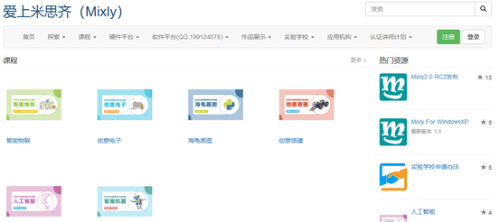

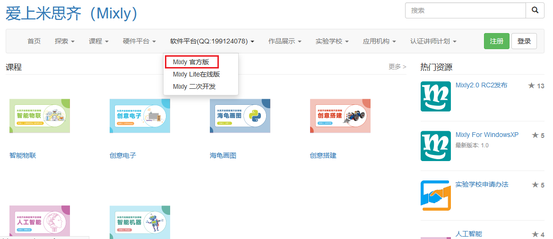

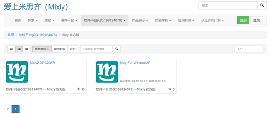

点击Mixly2.0版，再点击Mixly2.0 RC网盘文件下载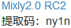。

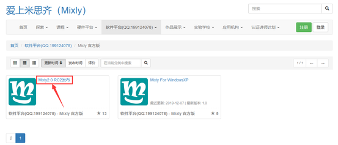

资料有四个系统版本的软件可以供选择，这里以Win10-x64版本为例，现在的电脑大部分都是Win10的系统，点击下载自己所需的软件版本。

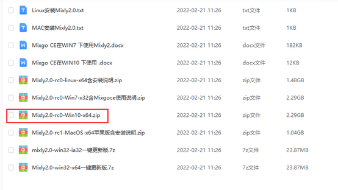

下载好的是米思奇软件的压缩包。压缩包下载好之后，解压到电脑的其中一个硬盘（建议不要放在系统盘，我这里是放到D盘），Mixly2.0版本不用安装，解压出来就可以用了。

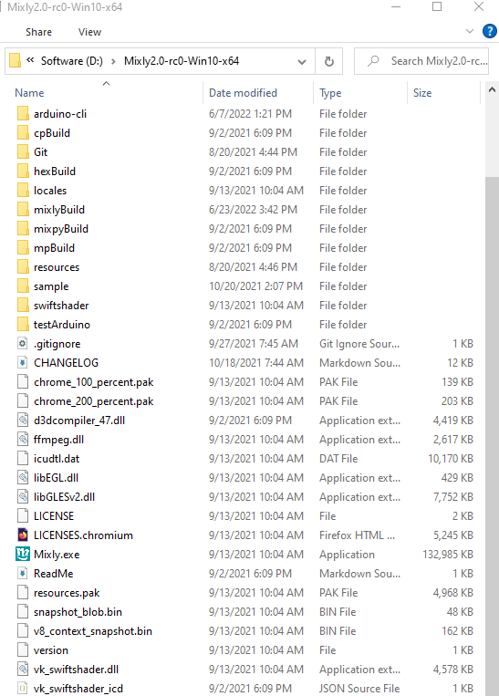

我们也在对应文件夹中提供下载好的米思奇软件压缩包，这样节省下载的时间，只要将我们提供的米思奇软件压缩包解压就行，Mixly2.0版本不用安装，解压出来就可以用了。我们提供的米思奇软件压缩包所在位置如下图所示：

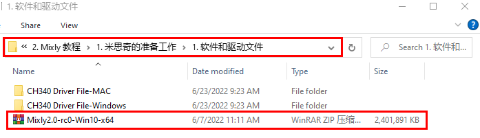

## 软件的更新

点击软件目录下的一键更新

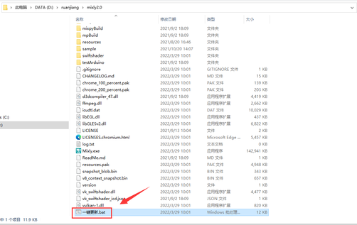

按提示输入“y”然后按下Enter键(回车键)即可自动安装，安装完成按下键盘的任意键即可退出。

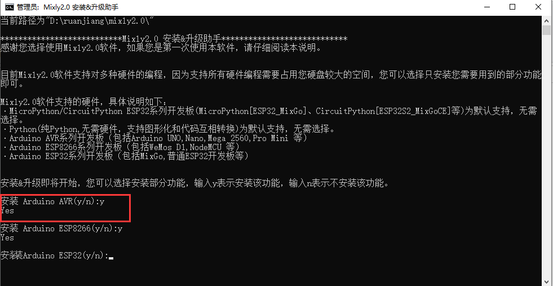

鼠标右键点击Mixly.exe 发送到电脑桌面，方便日后我们使用。

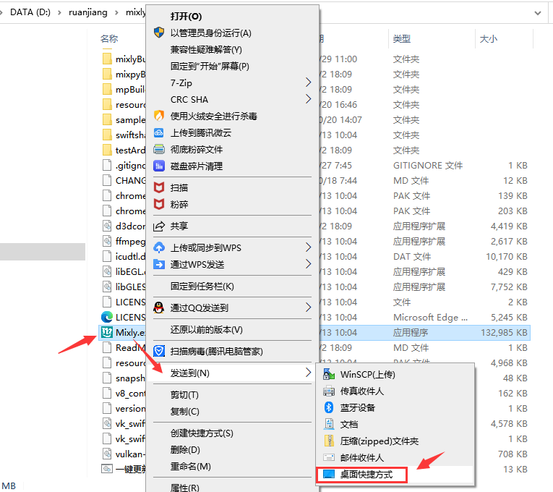

（3）米思奇软件介绍

米思奇（Mixly）是一个免费的开源图形Arduino编程软件，基于Google的图形化编程框架。它是创意电子开发的免费开源图形编程工具；是完整支持创意电子教育的生态系统；是创客教育者实现梦想的舞台。

安装好了米思奇（Mixly）软件后，我们点击电脑桌面上的mixly图标来打开软件，选择Arduino AVR。

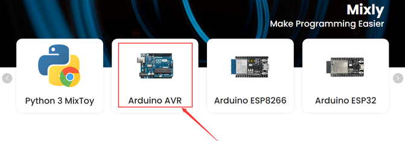

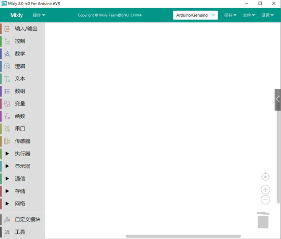

代码程序上传到Arduino开发板或者兼容板之前，必须先了解米思奇软件工具栏中出现的每个区和接口的功能。

界面布局

介绍面总的分为四大功能区域块。

1.基本功能块区

2.程序构建区

3.代码区

4.信息提示区

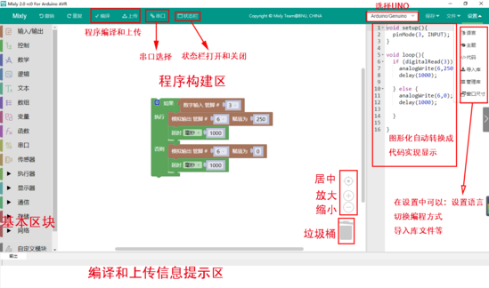

基本功能块区

输入输出: IO相关功能块

控制: 程序流程控制相关功能块

数学: 数学运算相关功能块

文本: 字符串操作相关功能块

数组: 数组相关功能块

逻辑: 逻辑关系的相关功能块

串口: 串口通信相关功能块

通信: 以太网,红外遥控等通讯功能块

储存: 数据储存相关功能块 (高级视图)

传感器: 通用传感器相关功能块

执行器: 通用执行器相关功能块

显示器: 显示相关功能块

以太网:以太网通讯功能块(高级视图)

变量: 变量操作相关功能块

函数: 函数相关功能块

自定义模块: 自定义代码功能块(高级视图)

程序建构区

该区域为程序功能拼接区域。将功能块从左侧块区拖入程序建构区进行拼接。该区域的右下角有个垃圾桶，可以将不用的代码拖进去删除，也可以将不用的代码直接往最左方拖拽（模块选择区），同样可以删除代码。当然，点击不用的代码后点击键盘
Delete也可将代码删除，还可以右键点击块选择删除块.

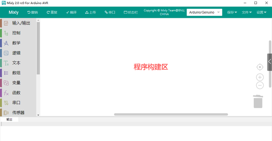

视图缩放

在垃圾桶的上方有两个图形，一个是 ⊕一个是Θ。该图形可放大或缩小程序构建区模块

的大小。在⊕的上方有一个按钮，这个按钮的功能是将模块的大小恢复至标准大小，并居中.

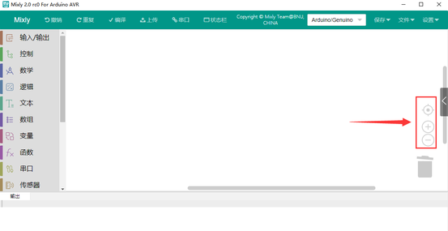

功能切换

语言切换:在该区域的右上角的设置中，还可以切换语言显示的种类。

主题切换:在设置中主题可以进行普通视图和高级视图来进行视图之间的切换。

编程方式切换：在设置中的代码可以切换编程方式。

撤消/重做:撤销功能是当编写代码时误删模块后，便可以点击左箭头或者直接按Ctrl+Z 来恢复误删代码；而重做则是和 Ctrl+Z 相反。

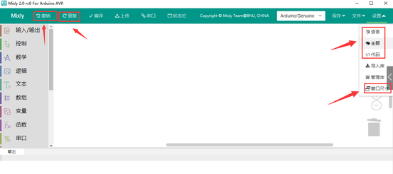

文件操作区

新建:新建项目文件

打开:打开项目文件

保存:保存项目文件

另存为:另存项目文件

导出库:导出当前项目为库文件

导入库:导入第三库文件

管理库:库的删除和重命名等操作

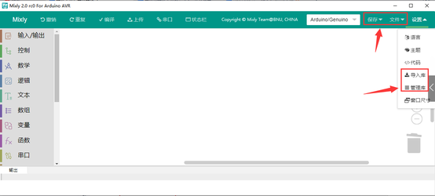

库文件是为了方便代码分享.将一个功能集成在个函数中。之后导出库文件.就可以分享给他人使用.

代码区

点击代码可以对当前模块自动生成的代码进行修改，修改后如不切换回图形区,进行编译和下载,将按照修改的代码进行编译或者下载.但如果切换回图形区.代码会恢复为图形区的代码.

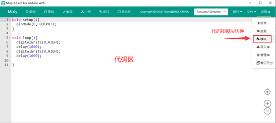

程序下载及串口监视

编译: 将程序编译为机器执行码.编译过程和结果会在信息显示区显示

上传: 编译程序并上传至主板,上传信息会在信息显示区显示.

主板选择: 选择主板类型及连接的端口

串口监视:
用于监视主板从串口发来的信息或者给主板发送信息.需编程.主要用于调试程序或者显示信息用.

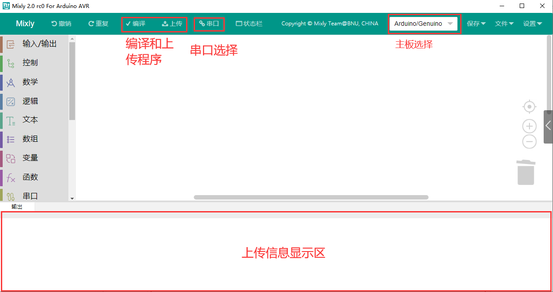需要注意的是在上传程序时请关闭串口监视窗口.否则会导致程序上传失败

（4）安装PLUS开发板驱动

第1小节 简单介绍keyes Nano CH340主板

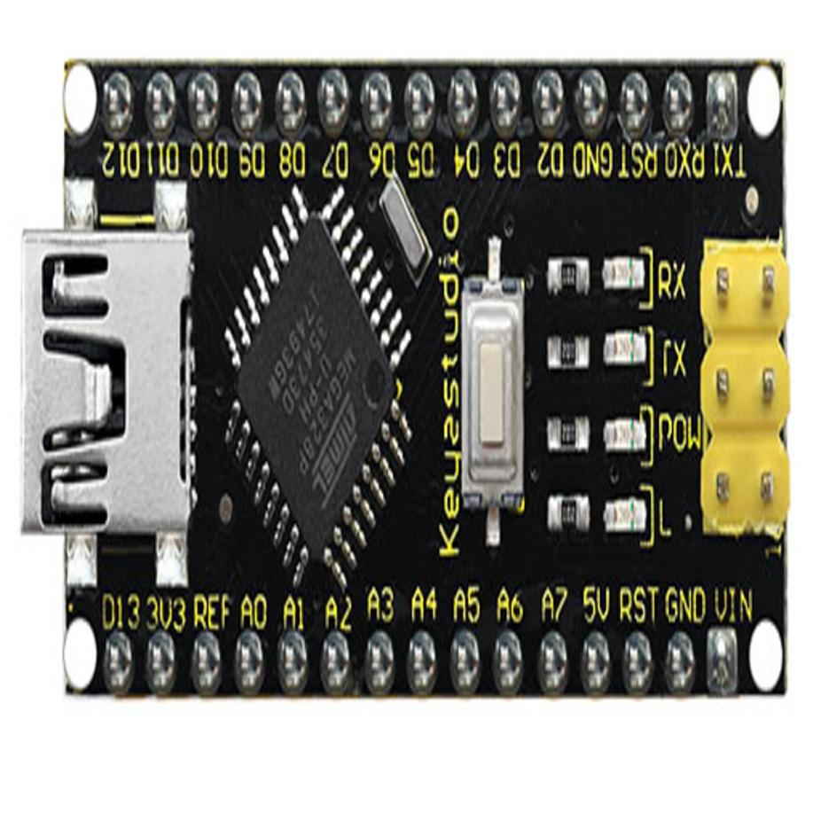

（1）项目介绍:

keyes Nano CH340主板是一款基于ATmega328P-AU的小型、完整、易于操作的主板。与ARDUINO NANO相比，keyes NANO使用的usb转串口芯片是CH340G，所以除了安装的驱动文件不一样，其他的使用方法完全一样。它有14个数字输入/输出引脚(其中6个可作为PWM输出)，8个模拟输入，一个16mhz晶体振荡器，一个迷你USB接口，一个ICSP接口和一个复位按钮。其中ICSP接口是用来给ATMEGA328P-AU烧录固件，由于这个该芯片我们在出厂前都以烧录好固件，所以一般不用。使用时我们可以利用miniUSB线供电，还可以利用排母接口Vin GND（DC 7-12V）供电。

（2）规格参数:

|微控制器|ATmega328P-AU|
|-|-|
|工作电压|5V|
|输入电压 (推荐)|DC7-12V|
|数字 I/O 引脚|14 (D0-D13) (其中6个提供PWM输出)|
|PWM 数字 I/O 引脚|6 (D3, D5, D6, D9, D10, D11)|
|模拟输入引脚|8 (A0-A7)|
|每个I/O引脚直流电流|40 mA|
|闪存|32 KB，其中2 KB由引导加载程序使用|
|静态存储器|2 KB|
|只读储存器|1 KB|
|时钟频率|16 MHz|
|内置LED|D13|

（3）各个接口和主要元件说明:

这里是一个解释图，每一个元件和接口是可以做什么:

|1|ICSP Header|是一个AVR，一个由MOSI，MISO，SCK，RESET，VCC和GND组成的的微型编程头。它通常被称为SPI（串行外设接口），可以被认为是输出的“扩展”。实际上，你是将输出设备从属到SPI总线的主机。连接电脑时，可以给ATMEGA328P-AU烧录固件。|
|-|-|-|
|2|LED indicator （RX）|控制板通过串口通信，接收到信息时，RX灯闪烁。|
|3|LED indicator （TX）|控制板通过串口通信，发送信息时，TX灯闪烁。|
|4|LED indicator （POW）|给控制板供电时，LED亮起，否则熄灭。|
|5|LED indicator （L）|当D13为高电平时，LED亮起，为低电平时，LED熄灭。|
|6|RX0（D0） TX1（D1） D2-D13|有14个数字I/O引脚（D0-D13）（其中6个提供PWM（脉宽调制）输出），这些引脚可配置为数字输入引脚，用于读取逻辑值（0或1）；或作为数字输出引脚来驱动不同的模块，如LED，继电器等。|
|7|RST|可外按键，和ResetButton功能一样。|
|8|MEGA 328P|每个控制板板都有自己的微控制器。你可以假设它作为板的大脑。微控制器通常是ATMEL公司的。在从Arduino IDE加载新程序之前，你必须知道你的板上有什么IC。此信息位于IC顶部。这个控制板的微控制器是ATMEGA328P-AU。有关IC结构和功能的更多详细信息，请参阅数据表。|
|9|MINI USB|利用mini USB线连接到电脑USB端口，可以给控制板供电，还可以给控制板上传程序。|
|10|3V3 pin|提供DC 3.3V 输出电压。|
|11|REF|代表模拟参考。它有时用于设置外部参考电压（0至5伏之间）作为模拟输入引脚的上限。|
|12|A0-A7|8个模拟引脚A0-A7|
|13|5V pin|提供DC 5V 输出电压。|
|14|GND|GND|
|15|VIN|外部输入DC 7-12V电压，给控制板供电。|
|16|Reset Button|可以重置你的控制板|
|17|CH340G|USB转串口芯片，将电脑USB信号转化成串口信号。|
|18|AMS1117|它将外部输入的DC 7-12V电压转化成DC 5V电压，然后将DC 5V电压转送给处理器和其他元件。|

（4）特殊功能接口说明：

串口通信接口：RX0、TX1

PWM接口（脉宽调制）：D3 D5 D6 D9 D10 D11

外部中断接口：D2(中断0)和D3 (中断)

SPI通信接口：D10为SS、D11为MOSI、D12为MISO、D13为SCK

IIC通信端口：A4为SDA、A5为SCL

第2小节 安装驱动

（注意：如果电脑已经安装了CH340驱动程序，则不需要再安装驱动；如果没有，则需要进行以下操作）

安装Arduino IDE后，我们就开始安装驱动。将Nano主板用USB线连接在电脑上，如果是Windows10系统电脑，电脑会自动安装驱动。如果是其他系统电脑，如Windows7系统电脑，则需要手动安装驱动。

Nano主板的USB转串口芯片为CH340G，我们需要安装这芯片的驱动，驱动为usb_ch341_3.1.2009.06。第一次将Nano主板通过USB线连接电脑上时，右键点击计算机→属性→设备管理器，显示如下图：

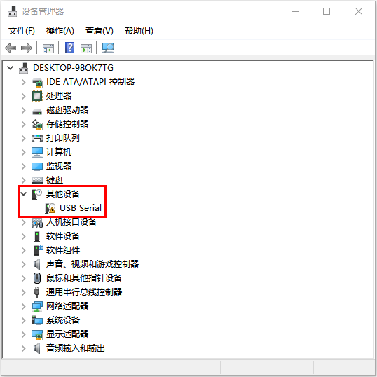

过一会儿后，Windows10系统一般会自动安装好USB-SERIAL CH340驱动的。但是，如果过一会儿后没有自动安装，则需要用手操作下，右键点击“USB2.0-Serial”，选择“更新驱动程序（P）”并点击。

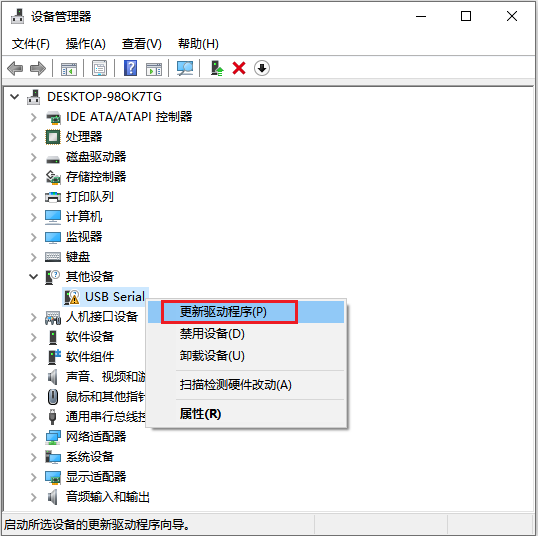

跳转到以下页面，选择“浏览我的电脑以查找驱动程序（R）”并点击。

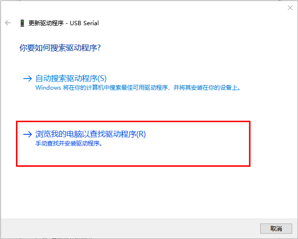

点击“浏览（R）...”选择“usb_ch341_3.1.2009.06 ”文件夹。

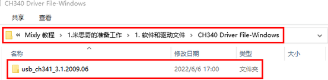

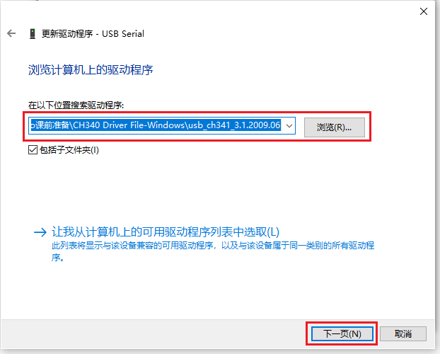

几秒种后，驱动安装完成后，需要单击“关闭”。

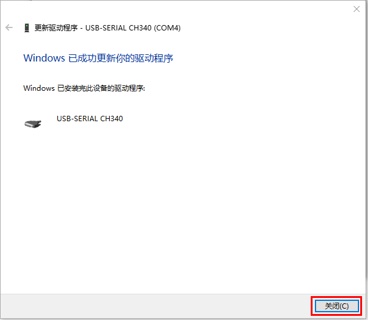

然后你可以右键单击“我的电脑”图标-\>单击“属性”-\>单击“设备管理器”-\>单击“端口”，你会看到设备如下图所示。

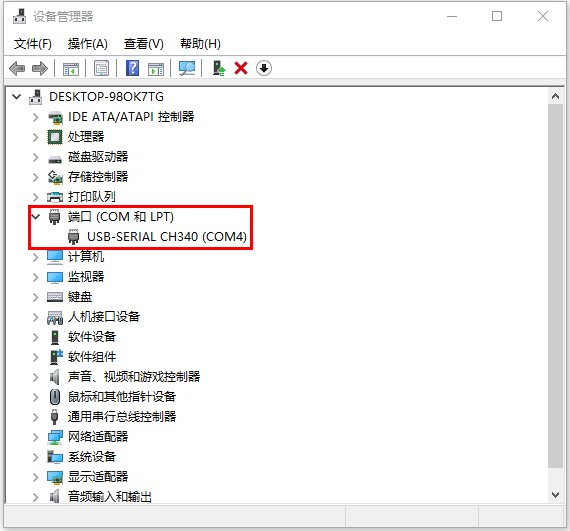

如果你的电脑系统不是Windows10系统，而是Windows其他系统的话，需要手动操作选择驱动文件来安装驱动。（这里需要使用我们提供的驱动“usb_ch341_3.1.2009.06”）

其CH340驱动安装操作过程和上面是相同的。

（5）导入KEYES智能小车的mixly库文件

打开米思奇软件，点击设置----\>导入库

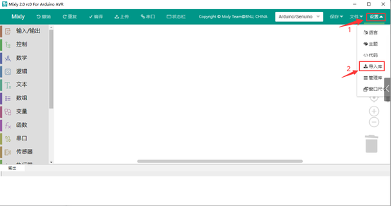

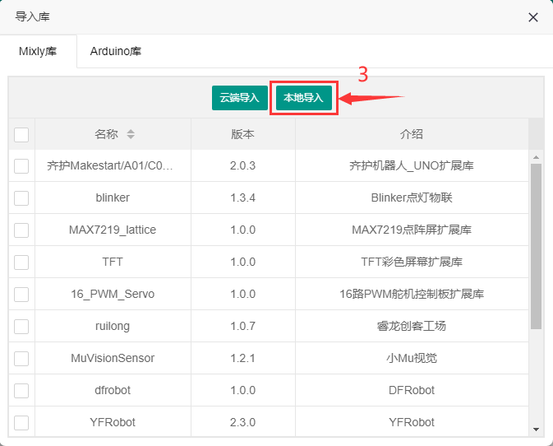

点击本地导入

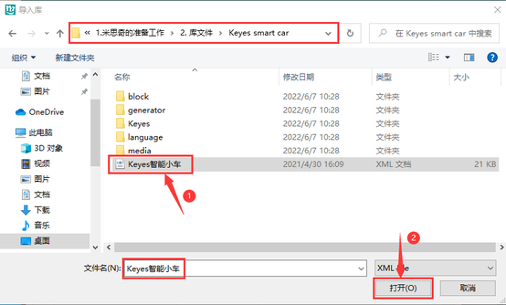

选择我们文件里提供的keyes智能小车文件，这样米思奇库文件就导入完成了。

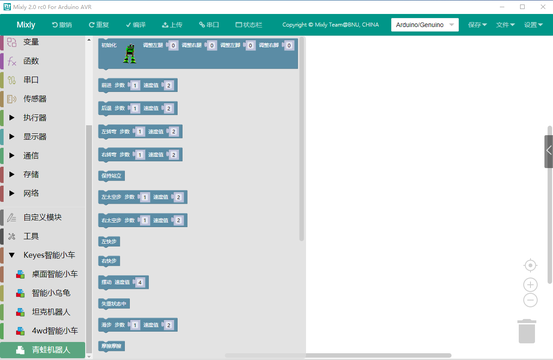
