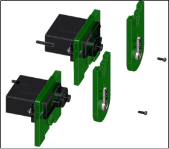
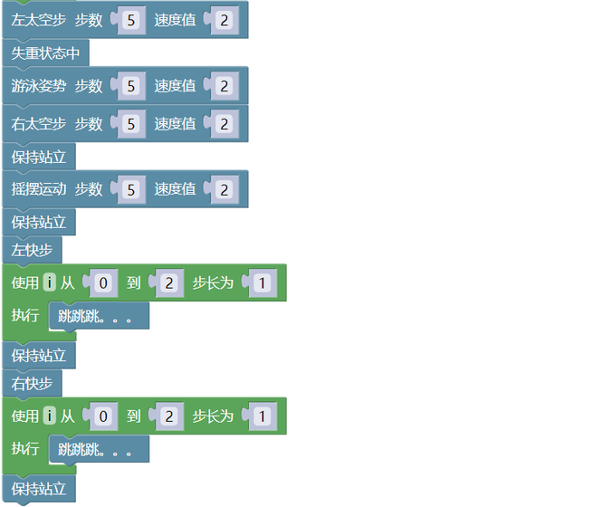
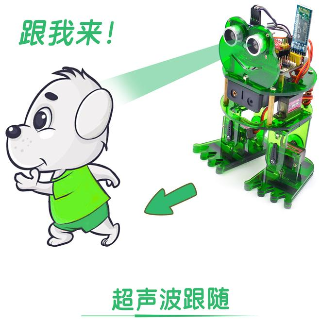
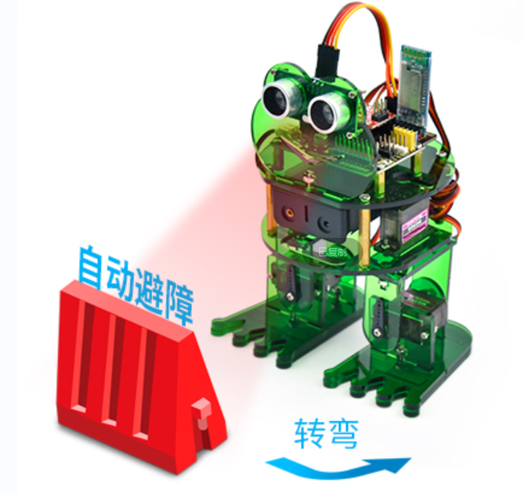
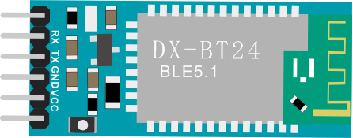
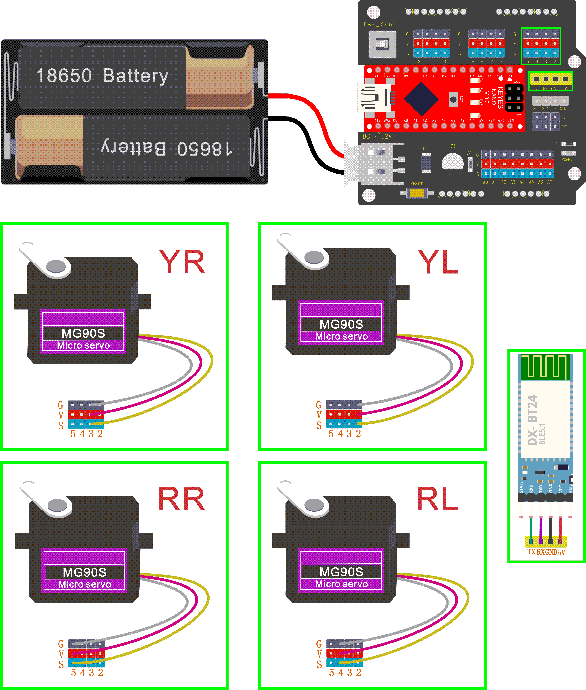

# Keyes Arduino青蛙机器人双足舞蹈步行

## 关于本教程：

多么神奇的奥托青蛙机器人要来了!

这个工具包提供了一个完美的机会来构建您的第一个机器人，它使学习机器人的过程容易，互动，和有趣!该工具包基于Keyes Nano CH340主板，兼容Arduino开源平台和Mixly Blocks编码。你可以编程自己的机器人走路，跳舞，避障和跟随障碍等，很容易构建和编程的。通过玩耍和实验，孩子们可以锻炼计算思维和编程思维，并将解决问题所需的技能付诸实践.

## 青蛙机器人特点：

（1）输入电压：DC 7-12V

（2）工作电压：5V

（3）最大输出电流：1.5A

（4）最大耗散功率：32W

（5）超声波感应角度：\<15度

（6）超声波探测距离：2cm-300cm

（7）自带超声波模块，检测前方障碍物距离，组成青蛙机器人跟随系统.

（8）自带DX-BT24 5.1蓝牙模块，可以和手机蓝牙配对遥控青蛙机器人。

（9）特别提供兼容安卓系统和mac系统的蓝牙APP。

（10）扩展板自带一些数字口和模拟口的3pin 接口和4pin接口，可外接其他传感器模块，扩展实验。

（11）扩展板自带I2C通信接口，可外接其他I2C通信模块，扩展实验。

## 青蛙机器人清单：

当我们收到这个青蛙机器人套件的时候，我们首先看到是一个包装精美的外盒，每个配件被安全且有序的装在外盒里面的小盒子里，对，你收到的就是这样一堆散装的配件和螺丝。我们先来清点一下：

|序号|产品名称|数量|图片|
|-|-|-|-|
|1|Keyes nano ch340 主板|1||
|2|AM/mini5P透明蓝 OD:5.0 L=30cm|1||
|3|keyestudio NANO 扩展板|1||
|4|DX-BT24 V5.1 BLE蓝牙模块 上电不打印数据|1||
|5|HC-SR04超声波传感器|1||
|6|18650双节15CM露线适用DIY小车+双头JST-PH2.0MM-2P红黑线(总线长115MM)|1||
|7|M1.6*10MM 圆头 十字螺丝|4||
|8|M1.6 304不锈钢螺母|4||
|9|M3*6MM 圆头 十字螺丝|16||
|10|M3*10MM 圆头 十字螺丝|10||
|11|M3*10MM 平头 十字螺丝|3||
|12|M3 镀镍螺母|14||
|13|M2*10MM 圆头 十字螺丝|8||
|14|M2 镀镍 螺母|12||
|15|M1.2X5MM 自攻螺丝|12||
|16|M3 304材质|2||
|17|双通M3*10MM|4||
|18|双通M3*30MM|4||
|19|小青蛙套件亚克力 3片 215*120MM T=3MM 绿色透明 环保|1||
|20|辉盛舵机 MG90S（14g）23*12.2*29mm(黑色) 180度 环保|4||
|21|母对母10CM/40P/2.54/12股铜丝24号线|1||
|22|手柄颜色黄黑3*40MM十字螺丝刀|1||
|23|红膜透明亚克力双面胶|1||
|24|法兰轴承|2||
|25|扎带|3||

1.  Mixly软件下载安装，CH340驱动安装和Mixly库文件添加

本教程的Mixly软件下载安装，CH340驱动安装和Mixly库文件添加都在“1.
米思奇的准备工作”文件夹中。如果Mixly软件已经下载安装好，CH340驱动也已经安装好和Mixly库文件也添加好了，就跳过这一步；否则，进入项目课程之前需要先将Mixly软件下载安装好，CH340驱动也要安装好和Mixly库文件也需要添加好才能进入下面的项目课程。本教程的Arduino软件下载安装方法，CH340驱动安装方法和Mixly库文件添加方法及软件如下所示：

## 在Mixly2.0文件夹中的“libraries”文件夹中添加一些额外库

（1）打开解压好的Mixly2.0-rc0-Win10-x64
文件夹并且进入该文件夹，在“Mixly2.0-rc0-Win10-x64”文件夹中点击“arduino-cli”文件夹并且进入，在“arduino-cli”文件夹中选择点击“libraries”文件夹并且进入，在“libraries”文件夹中可以看到很多库。

（2）将“4.额外的库”文件夹中的库文件“Oscillator”和“SR04”都复制粘贴到上面第（1）步打开的“libraries”文件夹中。

这样，额外的库文件“Oscillator”和“SR04”添加成功。这两个库文件一定要添加，否则代码程序上传不成功。

## 硬件项目：

当你通过每个项目的工作方式，你将学习如何编程机器人移动，舞蹈，和跟随障碍等。

### 项目 1: Keyes NANO CH340主板

（1）项目介绍:

keyes Nano CH340主板是一款基于ATmega328P-AU的小型、完整、易于操作的主板。与ARDUINO NANO相比，keyes NANO使用的usb转串口芯片是CH340G，所以除了安装的驱动文件不一样，其他的使用方法完全一样。它有14个数字输入/输出引脚(其中6个可作为PWM输出)，8个模拟输入，一个16mhz晶体振荡器，一个迷你USB接口，一个ICSP接口和一个复位按钮。其中ICSP接口是用来给ATMEGA328P-AU烧录固件，由于这个该芯片我们在出厂前都以烧录好固件，所以一般不用。使用时我们可以利用miniUSB线供电，还可以利用排母接口Vin GND（DC 7-12V）供电。

（2）规格参数:

|微控制器|ATmega328P-AU|
|-|-|
|工作电压|5V|
|输入电压 (推荐)|DC7-12V|
|数字 I/O 引脚|14 (D0-D13) (其中6个提供PWM输出)|
|PWM 数字 I/O 引脚|6 (D3, D5, D6, D9, D10, D11)|
|模拟输入引脚|8 (A0-A7)|
|每个I/O引脚直流电流|40 mA|
|闪存|32 KB，其中2 KB由引导加载程序使用|
|静态存储器|2 KB|
|只读储存器|1 KB|
|时钟频率|16 MHz|
|内置LED|D13|

（3）各个接口和主要元件说明:

这里是一个解释图，每一个元件和接口是可以做什么:

|1|ICSP Header|是一个AVR，一个由MOSI，MISO，SCK，RESET，VCC和GND组成的的微型编程头。它通常被称为SPI（串行外设接口），可以被认为是输出的“扩展”。实际上，你是将输出设备从属到SPI总线的主机。连接电脑时，可以给ATMEGA328P-AU烧录固件。|
|-|-|-|
|2|LED indicator （RX）|控制板通过串口通信，接收到信息时，RX灯闪烁。|
|3|LED indicator （TX）|控制板通过串口通信，发送信息时，TX灯闪烁。|
|4|LED indicator （POW）|给控制板供电时，LED亮起，否则熄灭。|
|5|LED indicator （L）|当D13为高电平时，LED亮起，为低电平时，LED熄灭。|
|6|RX0（D0） TX1（D1） D2-D13|有14个数字I/O引脚（D0-D13）（其中6个提供PWM（脉宽调制）输出），这些引脚可配置为数字输入引脚，用于读取逻辑值（0或1）；或作为数字输出引脚来驱动不同的模块，如LED，继电器等。|
|7|RST|可外按键，和ResetButton功能一样。|
|8|MEGA 328P|每个控制板板都有自己的微控制器。你可以假设它作为板的大脑。微控制器通常是ATMEL公司的。在从Arduino IDE加载新程序之前，你必须知道你的板上有什么IC。此信息位于IC顶部。这个控制板的微控制器是ATMEGA328P-AU。有关IC结构和功能的更多详细信息，请参阅数据表。|
|9|MINI USB|利用mini USB线连接到电脑USB端口，可以给控制板供电，还可以给控制板上传程序。|
|10|3V3 pin|提供DC 3.3V 输出电压。|
|11|REF|代表模拟参考。它有时用于设置外部参考电压（0至5伏之间）作为模拟输入引脚的上限。|
|12|A0-A7|8个模拟引脚A0-A7|
|13|5V pin|提供DC 5V 输出电压。|
|14|GND|GND|
|15|VIN|外部输入DC 7-12V电压，给控制板供电。|
|16|Reset Button|可以重置你的控制板|
|17|CH340G|USB转串口芯片，将电脑USB信号转化成串口信号。|
|18|AMS1117|它将外部输入的DC 7-12V电压转化成DC 5V电压，然后将DC 5V电压转送给处理器和其他元件。|

（4）特殊功能接口说明：

串口通信接口：RX0、TX1

PWM接口（脉宽调制）：D3 D5 D6 D9 D10 D11

外部中断接口：D2(中断0)和D3 (中断)

SPI通信接口：D10为SS、D11为MOSI、D12为MISO、D13为SCK

IIC通信端口：A4为SDA、A5为SCL

### 项目 2: keyestudio NANO 扩展板

（1）说明：

keyes Nano ch340作为一款小巧的基于arduino平台的控制板，一直深受大家的喜爱。但是，当keyes Nano ch340主板需要连接多个传感器模块，当keyes Nano ch340主板需要外接电源时，需要用到面包板接线。接线很不方便。

为此，我们特别设计了这款扩展板，它完全兼容keyes Nano ch340主板。这款扩展板不但将keyes Nano ch340主板上的数字口和模拟口扩展成GND 5V
信号端3PIN接口（2.54间距排针引出），还引出了一些常用的通信接口，如串口通信、I2C通信，大大方便了keyes Nano ch340和其他传感器模块的连接。扩展板还自带有一个电源指示灯和一个复位按键。

同时为方便外接电源，扩展板上自带一个PH2.0-2P接口（输入DC 7-12V），自带一个自锁开关（Power_Switch），用于控制电源开关。为方便给其他传感器供电，扩展板自带3路DC 3.3V电源输出端（2.54间距排针引出）。为方便将扩展板将扩展板固定在其他设备，扩展板自带4个直径为3mm的定位孔。

（2）特点：

A.将12路数字口扩展板成3pin 接口

B.将8路模拟口扩展板成3pin 接口

C.自带1个串口通信接口（蓝牙模块接口）

D.自带1个I2C通信接口

E.自带3路DC 3.3V电源输出接口

F.自带1个电源指示灯和1个复位按键

G.自带1个外接电源接口（PH2.0-2P）和1个控制按键

（3）相关参数：

输入电压：DC 7-12V

电源接口：PH2.0-2P

排针/排母间距：2.54mm

定位孔大小：直径 3mm

尺寸：575417mm

重量：20.4g

（4）兼容控制器：

keyes Nano ch340

（5）引脚说明：

（6）使用方法：

只需将keyes Nano ch340主板堆叠到keyestudio Nano扩展板上。通过白色接头用电池供电。

### 项目 3: 调节舵机角度 

1.  简介：

在青蛙机器人DIY的过程中，青蛙机器人的每个关节都有一个180的舵机。我们可以控制每个关节处的舵机进行不同角度的旋转，从而控制青蛙机器人进行不同的动作。在本课程中，我们将重点介绍青蛙机器人套件中舵机的原理和使用。舵机是一种位置伺服驱动器，可以在0到180度之间旋转。如果你想让你的机器人助手帮你拿一本书，机器人手臂旋转角度太大或太小，以致无法拿起书。只有角度刚刚好，才能完成取书的任务，所以才需要准确地控制关节处的舵机角度。

舵机是一种位置控制的旋转执行器。它主要由外壳、电路板、无芯电机、齿轮和位置传感器组成。
还包括与您的舵机装在一起的各种黑色轴。

2.  工作原理:

舵机的工作原理是由接收机或者单片机发出信号给舵机，其内部有一个基准电路，产生周期为20ms，宽度为1.5ms的基准信号，将获得的直流偏置电压与电位器的电压比较，获得电压差输出。

舵机有很多规格，但所有的舵机都有外接三根线，分别用棕、红、橙三种颜色进行区分，由于舵机品牌不同，颜色也会有所差异，棕色为接地线，红色为电源正极线，橙色为信号线。

舵机的转动的角度是通过调节PWM（脉冲宽度调制）信号的占空比来实现的，标准PWM（脉冲宽度调制）信号的周期固定为20ms（50Hz），理论上脉宽分布应在1ms到2ms之间，但是，事实上脉宽可以在0.5ms 到2.5ms之间，脉宽和舵机的转角0°～180°相对应。所以，舵机的信号线最好接到PWM数字口。但请注意，对于不同品牌的电机，相同的信号可能有不同的旋转角度。

我们可以在Mixly blocks软件中设置相应引脚的HIGH/LOW，从而调整伺服角度;此外，我们还专门创建了机器人库，以简化的代码方便地控制伺服角度。

3.  规格参数：

工作电压：DC 4.8V〜6V

可操作角度范围：大约 About 180°(在 500→2500 μsec)

脉波宽度范围：500→2500 μsec

空载转速：0.12±0.01 sec/60（DC 4.8V） 0.1±0.01 sec/60（DC 6V）

空载电流：200±20mA（DC 4.8V） 220±20mA（DC 6V）

停止扭力：1.3±0.01kg·cm（DC 4.8V） 1.5±0.1kg·cm（DC 6V）

停止电流：≦850mA（DC 4.8V） ≦1000mA（DC 6V）

待机电流：3±1mA（DC 4.8V） 4±1mA（DC 6V）

导线长度：250 ± 5 mm

外观尺寸：22.912.230mm

重量:9± 1 g (without servo horn)

保存温度:-20℃〜60℃

操作温度:-10℃〜50℃

4.  接线图：

只需将keyes Nano ch340主板堆叠到keystudio Nano扩展板。连接舵机引脚到数字引脚4 。

5. 测试代码：

测试舵机在0°到180°之间的运动角度。

（1）代码编写步骤：

先从“控制”模块中拖出指令方块，将从1到10改成0到180，步长1不变。再从“Keyes智能小车”下的“青蛙机器人”模块中拖出指令方块，这个指令方块的库文件中已经设置了脉冲宽度，管脚0可以改成任意的数字口数字，由于这里的舵机信号线是接在数字口4，所以将管脚0改成4，从“变量”模块中拖出变量“i”方块放入角度0方框，延时可以设置任意时间的，这里设置延时200毫秒。这样，舵机从0°每增加1°慢慢地转到180°。复制这段代码串一遍，把从0到180改成180到0，步长1改成-1，其他的不变。这样，代码编写完成，接着上传代码程序。

（2）完整的代码：

6. 测试结果：

上传代码成功，按下Power_Switch按键，舵机将在0°到180°之间来回旋转。

7. 知识点：

（1）在代码中定义舵机设置；4代表舵机信号端是D4；是使用代码中自带的自定义变量，这里用于控制舵机角度，由于舵机角度范围是0°-180°，的设置范围也是0-180；200代表的是设置角度后延迟200毫秒。

（2）代码中代表数字i从0直接增加到180，每一步增加了1，同样

代表i从180直接减小到0，每一步减小了1。

8.  扩展练习：

参考测试代码，重新设置接口，设置舵机来回摆动的速度。

（提示：有两种方法，一种是调整每次设置舵机角度的延时；一种是调节增加/减少的步数，需要能被180整除，如2、3、5等。）

  

### 项目 4: 超声波检测的障碍

1.  简介：

触发信号后，超声波模块发出超声波。当超声波遇到物体并被反射回来时，模块输出一个回波信号，因此它可以从触发信号和回波信号的时间差来确定物体的距离。我们可以用超声波传感器来探测前方是否有障碍物。通常用于测量前方障碍物与机器人之间的距离。在机器人DIY的过程中，我们可以利用超声波传感器测量到的距离来构建功能机器人，如自动躲避、跟随等。

在实验中，我们使用超声波传感器测量机器人与前方障碍物之间的距离。下图是一个超声波模块。

2.  规格参数：

工作电压：5V（DC）

工作电流：15mA

工作频率：40khz

最大探测距离：3-5m

最小探测距离：2cm

感应角度：不大于15度

高精度：可达3mm

3.  接线图：

将超声波传感器连接到NANO扩展板上，VCC引脚连接到5V(V)，
Trig引脚连接到数字6 (S)， Echo引脚连接到数字7 (S)，
GND引脚连接到GND(G)；然后将keyes Nano ch340主板堆叠到NANO扩展板上。

4.  测试代码：

（1）代码编写步骤：

从“控制”模块中拖出方块，从“串口”模块中拖出指令方块和，并且将方块移入方块中，然后从“Keyes智能小车”下的“青蛙机器人”模块中拖出指令方块放入指令方块中，从“控制”模块中拖出方块，设置延时200毫秒。这样，代码编写完成，接着上传代码程序。

（2）完整的代码：

5.  测试结果：

上传代码成功，按下NANO扩展板上的Power_Switch按键。点击打开串口监视器，选择串口和设置波特率为9600。点击，将你的手或一个大的、扁平的物体移近或移远超声波传感器。当物体接近或远离时，监视器将显示从传感器读取的距离(单位:厘米)。

6.  知识点：

（1）代码中的代表超声波模块测得模块与前方障碍物的距离，单位为cm。

（2）代码中的表示设置波特率为9600,
代码块是代表在串口监视器中显示距离数值，这里代码设置的是自动换行，如果是就不是自动换行。

代码中的是延迟时间指令方块，单位为毫秒。

7.  扩展练习：

（1）在串口监视器显示时，添加一些文字说明或者距离单位（cm）,使显示数据不那么单薄。

（2）更改波特率或延时时间等，在这里是延时时间的，看下显示效果。

## 青蛙机器人项目：

让我们开始组装可爱的青蛙机器人，让它移动、跳舞，甚至跟随物体。通过蓝牙APP轻松操作机器人!
遵循这个简单的指导，如何安装和编程你的青蛙机器人呢？

### 青蛙机器人组装 

制作青蛙机器人的所有部件都包含在工具包中，组装它们很容易，通常需要大约半小时左右。

注意:

在安装青蛙机器人之前，首先需要调节4个舵机到90°，然后将4个舵机连接到Nano扩展板上；分别将4个舵机连接到数字引脚5、4、3、2，再把keyes Nano ch340主板堆叠到Nano扩展板上。

舵机初始化代码:

上传下面的代码，将4个舵机都转到90°的位置。(参考项目3)

（1）代码编写步骤：

从“Keyes智能小车”下的“青蛙机器人”模块中拖出指令方块并复制三遍，管脚0分别改成2、3、4和5，角度0都改成90，延时都设置500毫秒。这样，代码编写完成，接上外界电源后，上传代码程序。

（2）完整的代码：

4个舵机都初始化完后，接下来开始组装青蛙机器人，组装步骤如下：

#### 固定脚 

材料：①、两片青蛙脚背亚克力。

②、一卷亚克力胶带。

工具：①、一把剪刀（自备）。

安装：将亚克力外皮纸撕下，用剪刀把亚克力胶带剪成6小段，贴到亚克力上，如右图A-1。

注意：脚背亚克力两只脚丫子向外。

材料：①、A-1亚克力组件。

②、两片脚底板亚克力。

工具：①、一把剪刀（自备）。

安装：将亚克力外皮纸撕下，用剪刀把亚克力胶带的另一面膜撕下，贴合到亚克力上，如右图A-2。

注意：螺丝孔位对齐。

安装：以上安装可得到亚克力组件A，如右图A。

#### 把腿固定在脚上

材料：①、2个M3X10十字螺丝。

②、2个M3防松螺母。

③、2个φ8X3法兰轴承。

④、4片亚克力。

工具：①、一把M3螺丝刀。

②、M3小扳手（自备）。

安装：将亚克力外皮纸撕下，按照图B-1中排列安装，无需拧紧螺丝，保证两片亚克力能旋转，如右图B-1。

材料：①、4个M2X10十字螺丝。

②、4个M2螺母。

③、2个9G舵机。

④、2片亚克力。

工具：①、一把M3螺丝刀。

安装：将亚克力外皮纸撕下，按照图B-2中排列安装，注意舵机的安装方向靠里，拧紧螺丝，舵机保证已调好的90°。如右图B-2。

材料：①、4个M1.2X5自攻螺丝。

②、2个9G舵机单边支架。

③、2片亚克力。

工具：①、一把M3螺丝刀。

安装：将亚克力外皮纸撕下，按照图B-3中排列安装，拧紧螺丝。如右图B-3。

材料：①、B-2组件。

②、B-3组件。

③、2个舵机包里的M2X4螺丝。

工具：①、一把M3螺丝刀。

安装：准备两个装好的组件，按照图B-4中排列安装，拧紧螺丝，保证舵机的90°方向。如右图B-4。

材料：①、A组件。

②、B-1组件。

③、B-4组件。

④、4个M3X10 十字螺丝。

⑤、4个M3螺母。

工具：①、一把M3螺丝刀。

安装：准备三个装好的组件，按照图A-B中排列安装，同样的方法安装两条腿，拧紧螺丝，注意孔位对齐。如右图A-B。

#### 固定头部到身体

材料：①、4个M1.6X10螺丝。

②、4个M1.6螺母。

③、1块超声波板子。

④、1块青蛙脸部亚克力。

工具：①、一把M3螺丝刀。

安装：将亚克力外皮纸撕下，按照图C-1中排列安装，拧紧螺丝，注意孔位对齐。如右图C-1。

材料：①、4个M3X30双通铜柱。

②、4个M3X6螺丝。

③、1块青蛙头部亚克力。

工具：①、一把M3螺丝刀。

安装：将亚克力外皮纸撕下，按照图C-2中排列安装，拧紧螺丝，注意铜柱在logo的同一面，保持孔位对齐。如右图C-2。

材料：①、4个M3X10双通铜柱。

②、4个M3X6螺丝。

③、安装好的C-2组件。

工具：①、一把M3螺丝刀。

安装：准备好材料，按照图C-3中排列安装，拧紧螺丝，注意铜柱在logo的背面，保持孔位对齐。如右图C-3。

材料：①、安装好的C-1组件。

②、安装好的C-3组件。

③、1个M3X10平头螺丝。

④、1个M3螺母。

工具：①、一把M3螺丝刀。

安装：将M3螺母卡到十字型的亚克力孔上，用螺丝从底下将两片亚克力固定在一起，按照图C-4中排列安装，注意保持孔位对齐，适当力拧螺丝，避免亚克力断裂。如右图C-4。

材料：①、安装好的C-4组件。

②、1个18650电池盒。

③、2个M3X10平头螺丝。

④、2个M3螺母。

工具：①、一把M3螺丝刀。

安装：将电池盒孔对齐亚克力孔，用螺丝从底下向上固定，按照图C-5中排列安装，注意保持孔位对齐，电池盒方向的线在logo的下边。如右图C-5。

材料：①、安装好的C-5组件。

②、1块NANO控制主板。

③、4个M3X6十字螺丝。

④、一块NANO拓展板。

工具：①、一把M3螺丝刀。

安装：将NANO扩展板的四个孔对齐4个M3X10双通铜柱孔，按照图C中排列安装，注意保持孔位对齐，用M3螺丝刀向下适当力拧螺丝固定。再将NANO控制主板堆叠在NANO扩展板上。如右图C。

#### 国定舵机到身体上

材料：①、4个M2X10螺丝。

②、4个M2螺母。

③、2个9G舵机。

④、1块青蛙头部底板亚克力。

工具：①、一把M3螺丝刀。

安装：将亚克力外皮纸撕下，用螺丝从底下向上固定舵机的两个孔，按照图D-1中排列安装，注意保持孔位对齐，舵机的旋转轴在同一侧，舵机保证90°。如右图D-1。

材料：①、4个M1.2X5自攻螺丝。

②、2个舵机一字支架。

③、2块工字亚克力板。

工具：①、一把M3螺丝刀。

安装：将亚克力外皮纸撕下，用螺丝从右向左固定舵机支架的两个孔，按照图D-2中排列安装，注意保持孔位对齐。如右图D-2。

材料：①、1块D-1组件。

②、1块D-2组件。

③、2个舵机包里的M2X4 螺丝。

工具：①、一把M3螺丝刀。

安装：将D-2组件支架卡入舵机旋转轴，用M2X4螺丝固定舵机支架，按照图D中排列安装，注意保持舵机的90°状态（安装舵机配件前，舵机角度已经调节为90°角度，不能手动更改。也许舵机设置为90度时，也没能和连接块以90度安装起来，不过没关系，只需要尽量接近90度，后面再在程序里调整角度）。如右图D。

#### 完整的青蛙机器人

材料：①、1块A-B组件。

②、1块D组件。

③、4个M3X10 十字螺丝。

④、4个M3螺母。

工具：①、一把M3螺丝刀。

安装：将D组件支架舵机旋转90°如图A-B-D，在将组件带螺母亚克力卡位卡入，用M3X10螺丝从上向下拧紧，按照图A-B-D中排列安装，同样的办法安装好青蛙的两条腿，注意螺丝拧紧时不宜用力过度，保证亚克力不断裂。如右图A-B-D。

材料：①、1块A-B-D组件。

②、1块C组件。

③、4个M3X6 十字螺丝。

工具：①、一把M3螺丝刀。

安装：将A-B-D组件支架舵机旋转90°如图A-B-C-D，再将C组件的4根铜柱对应A-B-D组件的孔，从下向上用M3X6螺丝锁紧固定，按照图A-B-C-D中排列安装，同样的办法安装固定好4个螺丝，保证亚克力不断裂。如右图A-B-C-D。这样，青蛙机器人已安装完全了，剩下的就是接线部分了。

#### 接线图：

先将keyes Nano ch340主板堆叠到keyestudio NANO
扩展板上，然后用4根母对母杜邦线将HC-SR04超声波传感器模块连接到keyestudio NANO
扩展板上，超声波传感器的VCC引脚连接至5V(V)，Trig引脚至数字6(S)，Echo引脚至数字7(S)，Gnd引脚至Gnd(G)（超声波传感器布线可以参考项目
4）

将舵机的棕色线是与Gnd(G)相连，红色线与5v(V)相连，橙色线是分别与数字口5,4,3,2相连的。

(4个舵机的接线可以参考项目3)

4个舵机控制接口可以参考下图:

         ---------------
        |     O   O     |
        |---------------|
YR D3==> |             |   <== YL D2
         ---------------
            ||     ||
            ||     ||
RR D5==>  -----   ------   <== RL D4
         |-----   ------|

插入DX-BT24 V5.1 BLE蓝牙模块，引脚头TX, RX, GND, 5V在Keyestudio NANO扩展板上。

|Keyestudio NANO扩展板|DX-BT24 V5.1 BLE蓝牙模块|
|-|-|
|TX|RXD|
|RX|TXD|
|GND|GND|
|5V|VCC|

### 项目 5: 行走

1.  设计思路：

完成机器人组装后，你会看到机器人上的4个舵机连接到keyestudio Nano
扩展板上。我们前面已经介绍了如何调整舵机角度的相关知识。在电路中，我们将利用keyestudio Nano 扩展板使4个舵机进行不同角度的切换，从而控制青蛙机器人行走起来。

2.  青蛙是如何工作的?

设计青蛙机器人，需要设计4个舵机的安装位置，以及对应的控制接口。舵机的详细安装位置，我们可以参考前面的安装方法，控制接口可以参考下图。

         ---------------
        |     O   O     |
        |---------------|
YR D3==> |             |   <== YL D2
         ---------------
            ||     ||
            ||     ||
RR D5==>  -----   ------   <== RL D4
         |-----   ------|

3.  接线图:

只需将keyes Nano ch340主板堆叠到keystudio Nano扩展板上。将4个舵机与数字引脚2,3,4,5分别连接。

其中最重要的一步是通过程序对机器人中使用的舵机进行调整。这里的调整决定了青蛙行走和各种姿势的质量:

首先要对青蛙机器人的舵机进行调整，因为在安装舵机时会出现了误差。先调整D2引脚的舵机，调整到正值，这样它就会旋转到青蛙机器人的右边。先从“控制”模块中拖出方块，再从“Keyes智能小车”下的“青蛙机器人”模块中拖出指令方块

放入方块中得到代码块，腿和腿后面方框填入的数字都是用来设置青蛙机器人的腿和脚对应的舵机转动的角度，例如在这里设置调整左腿后面方框中的数字0为10
时，其他的不变，上传代码后，青蛙机器人的左腿就会往右边的方向转动10°。

相反，设置调整左腿后面方框中的数字0为-10时，其他的不变，上传代码后，左腿就会往青蛙机器人的左边转动10°。（注意：在上传程序代码前，需要把蓝牙模块取下，否则代码会上传失败。需要上传代码成功后，再连接蓝牙模块。）

调整D3引脚的舵机，和调整D2引脚的舵机的方向一样，调整右腿 。

调整D4引脚的舵机，和调整D2引脚的舵机的方向一样，调整左脚 。

调整D5引脚的舵机，和调整D2引脚的舵机的方向一样，调整右脚 。

对于D3引脚舵机、D4引脚舵机和D5引脚舵机的方向调整，自己改下对应的值，就可以了。

现在已经学会了怎么设置D2、D3、D4和D5引脚的舵机转动角度吧。由于我们每个人组装青蛙机器人的时候，不一定会安装的非常直立状态，需要先对青蛙机器人直立最佳状态调整。

4.  测试代码:

（1）代码编写步骤：

先从“控制”模块中拖出方块，再从“Keyes智能小车”下的“青蛙机器人”模块中拖出指令方块放入方块，以我安装的青蛙机器人状态设置调整左腿为0，调整右腿为5，调整左脚为-5，调整右脚为-5，使青蛙机器人达到直立最佳状态的初始化。你们也可以根据你们安装的青蛙机器人实际情况设置腿和脚后面方框的数字来达到最佳直立状态。

设置好了初始状态后，想要青蛙机器人前进5步，后退5步，站立停止1秒，左转弯5步，右转弯5步，站立停止1秒的程序怎么编写呢？从“青蛙机器人”模块中拖出指令方块，把步数1改成5，速度值是可以任意改变的，这里默认速度值为2，这样青蛙机器人会以速度值为2前进5步，接着拖出指令方块，速度值为2不变，把步数1改成5，拖出指令方块，从“控制”模块中拖出方块，然后又分别拖出指令方块、和，速度值都不变，把步数1都改成5，再从“控制”模块中拖出方块。

这样，青蛙机器人前进5步，后退5步，站立停止1秒，左转弯5步，右转弯5步，站立停止1秒的程序代码全部编写好了。上传程序代码，看看效果吧。

（注意：应先上传代码成功，再插入蓝牙模块。否则，代码上传失败。）

（2）完整的代码：

5.  实验结果：

上传代码完成后，按下 Nano
扩展板上的Power_Switch按键后。青蛙机器人准备向前走5步，后退5步，保持站立1秒，向左转5步，向右转5步，保持站立1秒，交替循环。

### 项目 6: 跳舞

1.  设计思路：

基于机器人行走电路，我们可以使用相同的电子元件和接线方法。只要修改代码，让青蛙机器人跳舞就行了。

2.  接线图:

将 Nano ch340 主板堆叠到Nano
扩展板上；分别将4个舵机连接到数字引脚2、3、4、5。

3.  测试代码:

（1）代码编写步骤：

先对青蛙机器人的最佳初始状态进行调整，从“控制”模块中拖出方块，再从“Keyes智能小车”下的“青蛙机器人”模块中拖出指令方块放入方块中，这里还是设置调整左腿为0，调整右腿为5，调整左脚为-5，调整右脚为-5，使青蛙机器人达到直立最佳状态的初始化。

从“青蛙机器人”模块中拖出指令方块，速度值是可以任意更改的，这里就默认速度值为2，从“控制”模块中拖出方块，把从1到10改成从0到2，步长为1不变，从“青蛙机器人”模块中拖出指令方块放入执行中，生成代码块，复制此代码块一遍，拖出指令方块代替后面的指令方块。所以现在你可以得到一小部分代码串，如下所示：

下一步分别拖出指令方块和，步数都改成3，速度值2保持不变，接着又拖出指令方块并复制两次，步数1不变，速度值为2分别改成5、1、3。

从“控制”中拖出方块，把从1到10改成从0到2，步长为1不变，从“青蛙机器人”模块中拖出指令方块放入执行中，生成代码块。拖出指令方块，步数1改成5，速度值2不变；拖出方块；接着拖出指令方块和，步数1都改成5，速度值2都不变；拖出指令方块；拖出指令方块，步数1改成5，速度值2不变；再分别拖出指令方块和。

从“控制”中拖出把从1到10改成从0到2，步长为1不变，从“青蛙机器人”模块中拖出指令方块放入执行中，生成代码块，然后分别拖出方块和
，再复制代码块一遍，再次拖出指令方块。

好了，青蛙跳舞的代码程序全部编写完了，上传代码程序看看效果吧。

（注意：应先上传代码成功，再插入蓝牙模块。否则，代码上传失败。）

（2）完整的代码：

4. 测试结果：

上传代码完成，按下Nano扩展板上的Power_Switch按键后。青蛙机器人将会跳舞。你会看到令人难以置信的舞蹈动作。

### 项目 7: 跟随

1.  设计思路：

在以上章节中，我们介绍了如何利用超声波传感器检测前方障碍物距离。同时对青蛙机器人的多种动作进行了操作。在该设计思路中，首先用超声波传感器测量前方障碍物的距离，然后根据距离值来控制机器人的运动方式，从而实现跟随功能。

超声波跟随的具体逻辑如下图所示:

|检测|超声波测试前方障碍物距离|distance（单位：cm）|
|-|-|-|
|设置|青蛙机器人初始站立||
|条件|distance＞20并且distance＜60||
|状态|机器人前进1步（速度为2）||
|条件|distance＞10并且distance≤20|distance≥60|
|状态|站立停止||
|条件|distance≤10||
|状态|后退1步（速度为2）||

在设计思路的基础上，可以开始制作带有超声波传感器的障碍物跟踪机器人。参照下面的接线图和测试代码.

2.  接线图:

将 Nano ch340主板堆叠到Nano
扩展板上；分别将4个舵机连接到数字引脚2、3、4、5。

3.  测试代码:

4个舵机、1个超声波传感器和电源连接良好。在超声波测量距离的情况下要实现以下功能，我们要做到以下几点：

（1）代码编写步骤：

从“控制”模块中拖出方块，再从“Keyes智能小车”下的“青蛙机器人”模块中拖出指令方块放入方块中，这里还是设置调整左腿为0，调整右腿为5，调整左脚为-5，调整右脚为-5，初始化使青蛙机器人达到直立最佳状态。

接下来点击“变量”模块，拖出指令方块放入方块中，从“数学”模块中拖出方块放入指令方块中得到代码块，把“item”改成“distance”并赋值为0，建立了一个变量。变量就像是一个盒子，而新建变量就像做了个盒子，我们可以给这个盒子取名字，像刚刚给它取的名字叫distance，盒子里面放的东西是可以变化的，例如：可以放桔子、放苹果、放梨等等。那变量盒子在这个程序中的作用是用来装距离数字的，有了这个叫distance的盒子后，我们就可以把超声波传感器检测到离前方障碍物的距离数字放入其中。之后每当提到distance，指的就是当时超声波传感器检测的距离数字。如下所示：

从“变量”模块中拖出方块，从“青蛙机器人”模块中拖出指令方块放入方块后面插入框成为代码块，为了能够在串口监视器窗口看到超声波传感器检测的距离，可以添加串口方块，从“串口”模块拖出方块和
，并且把方块移入方块中，从“变量”模块中变量方块放入方块中，接着判断超声波传感器检测离前方障碍物的距离，使用“如果…执行…否则如果...执行”指令方块进行判断。从“控制”模块中拖出指令方块，点击蓝色齿轮，出现方框，把方块移到方块中两次，再移方块放在方块下面，如下所示，这样就可以得到指令方块。从“逻辑”模块中拖出方块，把“=”换成“＞”，再从“变量”模块中拖出变量方块放入“\>”左侧，从“数学”模块中拖出方块放入“\>”右侧，右侧的数字0改为20，得到代码块，这个数字20可以灵活设置的。再复制这个代码块一遍，把“＞”改成“＜”，数字20改成60，回想一下，在描述判断条件时使用了“并且”这个词，在“逻辑”模块中也有一个表示两种情况同时发生的指令方块，就是指令方块

。拖出指令方块放入如果后面，把判断条件distance＞20和distance＜60的代码块分别放到的左右两边，这样就能表示判断的条件是“20cm到60cm”了。接着从“青蛙机器人”模块中拖出指令方块

<放入执行中，步数和速度值都保持不变。所以现在你可以得到一小部分代码串，如下所示：

这样超声波传感器检测前方障碍物的距离＞20cm且距离＜60cm时青蛙机器人以速度为2前进1步的效果实现了。

接下来实现超声波传感器检测前方障碍物的距离＞10cm且距离≤20cm和距离≥60cm时青蛙机器人都是站立停止，检测的距离≤10cm时青蛙机器人以速度为2后退1步的效果。复制如果后面的条件语句代码块

一遍放入第一个否则如果后面，将“distance＞20”改成“distance＞10”，“distance＜60”改成“distance≤20”，从“青蛙机器人”模块中拖出指令方块放入第二个执行中。复制条件语句代码块一遍放入第二个否则如果后面，把“＞”改成“≤”，从“青蛙机器人”模块中拖出指令方块放入第三个执行中，否则中放入方块

好了，青蛙跟随的代码程序全部编写完了，上传代码程序看看效果吧。

（注意：应先上传代码成功，再插入蓝牙模块。否则，代码上传失败。）

（2）完整的代码：

4.  测试结果：

上传代码完成，按下Nano扩展板上的Power_Switch按键后，青蛙机器人会随着前面的障碍物移动。

### 项目 8: 避障

1.  设计思路：

在以上章节中，我们利用超声波传感器检测前方障碍物距离来控制青蛙实现跟随功能。那么在本实验的设计思路中，我们用超声波传感器测量前方障碍物的距离，然后根据距离值来控制机器人的运动方式，从而实现避障功能。

超声波避障的具体逻辑如下图所示:

|检测|超声波测试前方障碍物距离|distance（单位：cm）|
|-|-|-|
|设置|青蛙机器人初始站立||
|条件|distance≥10||
|状态|机器人前进1步（速度为2）||
|条件|distance＜10||
|状态|左转弯3步（速度为3）||

在设计思路的基础上，可以开始制作带有超声波传感器的障碍物避障机器人。参照下面的接线图和测试代码.

2.  接线图:

将 Nano ch340主板堆叠到Nano
扩展板上；分别将4个舵机连接到数字引脚2、3、4、5。

3.  测试代码:

4个舵机、1个超声波传感器和电源连接良好。在超声波测量距离的情况下要实现以下功能，我们要做到以下几点：

（1）代码编写步骤：

从“控制”模块中拖出方块，再从“Keyes智能小车”下的“青蛙机器人”模块中拖出指令方块放入方块中，这里还是设置调整左腿为0，调整右腿为5，调整左脚为-5，调整右脚为-5，初始化使青蛙机器人达到直立最佳状态。

接下来点击“变量”模块，拖出指令方块放入方块中，从“数学”模块中拖出方块放入指令方块中得到代码块，把“item”改成“distance”并赋值为0，建立了一个变量。变量就像是一个盒子，而新建变量就像做了个盒子，我们可以给这个盒子取名字，像刚刚给它取的名字叫distance，盒子里面放的东西是可以变化的，例如：可以放桔子、放苹果、放梨等等。那变量盒子在这个程序中的作用是用来装距离数字的，有了这个叫distance的盒子后，我们就可以把超声波传感器检测到离前方障碍物的距离数字放入其中。之后每当提到distance，指的就是当时超声波传感器检测的距离数字。如下所示：

从“变量”模块中拖出方块，从“青蛙机器人”模块中拖出指令方块放入方块后面插入框成为代码块，为了能够在串口监视器窗口看到超声波传感器检测的距离，可以添加串口方块，从“串口”模块拖出方块和
，并且把方块移入方块中，从“变量”模块中变量方块放入方块中，接着判断超声波传感器检测离前方障碍物的距离，使用“如果…执行…否则如果...执行”指令方块进行判断。从“控制”模块中拖出指令方块，点击蓝色齿轮，出现方框，将方块移到方块中，如下所示，这样就可以得到指令方块。从“逻辑”模块中拖出方块，把“=”换成“≥”，再从“变量”模块中拖出变量方块放入“≥”左侧，从“数学”模块中拖出方块放入“≥”右侧，右侧的数字0改为10，得到代码块，这个数字10可以灵活设置的。接着从“青蛙机器人”模块中拖出指令方块放入执行中，步数和速度值都保持不变。然后又从“青蛙机器人”模块中拖出指令方块，步数和速度值都设置为数字3。

好了，青蛙跟随的代码程序全部编写完了，上传代码程序看看效果吧。

（注意：应先上传代码成功，再插入蓝牙模块。否则，代码上传失败。）

（2）完整的代码：

4.  测试结果：

上传代码完成，按下Nano扩展板上的Power_Switch按键后，青蛙机器人根据前面的障碍物的距离而左转弯。

### 项目 9: 蓝牙控制

1.  简介：

我们现在准备给青蛙机器人另一种能力——蓝牙遥控!
对于一个智能机器人来说，应该有一个控制终端和一个被控制终端。在本项目实验中，我们使用手机作为控制台(主机)，与机器人连接的DX-BT24 5.1蓝牙模块（从机）作为被控制终端。使用时，我们需要在手机上安装一个APP，连接DX-BT24 5.1蓝牙模块，点击蓝牙APP上的按钮，就可以导航机器人的多种动作。同时在串口显示器上显示每个按键的控制字符。

#### DX-BT24 5.1蓝牙模块

（1）描述：

DX-BT24 5.1蓝牙模块是为智能无线数据传输而打造，采用英国DAILOG公司14531芯片，配置
256Kb 空间，遵循V5.1 BLE蓝牙规范。支持AT
指令，用户可根据需要更改串口波特率、设备名称等参数，使用灵活。本模块支持
UART
接口，并支持蓝牙串口透传，具有成本低、体积小、功耗低、收发灵敏性高等优点，只需配备少许的外围元件就能实现其强大功能。

（2）技术参数：

蓝牙协议：Bluetooth Specification V5.1 BLE

工作距离：在开放环境中，实现40m超远距离通讯

工作频率：2.4GHz ISM频段

通信接口：UART

蓝牙认证：符合FCC CE ROHS REACH认证标准

串口参数：9600、8数据位、1停止位、无效位、无流控

电源：5V DC

工作温度：–10至+65摄氏度

（3）应用领域:

DX-BT24蓝牙模块同时支持 BT5.1 BLE 协议，可以同具备
BLE 蓝牙功能的 iOS 设备直
接连接，支持后台程序常驻运行。主要用于短距离的数据无线传输领域。避免繁琐的线缆
连接，能直接替代串口线。BT24 模块成功应用领域：

※ 蓝牙无线数据传输； ※ 手机、电脑周边设备； ※ 手持
POS 设备；

※ 医疗设备无线数据传输； ※ 智能家居控制； ※
蓝牙打印机；

※ 蓝牙遥控玩具； ※ 共享单车；

（4）接口说明：

①STATE：状态脚

②RX：接收脚

③TX：发送脚

④GND：接地脚

⑤VCC：电源脚

⑥EN：使能脚

将蓝牙连接到Keyestudio
Nano扩展板上：

|Keyestudio NANO扩展板|DX-BT24 V5.1 BLE蓝牙模块|
|-|-|
|TX|RXD|
|RX|TXD|
|GND|GND|
|5V|VCC|

#### 使用蓝牙APP

对于Android 系统:

① 方法1.扫二维码下载APP  
注意：  
当我们扫码下载的时候需要使用浏览器打开，  
使用微信扫可能无效。

方法2.在浏览器中搜索：[http://8.210.52.206/Frog%20Otto.apk](http://8.210.52.206/Frog Otto.apk)
，即可下载。  
方法3.资料中已提供有Frog Otto.apk文件程序，你可以转移到手机或平板电脑上，点击安装即可。

② APP安装完成后，点击Frog_Otto图标进入蓝牙APP，界面如下图所示：

③ 将代码上传至Nano ch340控制板，连接蓝牙模块，蓝牙模块上的LED会闪烁。点击APP上的“CONNECT”选项，搜索蓝牙，HMSoft上出现“connect”。

④ 单击“connect”连接蓝牙之后。HMSoft上的“connect”变成“is connected”，蓝牙LED正常开启，说明蓝牙已连接上。

对于 iOS 系统:

1.  打开 APP商店。       

2.  点击搜索，搜索Frog Otto，下载搜索到的APP。

3.  点击打开Frog Otto。

4.  上传代码完成，连接蓝牙模块，蓝牙模块上的LED会闪烁。打开蓝牙APP，点击APP左上角的“CONNECT”按钮，搜索蓝牙，HMSoft上出现“connect”。

1.  单击“connect”连接蓝牙之后。HMSoft上的“connect”变成“is     connected”，蓝牙LED正常开启，说明蓝牙已连接上。

#### 蓝牙测试

1.接线图:

先将 Nano ch340 主板堆叠到Nano
扩展板上，然后将蓝牙模块连接到Keyestudio
Nano扩展板上：

|Keyestudio NANO扩展板|DX-BT24 V5.1 BLE蓝牙模块|
|-|-|
|TX|RXD|
|RX|TXD|
|GND|GND|
|5V|VCC|

2.  测试代码:

下载APP，并将蓝牙模块和电源连接好，我们需要编写程序代码来了解蓝牙模块发出的是什么信号.

（1）代码编写步骤：

从“青蛙机器人”模块中拖出指令方块，从“串口”模块中拖出方块放入方块
中，再从“变量”模块中拖出变量方块放入方块中。

好了，蓝牙测试的代码程序全部编写完了，上传代码程序看看效果吧。

（注意：应先上传代码成功，再插入蓝牙模块。否则，代码上传失败。）

（2）完整的代码：

3.  测试结果：

①在Keyes nano ch340开发板上上传测试代码代码成功。

②将开发板堆叠在扩展板，按照接线图接线。

③利用mini USB线将Keyes nano ch340开发板连接到电脑上。

④在手机中安装好APP。

⑤上电后，按下扩展板上Power_Switch按键后，蓝牙指示灯闪烁，进入手机APP连接蓝牙。

⑥蓝牙连接成功后，点击打开串口监视器，选择串口和设置波特率为9600，点击。

⑦对准蓝牙模块按下APP按键，我们可以看到APP按键对应的控制字符，如下图。

#### 蓝牙控制青蛙机器人 

1.  设计思路:

我们可以结合APP上每个按键的控制字符，扩展到控制4个舵机的角度，从而使机器人移动.

蓝牙APP界面如下所示：

|按钮|功能|
|-|-|
||配对连接DX-BT24蓝牙模块|
||进入蓝牙控制界面|
||断开蓝牙连接|
||控制字符|功能|
|按住发送“F” 松开发送“S”|按住，小青蛙前进； 松开，停止。|
||按住发送“B” 松开发送“S”|按住，小青蛙后退； 松开，停止。|
||按住发送“L” 松开发送“S”|按住，小青蛙左转； 松开，停止。|
||按住发送“R” 松开发送“S”|按住，小青蛙右转； 松开，停止。|
||按住发送“1” 松开发送“S”|按住，左侧漫步； 松开，停止。|
||按住发送“2” 松开发送“S”|按住，右侧漫步； 松开，停止。|
||按住发送“3” 松开发送“S”|按住，右侧跳步； 松开，停止。|
||按住发送“4” 松开发送“S”|按住，左侧跳步； 松开，停止。|
||按住发送“6” 松开发送“S”|点击，往右倾斜一次，再慢慢回复|
||按住发送“7” 松开发送“S”|点击，滑步一次|
||按住发送“8” 松开发送“S”|按住，摩擦摩擦； 松开，停止。|
||按住发送“G” 松开发送“S”|按住，左右摆动； 松开，停止。|
||按住发送“9” 松开发送“S”|按住，跳； 松开，停止。|
||按住发送“H” 松开发送“S”|按住，游泳动作； 松开，停止。|
||按住发送“J” 松开发送“S”|点击，慢慢踮起脚，再放下。|
||按住发送“P” 松开发送“S”|点击，跳舞。|
||点击一次发送“U” 再点击一次发送“S”|开启超声波跟随。|
||/|点击一次开启手机姿态控制；再点击一次关闭。|

在思路设计的基础上，可以开始构建蓝牙遥控青蛙机器人，参照下面的接线图和测试代码。

2. 接线图:

先将Nano ch340 主板堆叠到 Nano 扩展板上，然后将蓝牙连接到Keyestudio Nano扩展板上：

|Keyestudio NANO扩展板|DX-BT24 V5.1 BLE蓝牙模块|
|-|-|
|TX|RXD|
|RX|TXD|
|GND|GND|
|5V|VCC|

分别将4个舵机连接到数字引脚5、4、3、2。

3. 测试代码:

4个舵机、1个蓝牙模块和电源已经连接好。我们开始编写蓝牙控制机器人的程序代码，我们应该这样做：

（1）代码编写步骤：

首先需要初始化，从“控制”模块中拖出方块，再从“Keyes智能小车”下的“青蛙机器人”模块中拖出指令方块放入方块中，这里还是设置调整左腿为0，调整右腿为5，调整左脚为-5，调整右脚为-5，初始化使青蛙机器人达到直立最佳状态。

初始化后接着通过蓝牙模块读取APP中4个方向按钮的字符信号，从“青蛙机器人”模块中拖出指令方块，从“串口”模块中拖出方块放入方块
中，再从“变量”模块中拖出变量方块放入方块中。

按住任意一个方向按钮图案标志，蓝牙模块接收相应信号，青蛙机器人向相应的方向移动，这里需要作出“选择”判断，使用“控制”模块中的指令方块，拖出指令方块，点击蓝色齿轮标志，出现方块组合框，把方块拖入中，变成了选择语句，当switch后面的“表达式”的值与某个case后面的“常量表达式”的值相等时，就执行此case后面的语句。执行完一个case后面的语句后，流程控制转移到下一个case继续执行。由于APP中有4个方向按钮，按住不同的方向按钮，青蛙机器人相应的行走，最后松开所有按钮后，青蛙机器人站立停止，这里需要5个case语句，点击蓝色齿轮标志，再移入方块到方块中4次，得到选择语句。按下APP相应的方向箭头图案标志，青蛙机器人会向相应的方向行走，从“变量”中拖出变量方块放到“switch”后面，按住前进按钮图案，青蛙机器人以速度值为2前进1步，从“文本”模块中拖出方块放入case后面，由于按住前进按钮图案，手机蓝牙发送字符‘F’给青蛙机器人上的蓝牙模块，蓝牙模块会接收字符‘F’，就把‘a’改成‘F’，从“青蛙机器人”模块中拖出指令方块放入case中，步数和速度值都保持不变。按住后退按钮图案，手机蓝牙发送字符‘B’，蓝牙模块接收字符‘B’，青蛙机器人以速度值为2后退1步，从“文本”模块中拖出方块放入case后面，把‘a’改成‘B’,从“青蛙机器人”模块中拖出指令方块放入case中，步数和速度值都保持不变。接下来按住左转按钮图案，手机蓝牙发送字符‘L’，蓝牙模块接收字符‘L’，青蛙机器人向左转弯；按住右转按钮图案，手机蓝牙发送字符‘R’，蓝牙模块接收字符‘R’，青蛙机器人向右转弯；松开所有按钮后，手机蓝牙发送字符‘S’，蓝牙模块接收字符‘S’，青蛙机器人站立停止的代码就更好写了，分别从“文本”模块中拖出方块放入剩下3个case后面，把‘a’依次改成‘L’、‘R’和‘S’，再从“青蛙机器人”模块中分别拖出指令方块、和依次放入case中，步数和速度值都保持不变。

好了，蓝牙控制青蛙机器人的代码程序全部编写完了，上传代码程序看看效果吧。

（注意：应先上传代码成功，再插入蓝牙模块。否则，代码上传失败。）

（2）完整的代码：

4. 测试结果：

①在Keyes nano ch340开发板上上传代码成功。

②将keyes nano ch340开发板堆叠在Nano扩展板，按照接线图接线。

③使用mini USB线将Keyes nano ch340主板 与电脑连接上。

④在手机中安装好对应APP。

⑤上电后，按下Nano扩展板上的Power_Switch按键后，蓝牙指示灯闪烁，进入手机APP连接蓝牙。

⑥连接好蓝牙后，对准蓝牙模块，轻按蓝牙APP上的按键控制青蛙机器人，按住APP的按钮图案，机器人前进；按住APP按钮图案，机器人后退；按住APP按钮图案，机器人左转；按住APP按钮图案，机器人右转；松开所有按钮图案后，机器人站立停止。

### 项目 10: 蓝牙多功能 

1.  设计思路：

如何将我们所学到的青蛙机器人的多种功能结合起来?在这个思路设计中，我们编写完整的代码来通过蓝牙APP实现不同功能的切换，非常简单地。

2.  接线图:

将Nano ch340主板堆叠到Nano扩展板上；连接超声传感器到Nano扩展板上，VCC引脚到5V(V)，Trig引脚到数字6 (S)， Echo引脚到数字7 (S)，GND引脚到GND(G)。分别将4个舵机连接到数字引脚5、4、3、2。插入蓝牙模块引脚RXD, TXD, GND, VCC(RXD到TX, TXD到RX, GND到GND, VCC到5V)

3.测试代码:

4个舵机、1个蓝牙模块和电源已经连接好。由于这个代码程序比较复杂，步骤比较多，这里我们就不提供编写代码程序步骤过程，我们提供已经编程好的代码程序。如果你自己有兴趣的话，可以自己拖动代码块来操作下。

（注意：应先上传代码成功，再插入蓝牙模块。否则，代码上传失败。）

完整的代码程序：

4. 测试结果：

①在Keyes nano ch340开发板上上传测试代码代码成功。

②将开发板堆叠在扩展板，按照接线图接线。

③使用mini USB线将Keyes nano ch340主板与电脑连接上。

④在手机中安装好对应APP。

⑤上电后，按下扩展板上Power_Switch按键后，蓝牙指示灯闪烁，进入手机APP连接蓝牙。

⑥蓝牙连接成功，蓝牙指示灯常亮，对准蓝牙模块按下APP对应按键，实现对应功能。

