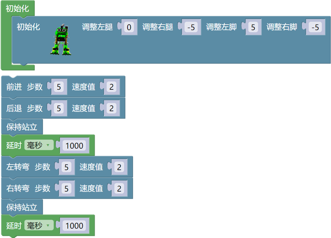

# 5. Mixly 教程

## 5.1 Mixly资料下载

请先下载本教程需要用到的 Mixly资料(包含：Mixly_代码 和 Mixly_库文件），请点击下载才能进行后续的学习，保存至您方便使用的路径下。

单击下载：[Mixly资料](./Mixly资料.7z) 

## 5.2 Mixly开发环境配置

### 5.2.1 Windows 系统

#### 5.2.1.1 Mixly IDE下载

我们通过百度网盘分享：mixly2.0 文件

**下载链接：** [https://pan.baidu.com/s/1sV0DUDKg7OiQcKyIkBI1Ew?pwd=keye](https://pan.baidu.com/s/1sV0DUDKg7OiQcKyIkBI1Ew?pwd=keye) 

**提取码：** keye 

根据计算机系统选择下载对应的mixly2.0版本，如下图所示：

Windows系统一般是下载“**mixly2.0-win32-x64-rc4完整版.zip**”版本.

#### 5.2.1.2 Mixly IDE安装

下载mixly2.0-win32-x64-rc4完整版压缩包之后，重新命名为：mixly2.0 ，解压到电脑的本地硬盘。

⚠️ **特别提醒：** (1)建议解压到硬盘根目录，路径不能包含中文及特殊字符(如:._( )等)。 (2)建议安装路径如 D:\mixly2.0

因为Mixly是一个绿色免安装软件，所以“mixly2.0-win32-x64-rc4完整版”版本在解压之后就可以直接使用了。如果是下载 “一键更新版.7z” 版本的压缩包，压缩包解压后，需要左键双击打开 “一键更新.bat” 文件按照提示更新Mixly。

### 5.2.2 MacOS 系统

#### 5.2.2.1 Mixly IDE下载

我们通过百度网盘分享：mixly2.0 文件

**下载链接：** [https://pan.baidu.com/s/1sV0DUDKg7OiQcKyIkBI1Ew?pwd=keye](https://pan.baidu.com/s/1sV0DUDKg7OiQcKyIkBI1Ew?pwd=keye) 

**提取码：** keye 

根据电脑系统选择下载对应的mixly2.0版本，如下图所示：

**Mixly For Mac(根据电脑系统选择)：**

#### 5.2.2.2 Mixly IDE安装

提供有MAC安装Mixly2.0.txt的文本，安装时可以参考里面的安装方法。

### 5.2.3 Linux 系统

#### 5.2.3.1 Mixly IDE下载

我们通过百度网盘分享：mixly2.0 文件

**下载链接：** [https://pan.baidu.com/s/1sV0DUDKg7OiQcKyIkBI1Ew?pwd=keye](https://pan.baidu.com/s/1sV0DUDKg7OiQcKyIkBI1Ew?pwd=keye) 

**提取码：** keye 

根据电脑系统选择下载对应的mixly2.0版本，如下图所示：

**Mixly For Linux(根据系统选择)：**

#### 5.2.3.2 Mixly IDE安装

提供有Linux安装Mixly2.0.txt的文本，安装时可以参考里面的安装方法。

### 5.2.4 Mixly IDE页面介绍

这里双击 “**Mixly.exe**” 就能打开Mixly软件。如下图所示：

打开Mixly软件后，找到并且单击“ **Arduino AVR** ”就可以进入Mixly编程界面。软件界面如下图所示：

总体来说，Mixly软件界面分为4部分。

1\. 界面左侧为模块区，这里包含了Mixly中所有能用到的程序模块，根据功能的不同，大概分为以下几类:“输入/输出”、“控制”、“数学”、“逻辑”、“文本”、“数组”、“变量”、“函数”、“串口”、“传感器”、“执行器”、“显示器”、“通信”、“存储”、“网络”。每种类型的模块都用不同的颜色块表示，其中每一个分类中的模块会在附录A中有专门的介绍。

2\. 模块区的右侧是程序构建区，模块区的模块可通过鼠标拖拽放到程序构建区，拖诟过来的模块会在这里组合成一段有一定逻辑关系的程序块。这个区域有点类似代码程序编辑软件中写代码的地方，在这个区域的右下角有一个垃圾桶，当我们删除模块时，就要将模块拖到垃圾桶中，在垃圾桶的上方有三个圆形的按钮，能够实现程序构建区的放大、缩小以及居中。

3\. 模块区和程序构建区的上方是基本功能区，类似一般软件的菜单区。这里不仅包含了“新建”、“打开”、“保存”、“另存为”、“导出库”和“管理库”软件都具有的按钮，还包含了硬件编程软件中需要用到的“编译”、“上传”、“控制板选择”、“串口端口”、“串口”这样的按钮。

4\. 界面的最下方是提示区，这里在软件编译、上传的过程中会显示相应的提示信息。我们可以通过提示信息来解决编译上传过程中出现的一些问题。

**最后还要补充两点：**

第一点: Mixly支持多国语言，我们可以通过如下界面找到并且点击  进入个性化设置页面，找到语言下面的简体中文下拉菜单，选择不同的语言版本，此时这个下拉菜单显示的是简体中文，如下图所示：

第二点: 在界面最上方右侧有一个  按钮，单击这个按钮就能进入纯代码形式，如下图所示：

Mixly作为一款将图形化编程方式和代码编程方式融合在一起的开发环境，如果只能单独地显示代码或显示图形程序块，那么肯定是不够好的。在Mixly中是能够将代码和图形程序块一起呈现在屏幕上的，这个功能可以通过界面最上方右侧有一个按钮实现，单击这个  按钮之后，如下图所示：

这时，在程序构建区的右侧会显示出对应的代码，这段代码是与程序构建区中的模块所组成的程序块对应的，会随着模块的变化而变化，不过区域中的代码是不可编辑的。同时，界面最右侧那个向左的箭头按钮变成了向右的箭头。

⚠️ **注意：想了解更多关于Mixly相关知识的请点击链接：** [https://mixly.readthedocs.io/zh-cn/latest/](https://mixly.readthedocs.io/zh-cn/latest/) 。

### 5.2.5 添加Mixly库文件(**重要**)

⚠️ **注意：Mixly 库文件必须添加好，否则后面涉及到相关模块的示例代码是打不开的**。

**特别提醒：** Mixly 库文件在**Mixly资料**文件夹提供有，请下载并且安装好库文件。

Mixly软件下载安装后，点击 **Arduino ESP32** 进入代码编辑器，先点击右上角 “**设置**”，再点击 “**管理库**” 进入添加库文件界面。如下图所示：

进入添加库文件界面后，先点击 “ **导入库** ” ，再点击  进入库文件所放的位置，找到 **index.xml** 库文件并选中它，然后单击 “ **确定** ”。之后，就可以看到库文件在导入中，一会儿会出现 “ **导入成功** ” 字样，说明库文件导入成功。如下图所示：

点击 “**管理库**”，可以看到添加成功的库文件。如下图所示：

关闭添加库文件的窗口界面，在代码编辑器左侧看到刚刚添加的库文件。如下图所示：

点击 “**Keyes smart car**”，可以看到其他的库文件。由于本套件是青蛙机器人，则需要选择 “**frog robot**” 库文件；点击库文件 “**frog robot**”，可以看到对应的代码块。

### 5.2.6 编写代码并上传 

⚠️ **特别注意：这里是以Windows系统为例，其他的系统可以参考。并且后面的示例代码上传步骤也一样，也是可以参考的**。

**确保Nano主控板与计算机连接成功，然后双击 “ **Mixly.exe** ” 图标打开Mixly软件。**

从电脑打开已经编写好的代码，单击“ **文件** ” --> “ **打开** ”，然后选择保存代码的路径，选中代码文件打开即可。如下图所示：

代码文件打开后，需要手动选择Nano主控板的板型 “ **Arduino Nano** ” 和串口端口（COM3）（**提示：不同的电脑，串口端口是不一样的**） （**注意：** 将Nano主板通过USB线连接到计算机后才能看到对应的端口。)，如下图所示：

配置板卡，选择 “**ATmega328P**”。

单击  将代码上传到Nano主板，如下图所示：

这样，可以看到Nano主板的LED闪烁了。

## 5.3 传感器模块课程

当你通过每个项目的工作方式，你将学习如何编程机器人移动，舞蹈，和跟随障碍等。

### 5.3.1 调节舵机角度 

**1\. 简介**

在青蛙机器人DIY的过程中，青蛙机器人的每个关节都有一个180的舵机。我们可以控制每个关节处的舵机进行不同角度的旋转，从而控制青蛙机器人进行不同的动作。在本课程中，我们将重点介绍青蛙机器人套件中舵机的原理和使用。舵机是一种位置伺服驱动器，可以在0到180度之间旋转。如果你想让你的机器人助手帮你拿一本书，机器人手臂旋转角度太大或太小，以致无法拿起书。只有角度刚刚好，才能完成取书的任务，所以才需要准确地控制关节处的舵机角度。

舵机是一种位置控制的旋转执行器。它主要由外壳、电路板、无芯电机、齿轮和位置传感器组成。还包括与您的舵机装在一起的各种黑色轴。

**2\. 工作原理**

舵机的工作原理是由接收机或者单片机发出信号给舵机，其内部有一个基准电路，产生周期为20ms，宽度为1.5ms的基准信号，将获得的直流偏置电压与电位器的电压比较，获得电压差输出。

舵机有很多规格，但所有的舵机都有外接三根线，分别用棕、红、橙三种颜色进行区分，由于舵机品牌不同，颜色也会有所差异，棕色为接地线，红色为电源正极线，橙色为信号线。

舵机的转动的角度是通过调节PWM（脉冲宽度调制）信号的占空比来实现的，标准PWM（脉冲宽度调制）信号的周期固定为20ms（50Hz），理论上脉宽分布应在1ms到2ms之间，但是，事实上脉宽可以在0.5ms 到2.5ms之间，脉宽和舵机的转角0°～180°相对应。所以，舵机的信号线最好接到PWM数字口。但请注意，对于不同品牌的电机，相同的信号可能有不同的旋转角度。

我们可以在Mixly IDE软件中设置相应引脚的HIGH/LOW，从而调整伺服角度; 此外，我们还专门创建了Servo库，以简化的代码方便地控制舵机角度。

**3\. 规格参数**

工作电压：DC 4.8V〜6V

可操作角度范围：大约 About 180°(在 500→2500 μsec)

脉波宽度范围：500→2500 μsec

空载转速：0.12±0.01 sec/60（DC 4.8V）； 0.1±0.01 sec/60（DC 6V）

空载电流：200±20mA（DC 4.8V）； 220±20mA（DC 6V）

停止扭力：1.3±0.01kg·cm（DC 4.8V）； 1.5±0.1kg·cm（DC 6V）

停止电流：≦850mA（DC 4.8V）； ≦1000mA（DC 6V）

待机电流：3±1mA（DC 4.8V）； 4±1mA（DC 6V）

导线长度：250 ± 5 mm

外观尺寸：22.9\*12.2\*30mm

重量：(不包含白色的舵机转轴)

保存温度：-20℃〜60℃

操作温度；-10℃〜50℃

**4\. 接线图**

只需将keyes Nano主板堆叠到keyes Nano扩展板。连接舵机引脚到数字引脚4 。

**5\. 测试代码**

测试舵机在0°到180°之间的运动角度。

**6\. 测试结果**

上传代码成功，按下Power_Switch按键，舵机将在0°到180°之间来回旋转。

**7\. 知识点**

（1）在代码中定义舵机设置；4代表舵机信号端是D4；是使用代码中自带的自定义变量，这里用于控制舵机角度，由于舵机角度范围是0°-180°，的设置范围也是0-180；200代表的是设置角度后延迟200毫秒。

（2）代码中代表数字i从0直接增加到180，每一步增加了1; 同样地，代表i从180直接减小到0，每一步减小了1。

**8\. 扩展练习**

请参阅上面的舵机测试代码。尝试复位舵机和转速(提示:设置舵机角度的延迟时间; 或者调整增加/减少步长，步长应该能被180整除，比如2, 3, 5等。)

  

### 5.3.2 超声波检测的障碍

**1\. 简介**

触发信号后，超声波模块发出超声波。当超声波遇到物体并被反射回来时，模块输出一个回波信号，因此它可以从触发信号和回波信号的时间差来确定物体的距离。我们可以用超声波传感器来探测前方是否有障碍物。通常用于测量前方障碍物与机器人之间的距离。在机器人DIY的过程中，我们可以利用超声波传感器测量到的距离来构建功能机器人，如自动躲避、跟随等。

在实验中，我们使用超声波传感器测量机器人与前方障碍物之间的距离。下图是一个超声波模块。

**2\. 规格参数**

工作电压：5V（DC）

工作电流：15mA

工作频率：40khz

最大探测距离：3-5m

最小探测距离：2cm

感应角度：不大于15度

**3\. 接线图**

将超声波传感器连接到NANO扩展板上，VCC引脚连接到5V(V)，Trig引脚连接到数字 6 (S)， Echo引脚连接到数字 7 (S)，GND引脚连接到GND(G)；然后将keyes Nano主板堆叠到NANO扩展板上。

**4\. 测试代码**

**5\. 测试结果**

上传代码成功，按下NANO扩展板上的Power_Switch按键。点击打开串口监视器，选择串口和设置波特率为9600。点击，将你的手或一个大的、扁平的物体移近或移远超声波传感器。当物体接近或远离时，监视器将显示从传感器读取的距离(单位:厘米)。

**6\. 知识点**

（1）代码中的代表超声波模块测得模块与前方障碍物的距离，单位为cm。

（2）代码中的表示设置波特率为9600, 代码块是代表在串口监视器中显示距离数值，这里代码设置的是自动换行，如果是就不是自动换行。

代码中的是延迟时间指令方块，单位为毫秒。

**7\. 扩展练习**

（1）在串口监视器显示时，添加一些文字说明或者距离单位（cm）, 使显示数据不那么单薄。

（2）更改波特率或延时时间等，在这里是延时时间的，看下显示效果。

## 5.4 青蛙机器人组装 

让我们开始组装可爱的青蛙机器人，让它移动、跳舞，甚至跟随物体; 通过蓝牙APP轻松操作机器人!

制作青蛙机器人的所有部件都包含在工具包中，组装它很容易，通常需要大约半小时左右。

**注意:**

在安装青蛙机器人之前，首先需要调节4个舵机到90°，然后将4个舵机连接到Nano扩展板上；分别将4个舵机连接到数字引脚 5、4、3、2，再把keyes Nano主板堆叠到Nano扩展板上。

### 5.4.1 4个舵机角度初始化

上传下面的代码，将4个舵机都转到90°的位置。(**参考 5.3.1 调节舵机角度**)

完整的代码：

4个舵机的角度都初始化完后，接下来开始组装青蛙机器人，组装步骤如下：

### 5.4.2 固定脚 

### 5.4.3 把腿固定在脚上

### 5.4.4 固定头部到身体

### 5.4.5 国定舵机到身体上

### 5.4.6 完整的青蛙机器人

### 5.4.7 接线

先将keyes Nano主板堆叠到keyes NANO扩展板上，然后用4根母对母杜邦线将HC-SR04超声波传感器模块连接到keyes NANO扩展板上，超声波传感器的VCC引脚连接至5V(V)，Trig引脚至数字6(S)，Echo引脚至数字7(S)，Gnd引脚至Gnd(G);

将舵机的棕色线是与Gnd(G)相连，红色线与5V(V)相连，橙色线是分别与数字口 5、4、3、2 相连的。

4个舵机控制接口可以参考下图:

插入DX-BT24 V5.1 BLE蓝牙模块，引脚头TX, RX, GND, 5V在keyes NANO扩展板上。

|keyes NANO扩展板|DX-BT24 V5.1 BLE蓝牙模块|
|-|-|
|TX|RXD|
|RX|TXD|
|GND|GND|
|5V|VCC|

## 5.5 青蛙机器人课程：

### 5.5.1 行走

**1\. 设计思路**

完成机器人组装后，你会看到机器人上的4个舵机连接到keyes Nano扩展板上。我们前面已经介绍了如何调整舵机角度的相关知识。在电路中，我们将利用keyes Nano扩展板使4个舵机进行不同角度的切换，从而控制青蛙机器人行走起来。

**2\. 青蛙是如何工作的**

设计青蛙机器人，需要设计4个舵机的安装位置，以及对应的控制接口。舵机的详细安装位置，我们可以参考前面的安装方法，控制接口可以参考下图。

**3\. 接线图**

⚠️ **特别注意：青蛙机器人已经组装好了，这里不需要把舵机拆下来又重新组装和接线，这里再次提供接线图，是为了方便您编写代码！**

**4\. 青蛙机器人初始状态**

⚠️ **特别提醒：应先将蓝牙模块拔下来，接着上传测试代码，代码上传成功后，再插入蓝牙模块。否则，测试代码上传会失败！**

其中最重要的一步是通过程序对机器人中使用的舵机进行调整。这里的调整决定了青蛙行走和各种姿势的质量:

首先要对青蛙机器人的舵机进行调整，因为在安装舵机时会出现了误差。先调整D2引脚的舵机，调整到正值，这样它就会旋转到青蛙机器人的右边。例如在这里设置调整左腿后面方框中的数字0为10时，其他的不变，上传代码后，青蛙机器人的左腿就会往右边的方向转动10°。

相反，设置调整左腿后面方框中的数字0为-10时，其他的不变，上传代码后，左腿就会往青蛙机器人的左边转动10°。

调整D3引脚的舵机，和调整D2引脚的舵机的方向一样，调整右腿。

调整D4引脚的舵机，和调整D2引脚的舵机的方向一样，调整左脚。

调整D5引脚的舵机，和调整D2引脚的舵机的方向一样，调整右脚。

对于D3引脚舵机、D4引脚舵机和D5引脚舵机的方向调整，自己改下对应的值，就可以了。

现在已经学会了怎么设置D2、D3、D4和D5引脚的舵机转动角度吧。由于我们每个人组装青蛙机器人的时候，不一定会安装的非常直立状态，需要先对青蛙机器人直立最佳状态调整。

**5\. 测试代码**

⚠️ **特别提醒：应先将蓝牙模块拔下来，接着上传测试代码，代码上传成功后，再插入蓝牙模块。否则，测试代码上传会失败！**

7\. 实验结果

上传代码完成后，按下Nano扩展板上的Power_Switch按键后。青蛙机器人准备向前走5步，后退5步，保持站立1秒，向左转5步，向右转5步，保持站立1秒，交替循环。

### 5.5.2 跳舞

**1\. 设计思路**

基于机器人行走电路，我们可以使用相同的电子元件和接线方法。只要修改代码，让青蛙机器人跳舞就行了。

**2\. 接线图**

⚠️ **特别注意：青蛙机器人已经组装好了，这里不需要把舵机拆下来又重新组装和接线，这里再次提供接线图，是为了方便您编写代码！**

**3\. 测试代码**

⚠️ **特别提醒：应先将蓝牙模块拔下来，接着上传测试代码，代码上传成功后，再插入蓝牙模块。否则，测试代码上传会失败！**

**4\. 测试结果**

上传代码完成，按下Nano扩展板上的Power_Switch按键后。青蛙机器人将会跳舞。你会看到令人难以置信的舞蹈动作。

### 5.5.3 跟随

**1\. 设计思路**

在以上章节中，我们介绍了如何利用超声波传感器检测前方障碍物距离。同时对青蛙机器人的多种动作进行了操作。在该设计思路中，首先用超声波传感器测量前方障碍物的距离，然后根据距离值来控制机器人的运动方式，从而实现跟随功能。

超声波跟随的具体逻辑如下图所示:

在设计思路的基础上，可以开始制作带有超声波传感器的障碍物跟踪机器人。参照下面的接线图和测试代码.

**2\. 接线图**

⚠️ **特别注意：青蛙机器人已经组装好了，这里不需要把舵机和超声波传感器拆下来又重新组装和接线，这里再次提供接线图，是为了方便您编写代码！**

**3\. 测试代码**

⚠️ **特别提醒：应先将蓝牙模块拔下来，接着上传测试代码，代码上传成功后，再插入蓝牙模块。否则，测试代码上传会失败！**

4个舵机、1个超声波传感器和电源连接良好。在超声波测量距离的情况下要实现以下功能，我们要做到以下几点：

**4\. 测试结果**

上传代码完成，按下Nano扩展板上的Power_Switch按键后，青蛙机器人会随着前面的障碍物移动。

### 5.5.4 避障

**1\. 设计思路**

在以上章节中，我们利用超声波传感器检测前方障碍物距离来控制青蛙实现跟随功能。那么在本实验的设计思路中，我们用超声波传感器测量前方障碍物的距离，然后根据距离值来控制机器人的运动方式，从而实现避障功能。

超声波避障的具体逻辑如下图所示:

在设计思路的基础上，可以开始制作带有超声波传感器的障碍物避障机器人。参照下面的接线图和测试代码.

**2\. 接线图**

⚠️ **特别注意：青蛙机器人已经组装好了，这里不需要把舵机和超声波传感器拆下来又重新组装和接线，这里再次提供接线图，是为了方便您编写代码！**

**3\. 测试代码**

⚠️ **特别提醒：应先将蓝牙模块拔下来，接着上传测试代码，代码上传成功后，再插入蓝牙模块。否则，测试代码上传会失败！**

4个舵机、1个超声波传感器和电源连接良好。在超声波测量距离的情况下要实现以下功能，我们要做到以下几点：

4\. 测试结果

上传代码完成，按下Nano扩展板上的Power_Switch按键后，青蛙机器人根据前面的障碍物的距离而左转弯。

### 5.5.5 蓝牙控制

**1\. 简介**

我们现在准备给青蛙机器人另一种能力——蓝牙遥控!

对于一个智能机器人来说，应该有一个控制终端和一个被控制终端。在本项目实验中，我们使用手机作为控制台(主机)，与机器人连接的DX-BT24 5.1蓝牙模块（从机）作为被控制终端。使用时，我们需要在手机上安装一个APP，连接DX-BT24 5.1蓝牙模块，点击蓝牙APP上的按钮，就可以导航机器人的多种动作。同时在串口显示器上显示每个按键的控制字符。

**2\. DX-BT24 5.1蓝牙模块**

（1）描述：

DX-BT24 5.1蓝牙模块是为智能无线数据传输而打造，采用英国DAILOG公司14531芯片，配置256Kb 空间，遵循V5.1 BLE蓝牙规范。支持AT指令，用户可根据需要更改串口波特率、设备名称等参数，使用灵活。本模块支持UART接口，并支持蓝牙串口透传，具有成本低、体积小、功耗低、收发灵敏性高等优点，只需配备少许的外围元件就能实现其强大功能。

（2）技术参数：

蓝牙协议：Bluetooth Specification V5.1 BLE

工作距离：在开放环境中，实现40m超远距离通讯

工作频率：2.4GHz ISM频段

通信接口：UART

蓝牙认证：符合FCC CE ROHS REACH认证标准

串口参数：9600、8数据位、1停止位、无效位、无流控

工作电压：5V DC

工作温度：–10至+65摄氏度

（3）应用领域:

DX-BT24蓝牙模块同时支持 BT5.1 BLE 协议，可以同具备BLE 蓝牙功能的 iOS 设备直接连接，支持后台程序常驻运行。主要用于短距离的数据无线传输领域。避免繁琐的线缆连接，能直接替代串口线。BT24 模块成功应用领域：

※ 蓝牙无线数据传输； ※ 手机、电脑周边设备； ※ 手持POS设备；※ 医疗设备无线数据传输； ※ 智能家居控制； ※蓝牙打印机；※ 蓝牙遥控玩具； ※ 共享单车；

（4）接口说明：

① STATE：状态脚

② RX：接收脚

③ TX：发送脚

④ GND：接地脚

⑤ VCC：电源脚

⑥ EN：使能脚

将蓝牙连接到keyes Nano扩展板上：

|keyes NANO扩展板|DX-BT24 V5.1 BLE蓝牙模块|
|-|-|
|TX|RXD|
|RX|TXD|
|GND|GND|
|5V|VCC|

**2\. 下载安装APP**

⚠️ **特别提醒：** 如果已经在手机/平板上安装好了APP，则这一步骤可以直接跳过；否则，需要参照参照 **APP下载安装说明** 中的步骤在手机/平板上安装APP。

**3\. 测试代码**

⚠️ **特别提醒：应先将蓝牙模块拔下来，接着上传测试代码，代码上传成功后，再插入蓝牙模块。否则，测试代码上传会失败！**

**4\. 测试结果**

① 在Keyes Nano开发板上上传测试代码代码成功。

② 先将Keyes Nano主板堆叠到Nano扩展板上，然后将蓝牙模块连接到keyes Nano扩展板上，按照如下接线图接线。

|keyes NANO扩展板|DX-BT24 V5.1 BLE蓝牙模块|
|-|-|
|TX|RXD|
|RX|TXD|
|GND|GND|
|5V|VCC|

③ 利用mini USB线将Keyes Nano开发板连接到电脑上。

④ 在手机中安装好APP。

⑤ 上电后，按下扩展板上Power_Switch按键后，蓝牙指示灯闪烁，进入手机APP连接蓝牙。打开蓝牙APP页面，会弹出如下图提醒，需要点击 **允许** 打开精确定位。

⑥ 点击APP左上角的 “**CONNECT**” 按钮，搜索并连接蓝牙。单击 “**connect**” 来连接蓝牙。BT24已连接，蓝牙模块上LED变为常亮。

蓝牙APP界面如下所示：

⑥ 蓝牙连接成功后，点击打开串口监视器，设置波特率为9600。

⑦ 对准蓝牙模块按下APP按键，我们可以看到APP按键对应的控制字符，如下图。

### 5.5.6 蓝牙控制青蛙机器人 

**1\. 设计思路**

我们可以结合APP上每个按键的控制字符，扩展到控制4个舵机的角度，从而使机器人移动.

**2\. 下载安装APP**

⚠️ **特别提醒：** 如果已经在手机/平板上安装好了APP，则这一步骤可以直接跳过；否则，需要参照参照 **APP下载安装说明** 中的步骤在手机/平板上安装APP。

蓝牙APP界面如下所示：

|按钮|控制字符|功能|
|-|-|-|
||  |配对连接DX-BT24蓝牙模块| 
||  |进入蓝牙控制界面| 
||  |断开蓝牙连接| 
||按住发送“F” 松开发送“S”|按住，小青蛙前进； 松开，停止。|
||按住发送“B” 松开发送“S”|按住，小青蛙后退； 松开，停止。|
||按住发送“L” 松开发送“S”|按住，小青蛙左转； 松开，停止。|
||按住发送“R” 松开发送“S”|按住，小青蛙右转； 松开，停止。|
||按住发送“1” 松开发送“S”|按住，左侧漫步； 松开，停止。|
||按住发送“2” 松开发送“S”|按住，右侧漫步； 松开，停止。|
||按住发送“3” 松开发送“S”|按住，右侧跳步； 松开，停止。|
||按住发送“4” 松开发送“S”|按住，左侧跳步； 松开，停止。|
||按住发送“6” 松开发送“S”|点击，往右倾斜一次，再慢慢回复|
||按住发送“7” 松开发送“S”|点击，滑步一次|
||按住发送“8” 松开发送“S”|按住，摩擦摩擦； 松开，停止。|
||按住发送“G” 松开发送“S”|按住，左右摆动； 松开，停止。|
||按住发送“9” 松开发送“S”|按住，跳； 松开，停止。|
||按住发送“H” 松开发送“S”|按住，游泳动作； 松开，停止。|
||按住发送“J” 松开发送“S”|点击，慢慢踮起脚，再放下。|
||按住发送“P” 松开发送“S”|点击，跳舞。|
||点击一次发送“U” 再点击一次发送“S”|开启超声波跟随。|
||/|点击一次开启手机姿态控制；再点击一次关闭。|

在思路设计的基础上，可以开始构建蓝牙遥控青蛙机器人，参照下面的接线图和测试代码。

**3\. 接线图**

⚠️ **特别注意：青蛙机器人已经组装好了，这里不需要把舵机和超声波传感器拆下来又重新组装和接线，这里再次提供接线图，是为了方便您编写代码！**

|keyes NANO扩展板|DX-BT24 V5.1 BLE蓝牙模块|
|-|-|
|TX|RXD|
|RX|TXD|
|GND|GND|
|5V|VCC|

分别将4个舵机连接到数字引脚 5、4、3、2。

**4\. 测试代码**

⚠️ **特别提醒：应先将蓝牙模块拔下来，接着上传测试代码，代码上传成功后，再插入蓝牙模块。否则，测试代码上传会失败！**

4个舵机、1个蓝牙模块和电源已经连接好。我们开始编写蓝牙控制机器人的程序代码，我们应该这样做：

**5\. 测试结果**

① 在Keyes Nano开发板上上传代码成功。

② 将keyes Nano开发板堆叠在Nano扩展板，按照接线图接线。

③ 使用mini USB线将Keyes Nano主板与电脑连接上。

④ 在手机中安装好APP。

⑤ 上电后，按下扩展板上Power_Switch按键后，蓝牙指示灯闪烁，进入手机APP连接蓝牙。打开蓝牙APP页面，会弹出如下图提醒，需要点击 **允许** 打开精确定位。

⑥ 点击APP左上角的 “**CONNECT**” 按钮，搜索并连接蓝牙。单击 “**connect**” 来连接蓝牙。BT24已连接，蓝牙模块上LED变为常亮。

蓝牙APP界面如下所示：

⑥ 连接好蓝牙后，对准蓝牙模块，轻按蓝牙APP上的按键控制青蛙机器人，按住APP的按钮图案，机器人前进；按住APP按钮图案，机器人后退；按住APP按钮图案，机器人左转；按住APP按钮图案，机器人右转；松开所有按钮图案后，机器人站立停止。

### 5.5.7 蓝牙多功能青蛙机器人 

**1\. 设计思路**

如何将我们所学到的青蛙机器人的多种功能结合起来?在这个思路设计中，我们编写完整的代码来通过蓝牙APP实现不同功能的切换，非常简单地。

**2\. 接线图**

⚠️ **特别注意：青蛙机器人已经组装好了，这里不需要把舵机和超声波传感器拆下来又重新组装和接线，这里再次提供接线图，是为了方便您编写代码！**

**3\. 测试代码**

⚠️ **特别提醒：应先上传测试代码，代码上传成功后，再插入蓝牙模块。否则，测试代码上传会失败！**

4个舵机、1个蓝牙模块和电源已经连接好。由于这个代码程序比较复杂，步骤比较多，这里我们就不提供编写代码程序步骤过程，我们提供已经编程好的代码程序。如果你自己有兴趣的话，可以自己拖动代码块来操作下。

完整的代码程序：

**4\. 测试结果**

① 在Keyes Nano开发板上上传测试代码代码成功。

② 将开发板堆叠在扩展板，按照接线图接线。

③ 使用mini USB线将Keyes Nano主板与电脑连接上。

④ 在手机中安装好APP。

⑤ 上电后，按下扩展板上 Power_Switch 按键后，蓝牙指示灯闪烁，进入手机APP连接蓝牙。打开蓝牙APP页面，会弹出如下图提醒，需要点击 **允许** 打开精确定位。

⑥ 点击APP左上角的 “**CONNECT**” 按钮，搜索并连接蓝牙。单击 “**connect**” 来连接蓝牙。BT24已连接，蓝牙模块上LED变为常亮。

蓝牙APP界面如下所示：

⑥ 蓝牙连接成功后，蓝牙指示灯常亮，对准蓝牙模块按下APP对应按键，实现对应功能。

