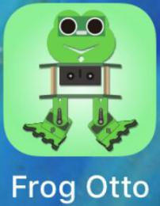
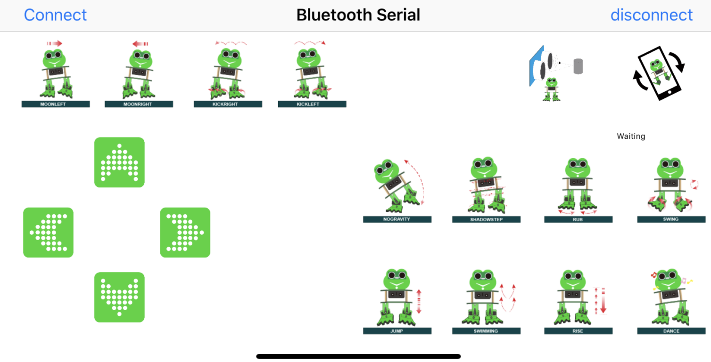
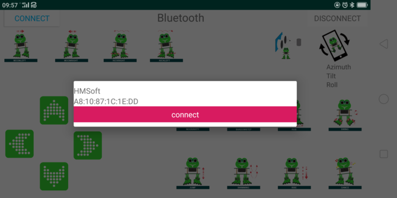

# 常见问题解答

## （1）青蛙机器人无反应

答：1.请检查电池电量是否充足。

2.请检查接线是否正确。

## （2）电脑识别不了USB端口

答：1.请确保已参考“Arduino软件下载安装，驱动安装和库文件添加”文档安装了CH340驱动程序。

2.请检查USB线是否良好。

## （3）无法上传代码

答：1.请尝试是否可以单独使用Nano
ch340主板进行烧录（拔掉外围传感器/模块或其他电子元件，排除外部干扰）。

2.请确保在上传代码期间蓝牙模块没有插在扩展板上，因为蓝牙模块使用的是Nano
ch340主板的RX\TX引脚，而上传代码时也需要使用的Nano
ch340主板的RX\TX引脚，如果在上传代码期间扩展板上接着蓝牙模块会影响上传代码。

## 资料下载链接

链接：[https://pan.baidu.com/s/1hQmSartt8IfgPx8IfChlTQ](https://pan.baidu.com/s/1hQmSartt8IfgPx8IfChlTQ)

提取码：keye 

## APP

### Android 使用蓝牙APP

对于Android 系统:

1.  点击Frog_Otto压缩包，直接安装Frog_Otto     APP；安装好了，出现下面的图标在你的手机:

从下面的链接下载Frog_Otto包:  
<https://drive.google.com/open?id=1pymZOlVBVBWJ4s-1buKP3q5T1uM_b-tj>

你也可以直接从Google Play下载keystudio Frog_Otto APP:

<https://play.google.com/store/apps/details?id=com.keyestudio.frogotto>

或者，你也还可以将我们提供的Frog Otto.apk文件转移到手机或平板电脑上，点击安装即可。

2.  点击Frog_Otto图标进入蓝牙APP，如下图所示：

3.  将代码上传至Nano     ch340控制板，连接蓝牙模块，蓝牙模块上的LED会闪烁。       点击APP上的“connect”选项，搜索蓝牙。

4.  单击“connect”来连接蓝牙之后。HMSoft上的“connect”变成“is     connected”，蓝牙LED正常开启，说明蓝牙已连接上。

蓝牙APP界面如下所示：

|按钮|功能|
|-|-|
||配对连接DX-BT24蓝牙模块|
||进入蓝牙控制界面|
||断开蓝牙连接|
||控制字符|功能|
|按住发送“F” 松开发送“S”|按住，小青蛙前进； 松开，停止。|
||按住发送“B” 松开发送“S”|按住，小青蛙后退； 松开，停止。|
||按住发送“L” 松开发送“S”|按住，小青蛙左转； 松开，停止。|
||按住发送“R” 松开发送“S”|按住，小青蛙右转； 松开，停止。|
||按住发送“1” 松开发送“S”|按住，左侧漫步； 松开，停止。|
||按住发送“2” 松开发送“S”|按住，右侧漫步； 松开，停止。|
||按住发送“3” 松开发送“S”|按住，右侧跳步； 松开，停止。|
||按住发送“4” 松开发送“S”|按住，左侧跳步； 松开，停止。|
||按住发送“6” 松开发送“S”|点击，往右倾斜一次，再慢慢回复|
||按住发送“7” 松开发送“S”|点击，滑步一次|
||按住发送“8” 松开发送“S”|按住，摩擦摩擦； 松开，停止。|
||按住发送“G” 松开发送“S”|按住，左右摆动； 松开，停止。|
||按住发送“9” 松开发送“S”|按住，跳； 松开，停止。|
||按住发送“H” 松开发送“S”|按住，游泳动作； 松开，停止。|
||按住发送“J” 松开发送“S”|点击，慢慢踮起脚，再放下。|
||按住发送“P” 松开发送“S”|点击，跳舞。|
||点击一次发送“U” 再点击一次发送“S”|开启超声波跟随。|
||/|点击一次开启手机姿态控制；再点击一次关闭。|

### iOS 使用蓝牙APP

对于 iOS 系统:

1.  打开 APP商店。       

2.  点击搜索，搜索Frog Otto，下载搜索到的APP。

3.  点击打开Frog Otto。

4.  上传代码完成，连接蓝牙模块，蓝牙模块上的LED会闪烁。打开蓝牙APP，点击APP左上角的“CONNECT”按钮，搜索并连接蓝牙。

1.  单击“connect”来连接蓝牙。HMSoft已连接，蓝牙模块上LED变为常亮。

蓝牙APP界面如下所示：

|按钮|功能|
|-|-|
||配对连接DX-BT24蓝牙模块|
||进入蓝牙控制界面|
||断开蓝牙连接|
||控制字符|功能|
|按住发送“F” 松开发送“S”|按住，小青蛙前进； 松开，停止。|
||按住发送“B” 松开发送“S”|按住，小青蛙后退； 松开，停止。|
||按住发送“L” 松开发送“S”|按住，小青蛙左转； 松开，停止。|
||按住发送“R” 松开发送“S”|按住，小青蛙右转； 松开，停止。|
||按住发送“1” 松开发送“S”|按住，左侧漫步； 松开，停止。|
||按住发送“2” 松开发送“S”|按住，右侧漫步； 松开，停止。|
||按住发送“3” 松开发送“S”|按住，右侧跳步； 松开，停止。|
||按住发送“4” 松开发送“S”|按住，左侧跳步； 松开，停止。|
||按住发送“6” 松开发送“S”|点击，往右倾斜一次，再慢慢回复|
||按住发送“7” 松开发送“S”|点击，滑步一次|
||按住发送“8” 松开发送“S”|按住，摩擦摩擦； 松开，停止。|
||按住发送“G” 松开发送“S”|按住，左右摆动； 松开，停止。|
||按住发送“9” 松开发送“S”|按住，跳； 松开，停止。|
||按住发送“H” 松开发送“S”|按住，游泳动作； 松开，停止。|
||按住发送“J” 松开发送“S”|点击，慢慢踮起脚，再放下。|
||按住发送“P” 松开发送“S”|点击，跳舞。|
||点击一次发送“U” 再点击一次发送“S”|开启超声波跟随。|
||/|点击一次开启手机姿态控制；再点击一次关闭。|

